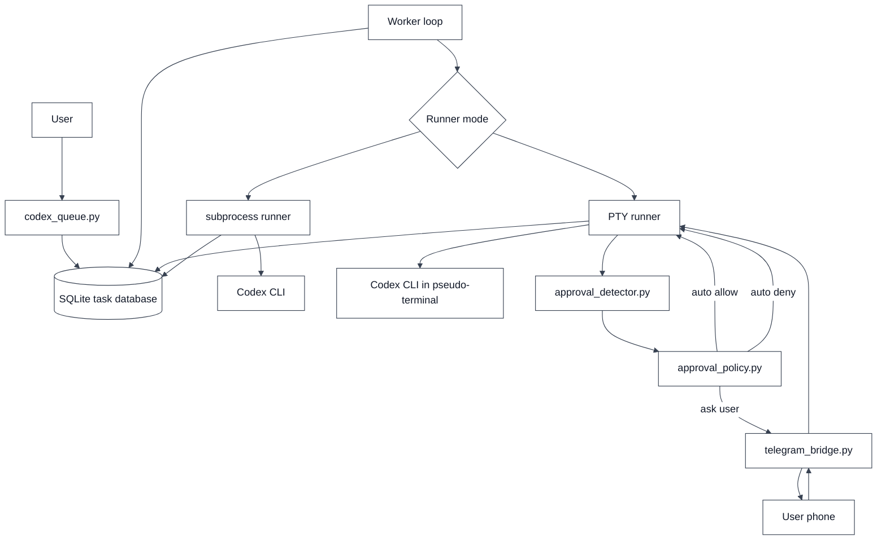
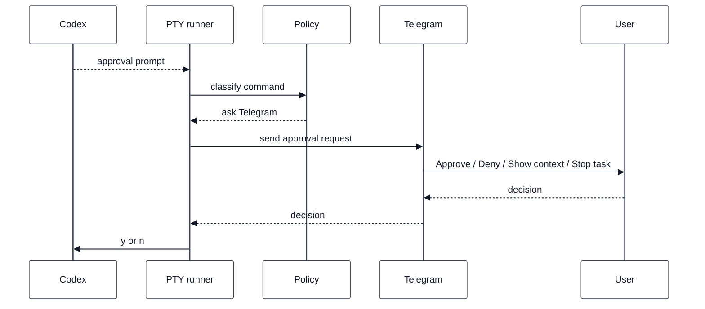

# Durex

Durex is a local task orchestrator for Codex CLI.

It lets you prepare a persistent queue of Codex jobs, run them unattended, resume work after usage-limit interruptions and, in v0.2, approve interactive terminal prompts from Telegram.

> Durex is currently an experimental local tool. Review commands carefully before approving them remotely.

## Why Durex exists

Codex is useful for long-running engineering tasks, but local workflows can still be interrupted by practical issues:

- usage limits can stop work before a task is finished;
- interactive approvals require the user to be near the computer;
- overnight execution windows are often wasted;
- multiple tasks need ordering, retry logic and persistence.

Durex solves these problems with:

- a persistent SQLite task queue;
- automatic retry and resume support;
- usage-limit detection;
- PTY-based interactive execution;
- approval policies;
- Telegram approval buttons;
- documentation and diagrams for future structured-event support.

## Current feature set

| Feature | Status |
|---|---|
| SQLite task queue | Available |
| Priority-based execution | Available |
| Usage-limit waiting | Available |
| Resume command support | Available |
| Classic subprocess runner | Available |
| PTY runner | Available |
| Approval detector | Available |
| Approval policy engine | Available |
| Telegram approval bridge | Available |
| Telegram remote queue control | Available |
| Example configuration | Available |
| Unit tests for detector and policy | Available |
| Structured event runner | Planned |
| Web dashboard | Planned |

## Architecture overview



In this diagram, edges represent runtime triggers. `User -> codex_queue.py`
starts a CLI command such as `add`, `run`, `telegram-check`, or
`telegram-control`. `Worker loop -> Runner mode` is triggered when the worker
claims a ready task. The subprocess runner captures normal command output, while
the PTY runner keeps Codex attached to a pseudo-terminal so interactive prompts
can be detected.

The approval path is only active in PTY mode. Terminal output triggers
`approval_detector.py`; detected prompts trigger `approval_policy.py`; policy can
auto-allow, auto-deny, or ask `telegram_bridge.py` to send the decision to the
user phone. The PTY runner remains the only component that writes the resulting
input back to Codex.

More diagrams are available in:

- [`docs/ARCHITECTURE.md`](docs/ARCHITECTURE.md)
- [`docs/SEQUENCE_DIAGRAMS.md`](docs/SEQUENCE_DIAGRAMS.md)
- [`docs/PTY_VS_EVENTS.md`](docs/PTY_VS_EVENTS.md)
- [`docs/TELEGRAM_APPROVALS.md`](docs/TELEGRAM_APPROVALS.md)
- [`docs/TELEGRAM_REMOTE_CONTROL.md`](docs/TELEGRAM_REMOTE_CONTROL.md)
- [`docs/SESSION_APPROVAL_DEDUP.md`](docs/SESSION_APPROVAL_DEDUP.md)
- [`docs/CONFIGURATION.md`](docs/CONFIGURATION.md)
- [`docs/ROADMAP.md`](docs/ROADMAP.md)

## Requirements

You need:

- Python 3.10 or newer;
- Codex CLI installed and configured;
- optional: `pytest` for running the test suite;
- optional: a Telegram bot token and chat id for remote approvals.

Check Python:

```bash
python3 --version
```

Check Codex:

```bash
codex --help
```

## Repository layout

```text
.
├── codex_queue.py              # Main CLI and task queue
├── approval_detector.py        # Terminal prompt detector
├── approval_policy.py          # Approval policy engine
├── telegram_bridge.py          # Telegram Bot API bridge
├── telegram_control.py         # Telegram remote-control command router
├── pty_runner.py               # PTY runner and approval pipeline
├── config.example.yaml         # Planned v0.2 configuration shape
├── tests/
│   ├── test_approval_detector.py
│   ├── test_codex_queue.py
│   ├── test_approval_policy.py
│   ├── test_pty_runner.py
│   └── test_telegram_control.py
└── docs/
    ├── ARCHITECTURE.md
    ├── CONFIGURATION.md
    ├── PTY_VS_EVENTS.md
    ├── ROADMAP.md
    ├── SESSION_APPROVAL_DEDUP.md
    ├── SEQUENCE_DIAGRAMS.md
    ├── TELEGRAM_REMOTE_CONTROL.md
    └── TELEGRAM_APPROVALS.md
```

## Quick start

Initialize the database:

```bash
python3 codex_queue.py init
```

Add example tasks:

```bash
python3 codex_queue.py seed --workdir /path/to/project
```

<details>
<summary>About <code>seed</code> command</summary>
    
The above command automatically creates a small set of example tasks in the SQLite queue. All generated tasks will use the directory specified by --workdir as their working directory.

The example tasks are designed to showcase a typical workflow:

1. Grade a student assignment.
2. Generate additional automated tests.
3. Create a final summary report.

When the worker executes these tasks, Codex will operate inside the specified project directory.

For example:

```bash
python3 codex_queue.py seed --workdir /home/user/my_project
```

will create example tasks that run against: `/home/user/my_project`

The `seed` command is useful for:

* learning how Durex works;
* testing the queue system;
* validating PTY and Telegram integrations;
* experimenting with task execution.

For real-world usage, it is recommended to create custom tasks with the add command instead:

```bash
python3 codex_queue.py add \
  --title "Grade Student A" \
  --workdir /home/user/student_a \
  --priority 1 \
  --prompt "Run tests, evaluate the assignment, and generate a grading report."
```
</details>
  
Show the queue:

```bash
python3 codex_queue.py list
```

Run with the classic non-interactive runner:

```bash
python3 codex_queue.py run
```

Run with the PTY runner:

```bash
python3 codex_queue.py run --runner-mode pty
```

Run with PTY and Telegram approvals:

```bash
python3 codex_queue.py run --runner-mode pty --telegram
```

## Adding tasks

Simple task:

```bash
python3 codex_queue.py add \
  --title "Grade student B" \
  --workdir /Users/antonio/projects/student_B \
  --priority 1 \
  --prompt "Run the tests, grade the assignment, and generate report_student_B.md"
```

More complete grading task:

```bash
python3 codex_queue.py add \
  --title "Grade Mario Rossi assignment" \
  --workdir /Users/antonio/grading/mario_rossi \
  --priority 1 \
  --prompt "You are an impartial grader. Read the code in the current directory. Run the tests. Evaluate using this rubric: correctness 0-4, code quality 0-2, error handling 0-2, clarity 0-2. Create report_mario_rossi.md with the grade, reasoning for each criterion, and final evaluation."
```

Priority is numeric. Lower values run first:

```text
priority=1    urgent
priority=10   important
priority=100  normal
priority=999  low priority
```

## Runner modes

Durex currently supports two runner modes.

### subprocess mode

This is the default mode:

```bash
python3 codex_queue.py run --runner-mode subprocess
```

It uses `subprocess.run()` and is best for non-interactive jobs.

### PTY mode

PTY mode runs Codex inside a pseudo-terminal:

```bash
python3 codex_queue.py run --runner-mode pty
```

PTY mode can detect prompts such as:

```text
Approve this command? [y/N]
```

Then it can:

- auto-approve according to policy;
- auto-deny according to policy;
- ask Telegram when configured.

## Telegram approvals

Telegram approvals allow you to confirm Codex prompts from your phone.

Flow:



The sequence starts only after Codex prints an approval prompt in the PTY. The
policy decides whether Telegram is required. If Telegram is used, the bridge
sends buttons to the configured chat and waits for an approved callback. The
callback is converted into a local decision; the PTY runner then writes `y` or
`n`, or stops the task for a stop decision.

### Telegram setup

Create a bot with Telegram's official `@BotFather`:

1. Open `@BotFather` in Telegram.
2. Send `/newbot`.
3. Choose a display name.
4. Choose a username ending in `bot`, for example `my_durex_bot`.
5. Copy the token returned by BotFather.

Store the token in the environment:

```bash
export DUREX_TELEGRAM_BOT_TOKEN="your-bot-token"
```

Validate the token, then send any message to the bot from the Telegram chat you
want to authorize and discover the chat id:

```bash
python3 codex_queue.py telegram-check
python3 codex_queue.py telegram-check --discover-chat-id
export DUREX_TELEGRAM_CHAT_ID="the-chat-id-from-the-check"
python3 codex_queue.py telegram-check --send-test
```

For a private chat, `DUREX_TELEGRAM_CHAT_ID` is usually a positive integer. For
groups and supergroups, it is often negative. Use exactly the value printed by
`telegram-check`.

Official Telegram references:

- Bot overview: https://core.telegram.org/bots
- BotFather guide: https://core.telegram.org/bots/features#botfather
- Bot API reference: https://core.telegram.org/bots/api
- `getMe`: https://core.telegram.org/bots/api#getme
- `getUpdates`: https://core.telegram.org/bots/api#getupdates
- `sendMessage`: https://core.telegram.org/bots/api#sendmessage

Then run approvals:

```bash
python3 codex_queue.py run --runner-mode pty --telegram
```

Verbosity options:

```bash
python3 codex_queue.py run --runner-mode pty --telegram --telegram-verbosity compact
python3 codex_queue.py run --runner-mode pty --telegram --telegram-verbosity normal
python3 codex_queue.py run --runner-mode pty --telegram --telegram-verbosity verbose
```

Buttons:

| Button | Meaning |
|---|---|
| Approve | Send positive confirmation back to Codex |
| Deny | Send negative confirmation back to Codex |
| Show context | Send more terminal output to Telegram |
| Stop task | Stop the current task process |

More details: [`docs/TELEGRAM_APPROVALS.md`](docs/TELEGRAM_APPROVALS.md)

## Telegram remote control

Telegram remote control lets you operate the Durex queue from your phone. It is
separate from approval mode: approval mode answers Codex prompts, while remote
control accepts Durex commands such as `/status`, `/tasks`, `/add`, `/run`,
`/tail` and `/stop`.

Start the remote-control daemon:

```bash
export DUREX_TELEGRAM_BOT_TOKEN="your-bot-token"
python3 codex_queue.py telegram-check
python3 codex_queue.py telegram-check --discover-chat-id
export DUREX_TELEGRAM_CHAT_ID="the-chat-id-from-the-check"
python3 codex_queue.py telegram-check --send-test

python3 codex_queue.py telegram-control --allowed-workdir /path/to/projects
```

Example Telegram command:

```text
/add --title "Fix tests" --workdir /path/to/projects/my-repo --priority 10
Run the tests, fix the failures, and summarize the changes.
```

Then start the worker from Telegram:

```text
/run
```

Remote control does not execute arbitrary shell input from Telegram. Direct live
Codex terminal control is intentionally left for a future policy layer such as
Alfred.

More details: [`docs/TELEGRAM_REMOTE_CONTROL.md`](docs/TELEGRAM_REMOTE_CONTROL.md)

## Approval policy

The policy engine classifies detected commands into:

```text
AUTO_ALLOW
ASK_TELEGRAM
AUTO_DENY
```

Default examples:

| Command type | Decision |
|---|---|
| local tests | auto allow |
| static analysis | auto allow |
| repository writes | ask Telegram |
| dependency installation | ask Telegram |
| elevated-privilege commands | auto deny |

The current CLI uses the built-in `default_policy()` from `approval_policy.py`.

The planned configuration shape is documented in:

- [`config.example.yaml`](config.example.yaml)
- [`docs/CONFIGURATION.md`](docs/CONFIGURATION.md)

## Usage-limit handling

When Codex returns output that looks like a usage or rate limit, Durex moves the task to:

```text
WAITING_LIMIT
```

It then tries to parse a reset timestamp from the output. If no reset timestamp is found, it falls back to:

```text
current UTC time + 5 hours
```

When the reset time has passed, the worker picks the task again and resumes it when a session id is available.

## Overnight workflow example

```bash
python3 codex_queue.py init

python3 codex_queue.py add \
  --title "Grade student A" \
  --workdir /Users/antonio/grading/student_A \
  --priority 1 \
  --prompt "Run tests, evaluate using the rubric, and create report_A.md"

python3 codex_queue.py add \
  --title "Grade student B" \
  --workdir /Users/antonio/grading/student_B \
  --priority 1 \
  --prompt "Run tests, evaluate using the rubric, and create report_B.md"

nohup python3 codex_queue.py run --runner-mode pty --telegram > durex.log 2>&1 &
```

Watch logs:

```bash
tail -f durex.log
```

## Testing

Install pytest if needed:

```bash
python3 -m pip install pytest
```

Run tests:

```bash
pytest -q
```

Manual demos:

```bash
python3 approval_detector.py
python3 approval_policy.py
python3 pty_runner.py
```

Telegram bridge demo requires environment variables:

```bash
export DUREX_TELEGRAM_BOT_TOKEN="your-bot-token"
export DUREX_TELEGRAM_CHAT_ID="your-chat-id"
python3 telegram_bridge.py
```

## Inspecting the database

Open SQLite:

```bash
sqlite3 codex_tasks.db
```

Query tasks:

```sql
SELECT id, title, status, priority, reset_at FROM tasks;
```

Exit:

```sql
.quit
```

## Recommended grading structure

For assignment grading, keep one folder per student:

```text
grading/
  student_A/
    solution.py
    test.py
  student_B/
    solution.py
    test.py
  student_C/
    solution.py
    test.py
```

Then add one task per folder. This keeps Codex isolated and avoids mixing files between students.

## Documentation

| Document | Purpose |
|---|---|
| [`docs/ARCHITECTURE.md`](docs/ARCHITECTURE.md) | High-level architecture and data model |
| [`docs/SEQUENCE_DIAGRAMS.md`](docs/SEQUENCE_DIAGRAMS.md) | Function-level runtime flows |
| [`docs/PTY_VS_EVENTS.md`](docs/PTY_VS_EVENTS.md) | Comparison between PTY and structured events |
| [`docs/TELEGRAM_APPROVALS.md`](docs/TELEGRAM_APPROVALS.md) | Telegram approval protocol |
| [`docs/TELEGRAM_REMOTE_CONTROL.md`](docs/TELEGRAM_REMOTE_CONTROL.md) | Telegram queue remote-control mode |
| [`docs/SESSION_APPROVAL_DEDUP.md`](docs/SESSION_APPROVAL_DEDUP.md) | Session id and approval deduplication fix |
| [`docs/CONFIGURATION.md`](docs/CONFIGURATION.md) | Planned configuration model |
| [`docs/ROADMAP.md`](docs/ROADMAP.md) | Version roadmap |

## Roadmap

```mermaid
%%{init: {"theme": "base", "themeVariables": {"primaryColor": "#ffffff", "primaryTextColor": "#111827", "primaryBorderColor": "#374151", "lineColor": "#374151", "secondaryColor": "#f3f4f6", "tertiaryColor": "#ffffff", "textColor": "#111827", "mainBkg": "#ffffff", "nodeBorder": "#374151", "clusterBkg": "#f9fafb", "clusterBorder": "#9ca3af", "edgeLabelBackground": "#ffffff", "actorBkg": "#ffffff", "actorBorder": "#374151", "actorTextColor": "#111827", "activationBkgColor": "#e5e7eb", "activationBorderColor": "#374151", "signalColor": "#111827", "signalTextColor": "#111827", "noteBkgColor": "#fef3c7", "noteTextColor": "#111827", "noteBorderColor": "#92400e"}}}%%
flowchart LR
    V01[v0.1 Queue] --> V02[v0.2 PTY + Telegram]
    V02 --> V03[v0.3 Structured events]
    V03 --> V04[v0.4 Workflow engine]
    V04 --> V05[v0.5 GitHub integration]
    V05 --> V06[v0.6 Dashboard]
    V06 --> V10[v1.0 Autonomous overnight engineer]
```



Each roadmap edge represents the next major capability layer. The project first
stabilizes local queue execution, then adds PTY approvals, then moves toward
structured events, workflow orchestration, repository integrations, monitoring,
and finally broader autonomous overnight execution.

See [`docs/ROADMAP.md`](docs/ROADMAP.md).

## Common issues

### `codex: command not found`

Codex CLI is not installed or is not in your PATH.

Check:

```bash
which codex
```

If needed, edit:

```python
CODEX_BIN = "codex"
```

### Telegram variables missing

If you run with `--telegram`, these variables must exist:

```bash
DUREX_TELEGRAM_BOT_TOKEN
DUREX_TELEGRAM_CHAT_ID
```

### Task stays in WAITING_LIMIT

Check:

```bash
python3 codex_queue.py list
```

If `reset_at` is in the future, this is expected.

### PTY prompt not detected

The PTY detector is text-based. If Codex changes prompt wording, update patterns in:

```text
approval_detector.py
```

## Security notes

- Telegram is an approval channel, not a shell.
- The bot accepts decisions only from the configured chat id.
- The PTY runner writes only normalized decisions back to Codex.
- Unknown commands should be reviewed by a human.
- The detector redacts obvious token-like values before forwarding text to Telegram, but it is not a complete data-loss-prevention system.

## License

Add a license before publishing this as a public reusable project.
