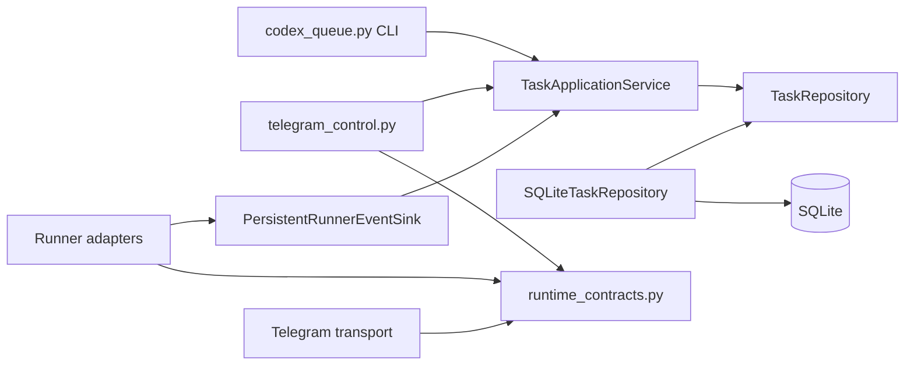

# Application Service Boundaries

This document defines the internal boundaries introduced for roadmap issue #8.
They preserve the current CLI and Telegram behavior while separating queue
persistence, application operations, runtime contracts, and transport adapters.

The change is intentionally incremental. Issue #9 supplies shared Telegram
polling and approval brokering. Issue #10 connects both runners to typed events
and bounded persistent live output. Durable worker ownership and immediate
process cancellation remain assigned to issues #11 through #15.

## Dependency direction

Dependencies point inward toward transport-neutral contracts:

- command adapters may depend on application services;
- application services may depend on repository protocols;
- SQLite implementation details stay in `task_services.py`;
- runner events do not import Telegram or SQLite types;
- Telegram control depends on a transport protocol instead of requiring a
  concrete Bot API client in its constructor;
- persistence and runtime contracts do not depend on CLI argument parsing,
  Telegram payloads, or voice transcription.

## Task persistence

`task_services.py` owns the task persistence boundary.

### `TaskRecord`

`TaskRecord` is the complete transport-neutral representation of a persisted
task. It preserves read-only `sqlite3.Row` access through case-insensitive field
names, integer positions, slices, ordered value iteration, `keys()`, dictionary
conversion, and the same missing-column `IndexError`. Legacy callers can
therefore keep using `task["id"]`, `task["ID"]`, or `task[0]`, while new code can
use typed attributes such as `task.id`. It does not expose `sqlite3.Row` outside
the repository.

### `TaskRepository`

`TaskRepository` defines the persistence operations required by the application
service:

- initialize task storage;
- add and retrieve tasks;
- list tasks in CLI order or Telegram recency order;
- select the next runnable task;
- count tasks by status;
- update task fields;
- perform compare-and-set status transitions;
- start and finalize task runs idempotently;
- append bounded ordered output and read it with sequence cursors.

`transition()` is the atomic state-transition boundary. It updates a task only
when the persisted status belongs to the caller's expected status set. Issue
#11 will use this boundary for atomic claiming and durable worker ownership; #8
introduces and tests the contract without changing current claiming behavior.

### `SQLiteTaskRepository`

`SQLiteTaskRepository` is the current single-host implementation. It owns the
schema and all task SQL. Connections and the clock are injected, which keeps
tests isolated while preserving the existing `codex_queue.DB_PATH` behavior.
It also owns the additive `task_runs` and `task_output_chunks` tables. Append,
deduplication, compaction, and run metadata updates share one short transaction.

### `TaskApplicationService`

`TaskApplicationService` provides the operations used by both entry points:

- local CLI initialization, add, list, scheduling, and updates;
- Telegram status, recent tasks, detail, output tail, guided add, and worker
  scheduling;
- live run start, append, finalization, and cursor reads for future presentation
  adapters.

The public functions in `codex_queue.py` remain compatibility shims. Existing
callers do not need to change, but the shims delegate to the same application
service used by `TelegramControlBot`. The bot accepts an injected service for
deterministic tests and future composition.

## Runtime contracts

`runtime_contracts.py` contains interfaces that must not know about SQLite or
Telegram Bot API payloads.

### Runner events

The runner event union contains:

- `RunnerLifecycleEvent` for start, completion, failure, and cancellation;
- `RunnerOutputEvent` for ordered text chunks;
- `RunnerInteractionEvent` for a transport-neutral request that needs a
  decision.

Every event carries task id, run id, and one shared monotonic sequence. Output
sequences can contain gaps when lifecycle or interaction events occur. PTY
interactions emit requested and resolved states.

`TaskRunner` accepts a `TaskRecord` and an event sink, then returns a normalized
`RunnerResult`. `run_pty_command()` and `run_subprocess_command()` are current
adapters. Issue #9 changed PTY approval waits to consume
`ApprovalDecisionProvider`; issue #10 connects lifecycle and output to
`PersistentRunnerEventSink`.

### Worker supervision

`WorkerSupervisor` defines start, cooperative stop, and observable snapshot
operations. The current `WorkerState` and background-thread behavior remain in
`telegram_control.py`; issue #11 will provide the durable implementation and
immediate process cancellation.

### Telegram transport

`TelegramTransport` defines authorization configuration, polling, message
delivery, callback acknowledgement, and bounded file download operations used
by the control adapter.
`TelegramApprovalBridge` satisfies this protocol structurally.
`TelegramUpdateDispatcher` now owns `getUpdates`, routes control updates, and
resolves approval callbacks through `TelegramApprovalBroker`. The PTY consumes
`TelegramApprovalGateway` through its decision-provider protocol instead of
depending on transport polling.

## Compatibility contract

The #8 extraction preserves:

- CLI subcommands and output formatting;
- the existing `tasks` schema and database rows, with additive live-output tables;
- queue ordering by status, priority, and identifier;
- runnable selection for `PENDING` and elapsed `WAITING_LIMIT` tasks;
- retry, usage-limit resume, session-id, and finalization behavior;
- Telegram authorization, callbacks, buttons, text, and voice commands;
- subprocess and PTY runner selection.

No migration command is required. Initialization creates `task_runs` and
`task_output_chunks` idempotently without rewriting `tasks`. Historical
`tasks.output` remains the final compatibility value; live display chunks are a
separate bounded and normalized projection.

## Characterization coverage

`tests/test_task_services.py` covers persistence ordering, elapsed reset times,
atomic status transitions, live-output migration, cursors, deduplication,
compaction, retention, restart, and finalization.

`tests/test_runner_events.py` and `tests/test_subprocess_runner.py` cover event
projection, terminal normalization, secret redaction boundaries, split ANSI and
UTF-8 input, and subprocess streaming.

`tests/test_codex_queue.py` covers successful finalization, usage-limit
suspension, retry exhaustion, session preservation, and runner dispatch.

`tests/test_telegram_control.py` continues to cover chat authorization,
callbacks, task views, guided add, voice handling, and configuration toggles. It
also verifies that an injected task service is used without global persistence
discovery.

## Deferred work

The following behavior is deliberately outside #8:

- atomic task claiming, leases, recovery, and immediate cancellation: #11;
- the mobile live task console: #12;
- durable interaction audit and lifecycle notifications: #13;
- unified validated configuration and migrations: #14;
- end-to-end release hardening: #15.

The complete issue #10 contract is documented in [LIVE_OUTPUT.md](LIVE_OUTPUT.md).
