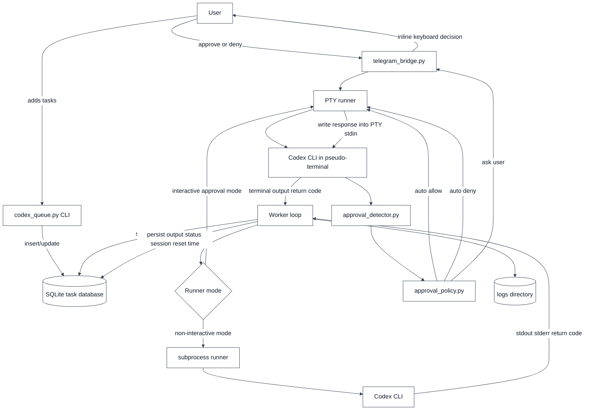
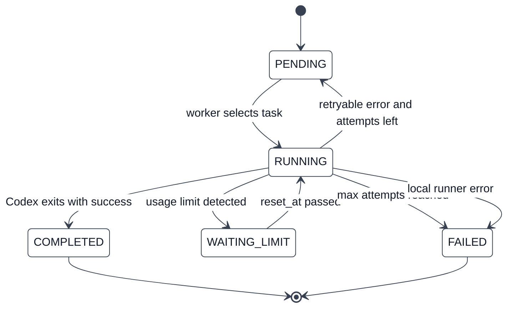
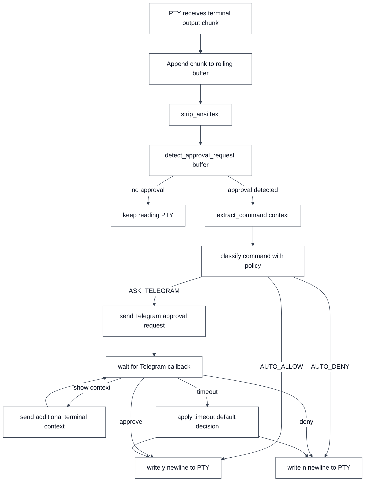
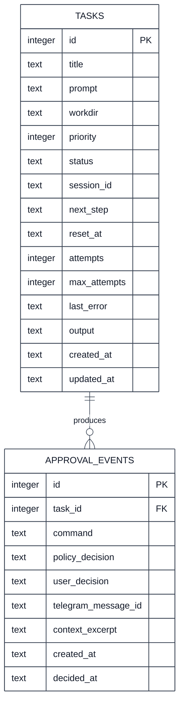
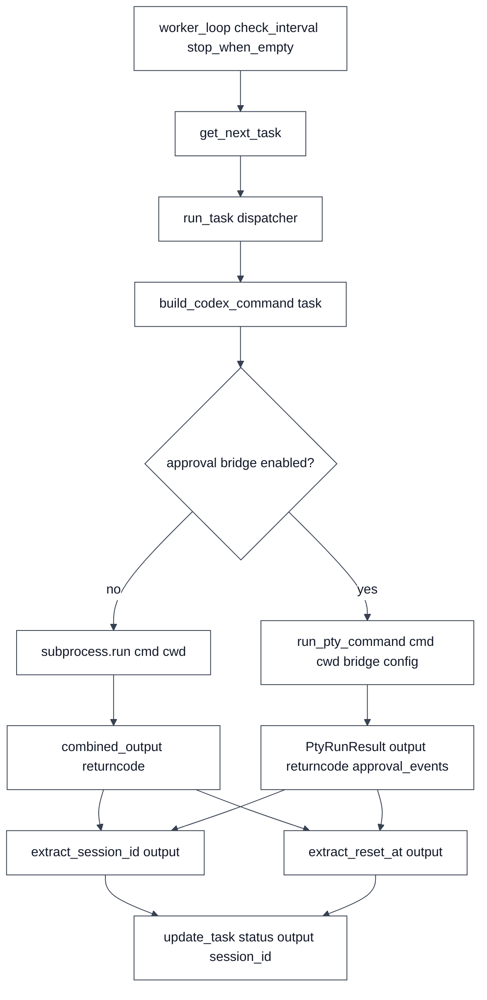
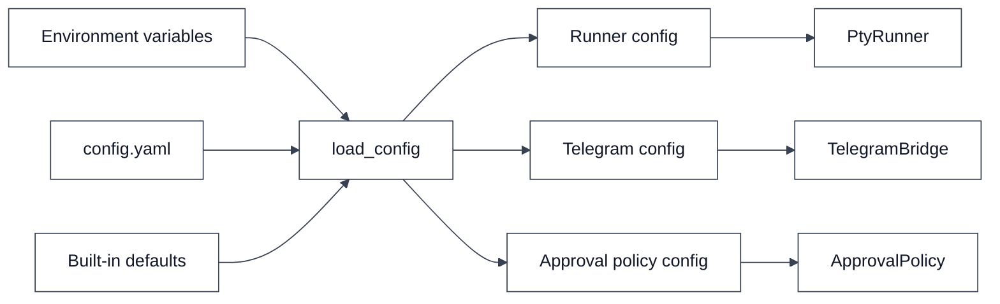

# Architecture

This document describes the v0.2 architecture for Durex.

Durex is evolving from a simple Codex task queue into a local LLM task orchestrator with remote human approval through Telegram.

The main goal of v0.2 is to let Codex run unattended for long sessions while still allowing the user to approve sensitive terminal prompts from a phone.

---

## How to read this document

Each Mermaid diagram shows a different level of the same system. The diagrams
are useful as maps, but the important behavior is in the edges: an edge means
"this component calls, writes to, reads from, or wakes up the next component
when this trigger happens."

At a high level Durex has four responsibilities:

1. store tasks in a local SQLite queue;
2. pick runnable tasks and execute Codex in the selected runner mode;
3. detect interactive approval prompts when the PTY runner is used;
4. optionally ask the user through Telegram before writing an answer back into
   Codex's terminal.

The current implementation is intentionally local-first. There is no server
process required for approvals, and Telegram is used through Bot API long
polling rather than webhooks.

---

## High-level architecture

### What each node does

`User` is the operator who adds tasks, starts the worker, and optionally answers
approval prompts from Telegram. The user is not expected to sit in front of the
terminal once a queue run is started.

`codex_queue.py CLI` is the command-line entry point. It initializes the
database, inserts tasks, lists tasks, runs the worker, validates Telegram
configuration, and starts Telegram remote-control mode.

`SQLite task database` is the source of truth for queued work. It stores task
metadata, status, attempts, output, session ids, usage-limit reset times, and
retry information.

`Worker loop` is the scheduler. It repeatedly asks SQLite for the next runnable
task, starts the selected runner, and persists the final result.

`Runner mode` is the dispatch decision between classic non-interactive
execution and PTY-based interactive execution.

`subprocess runner` runs Codex with `subprocess.run()`. It captures stdout,
stderr, and the return code after Codex exits. It cannot answer interactive
terminal prompts while Codex is running.

`PTY runner` runs Codex inside a pseudo-terminal. It reads terminal output while
the process is alive and can write answers such as `y\n` or `n\n` back into the
terminal.

`Codex CLI` and `Codex CLI in pseudo-terminal` are the external Codex process.
The difference is transport: subprocess mode treats Codex as a normal child
process, while PTY mode gives Codex an interactive terminal.

`approval_detector.py` scans recent PTY output and decides whether the terminal
appears to be waiting for human approval.

`approval_policy.py` classifies the detected command as auto-allow, auto-deny,
or ask-Telegram.

`telegram_bridge.py` is a small Telegram Bot API client. It sends approval
messages, polls for callback queries, validates bot setup, and returns a
normalized approval decision.

`User phone` is where the Telegram inline keyboard is shown. The phone never
executes commands directly; it only sends an approval decision back to the local
runner.

`logs directory` is shown as a future/operational sink for persisted runtime
logs. The current task output is stored in SQLite; richer file logging can be
added later without changing the main flow.

### What triggers each edge

`User -> codex_queue.py CLI` happens when the user runs commands such as
`python3 codex_queue.py add ...`, `run`, `telegram-check`, or
`telegram-control`.

`CLI -> SQLite` happens when the CLI initializes the schema, inserts a task,
lists tasks, or updates task fields.

`Worker loop -> SQLite` happens on every polling iteration. The worker calls
`get_next_task()` and selects the highest-priority runnable task.

`Worker loop -> Runner mode` happens after a task is selected. The configured
`--runner-mode` chooses subprocess or PTY.

`Runner mode -> subprocess runner` is triggered when `--runner-mode subprocess`
is selected. This is the simplest path and waits for Codex to exit.

`Runner mode -> PTY runner` is triggered when `--runner-mode pty` is selected.
This path is required for live approval handling.

`subprocess runner -> Codex CLI` starts Codex with a command built from the task.
If the task has no `session_id`, the command starts a new Codex execution. If it
has a `session_id`, Durex asks Codex to resume that session.

`PTY runner -> Codex CLI in pseudo-terminal` starts the same Codex command, but
connects stdin/stdout/stderr to a pseudo-terminal.

`Codex CLI in pseudo-terminal -> approval_detector.py` is triggered whenever the
PTY runner reads a new chunk of terminal output. The runner appends the chunk to
a rolling buffer and asks the detector whether it looks like an approval prompt.

`approval_detector.py -> approval_policy.py` is triggered only when a prompt is
detected. The detector extracts the likely command and creates an
`ApprovalRequest`.

`approval_policy.py -> PTY runner` with `auto allow` is triggered when the
command matches an auto-allow policy rule. The PTY runner writes `y\n`.

`approval_policy.py -> PTY runner` with `auto deny` is triggered when the
command matches an auto-deny policy rule. The PTY runner writes `n\n`.

`approval_policy.py -> telegram_bridge.py` with `ask user` is triggered when the
policy does not allow a local automatic decision.

`telegram_bridge.py -> User phone` is triggered by `send_approval_request()`.
The bridge sends a Telegram message with inline buttons.

`User phone -> telegram_bridge.py` happens when the user taps approve, deny,
show context, or stop task.

`telegram_bridge.py -> PTY runner` returns the normalized decision after polling
Telegram updates and matching the callback to the pending request id.

`PTY runner -> Codex CLI in pseudo-terminal` writes the final terminal input.
For approval this is usually `y\n`; for denial it is usually `n\n`.

`Codex CLI -> Worker loop` and `Codex CLI in pseudo-terminal -> Worker loop`
happen when the child process exits. The runner returns output and return code.

`Worker loop -> SQLite` persists the outcome. It stores completed output,
failure state, retry state, usage-limit reset time, and any detected Codex
session id.

---

## Main components

```mermaid
%%{init: {"theme": "base", "themeVariables": {"primaryColor": "#ffffff", "primaryTextColor": "#111827", "primaryBorderColor": "#374151", "lineColor": "#374151", "secondaryColor": "#f3f4f6", "tertiaryColor": "#ffffff", "textColor": "#111827", "mainBkg": "#ffffff", "nodeBorder": "#374151", "clusterBkg": "#f9fafb", "clusterBorder": "#9ca3af", "edgeLabelBackground": "#ffffff", "actorBkg": "#ffffff", "actorBorder": "#374151", "actorTextColor": "#111827", "activationBkgColor": "#e5e7eb", "activationBorderColor": "#374151", "signalColor": "#111827", "signalTextColor": "#111827", "noteBkgColor": "#fef3c7", "noteTextColor": "#111827", "noteBorderColor": "#92400e"}}}%%
flowchart LR
    subgraph QueueLayer[Queue layer]
        CLI[codex_queue.py]
        DB[(SQLite)]
    end

    subgraph RunnerLayer[Runner layer]
        BuildCommand[build_codex_command task]
        ClassicRun[run_codex_subprocess task]
        PtyRun[run_codex_pty task config]
    end

    subgraph ApprovalLayer[Approval layer]
        Detector[detect_approval_request text]
        Policy[classify_command command]
        Decision[ApprovalDecision]
    end

    subgraph RemoteLayer[Remote approval layer]
        Bot[TelegramApprovalBridge]
        Request[send_approval_request payload]
        Wait[wait_for_decision request_id]
    end

    CLI --> DB
    DB --> BuildCommand
    BuildCommand --> ClassicRun
    BuildCommand --> PtyRun
    PtyRun --> Detector
    Detector --> Policy
    Policy --> Decision
    Decision --> Request
    Request --> Bot
    Bot --> Wait
    Wait --> PtyRun
    ClassicRun --> DB
    PtyRun --> DB
```

### Component groups

`Queue layer` owns persistent state. The CLI writes user intent into SQLite, and
the worker reads that state later. This keeps task creation separate from task
execution.

`Runner layer` turns a queued task into a Codex process. `build_codex_command`
decides whether to start a new Codex run or resume a previous session.
`ClassicRun` is the subprocess path. `PtyRun` is the interactive path with
approval support.

`Approval layer` is pure decision plumbing. The detector recognizes that a
prompt exists, the policy decides how to handle the command, and the decision is
converted into terminal input or a Telegram request.

`Remote approval layer` performs Telegram-specific I/O. It should stay separate
from detector and policy logic so the approval model can later support other
channels or structured Codex events.

### Edge triggers in this diagram

`CLI -> DB` is triggered by queue commands such as `init`, `add`, `seed`, and
`list`.

`DB -> BuildCommand` is triggered after `get_next_task()` returns a task row.

`BuildCommand -> ClassicRun` is triggered by subprocess runner mode.

`BuildCommand -> PtyRun` is triggered by PTY runner mode.

`PtyRun -> Detector` is triggered by each readable PTY output chunk.

`Detector -> Policy` is triggered only after the detector recognizes an approval
prompt and extracts enough context to build an `ApprovalRequest`.

`Policy -> Decision` is the classification result: `AUTO_ALLOW`, `AUTO_DENY`,
or `ASK_TELEGRAM`.

`Decision -> Request` happens only for `ASK_TELEGRAM`; automatic policy
decisions go directly back to the PTY runner instead.

`Request -> Bot` sends the Telegram message through the Bot API.

`Bot -> Wait` starts long polling for the matching callback query.

`Wait -> PtyRun` returns the final approval decision, which the PTY runner turns
into terminal input.

`ClassicRun -> DB` and `PtyRun -> DB` happen after the child process exits and
the worker calls the shared output finalization path.

---

## Task lifecycle

### State meanings

`PENDING` means the task is queued and can be selected by the worker. New tasks
start here.

`RUNNING` means a worker has selected the task and started a Codex process. The
task attempt count is incremented before the process starts.

`COMPLETED` means Codex exited successfully with return code `0`.

`WAITING_LIMIT` means the output looked like a usage-limit or rate-limit
failure. The task is not runnable again until `reset_at` has passed.

`FAILED` means Durex does not plan to retry the task. This can happen because
the maximum number of attempts was reached or because the local runner failed.

### Transition triggers

`[*] -> PENDING` happens when `add_task()` inserts a new row.

`PENDING -> RUNNING` happens when `get_next_task()` selects the task and
`run_task()` dispatches it.

`RUNNING -> COMPLETED` happens when the runner returns `returncode == 0`.

`RUNNING -> WAITING_LIMIT` happens when the output contains usage-limit markers
such as "usage limit", "rate limit", "quota", "429", or similar text. Durex
also tries to extract a reset timestamp; if it cannot, it uses a conservative
default retry delay.

`WAITING_LIMIT -> RUNNING` happens when `reset_at <= now` and the worker selects
the task again.

`RUNNING -> PENDING` happens after a non-zero return code when attempts remain.
The next worker pass can retry the task.

`RUNNING -> FAILED` via "max attempts reached" happens when the task has used
all configured attempts.

`RUNNING -> FAILED` via "local runner error" happens when Durex itself cannot
start or manage the run, for example because Telegram configuration is invalid
or the process cannot be spawned.

---

## PTY approval pipeline

### Node responsibilities

`PTY receives terminal output chunk` is the moment `select()` reports that the
child process has data available on the PTY master file descriptor.

`Append chunk to rolling buffer` keeps recent terminal output for prompt
detection. Full output is stored separately for final task persistence.

`strip_ansi text` removes terminal colors, cursor control, carriage returns, and
other formatting that would make regex matching unreliable.

`detect_approval_request buffer` checks whether recent output looks like an
interactive approval prompt. It returns `None` when the runner should keep
reading.

`extract_command context` tries to identify the command that Codex wants to run.
It looks for fenced shell blocks, explicit labels such as `Command:`, shell
prompt lines beginning with `$`, and common command prefixes.

`classify command with policy` applies the approval policy. Known safe commands
can be approved automatically, known dangerous commands can be denied
automatically, and ambiguous commands can be sent to Telegram.

`write y newline to PTY` simulates the user typing yes.

`write n newline to PTY` simulates the user typing no.

`send Telegram approval request` creates a Telegram message with inline buttons
and enough context for the user to decide.

`wait for Telegram callback` polls Bot API updates until the matching callback
arrives or the approval timeout expires.

`send additional terminal context` sends a second Telegram message with more PTY
context when the user taps "Show context". It does not answer the Codex prompt.

`apply timeout default decision` applies the configured timeout behavior. The
safe default is deny.

### Edge triggers in the PTY pipeline

`A -> B` is triggered by new bytes from the PTY.

`B -> C` is triggered immediately after appending the bytes to the rolling
buffer.

`C -> D` is triggered every time the runner has normalized recent terminal
text.

`D -> E` happens when no approval prompt is detected.

`D -> F` happens when the detector returns an `ApprovalRequest`.

`F -> G` happens after command extraction. The command can be `None`; missing
commands are classified conservatively.

`G -> H` happens when the policy returns `AUTO_ALLOW`.

`G -> I` happens when the policy returns `AUTO_DENY`.

`G -> J` happens when the policy returns `ASK_TELEGRAM`.

`J -> K` happens after the Telegram approval message is sent.

`K -> H` happens when Telegram returns approve.

`K -> I` happens when Telegram returns deny, or when an unknown non-final action
is treated conservatively.

`K -> L -> K` happens when the user asks for more context. The runner keeps
waiting for a final approve, deny, stop, or timeout result.

`K -> M` happens when the timeout expires.

`M -> H` or `M -> I` depends on the configured timeout default decision.

---

## Data model overview

The current database table is intentionally simple. v0.2 can keep the same task table and add optional fields later.

### Table roles

`TASKS` is implemented today. It contains all queue and execution state needed
for the current worker.

`APPROVAL_EVENTS` is the planned audit table. The PTY runner already returns
in-memory `ApprovalAuditEvent` objects, but this table is not yet persisted in
the current schema.

### TASKS fields

`id` is the primary key used by the worker and CLI.

`title` is a short human-readable task name.

`prompt` is the original instruction passed to Codex for a new task.

`workdir` is the directory where Codex should run.

`priority` controls task ordering. Lower values run earlier.

`status` is one of `PENDING`, `RUNNING`, `WAITING_LIMIT`, `COMPLETED`, or
`FAILED`.

`session_id` stores the detected Codex session id so a future attempt can
resume.

`next_step` stores the follow-up instruction used when resuming a task.

`reset_at` stores the timestamp after which a usage-limited task can run again.

`attempts` and `max_attempts` control retry behavior.

`last_error` stores a compact error summary useful for list/status output.

`output` stores the captured runner output.

`created_at` and `updated_at` are ISO timestamps for queue bookkeeping.

### APPROVAL_EVENTS fields

`task_id` links the approval event back to the task that produced it.

`command` stores the command detected from terminal output.

`policy_decision` stores the local policy classification.

`user_decision` stores the final approve, deny, stop, or timeout result.

`telegram_message_id` links the audit record to the Telegram message when the
decision came from Telegram.

`context_excerpt` stores the relevant terminal text shown to the user.

`created_at` and `decided_at` show how long the approval stayed open.

### Relationship trigger

`TASKS ||--o{ APPROVAL_EVENTS : produces` means one task can produce zero, one,
or many approval events. A task produces an approval event only when the PTY
runner detects a prompt and records a decision.

---

## Function-level data flow

### Function roles

`worker_loop(check_interval, stop_when_empty)` owns the continuous worker
process. It sleeps between checks when no task is ready, unless
`stop_when_empty` asks it to exit.

`get_next_task()` queries SQLite for the next `PENDING` task or
`WAITING_LIMIT` task whose `reset_at` has passed.

`run_task(task, runner_mode, telegram_enabled, telegram_verbosity, echo_output)`
is the dispatcher that chooses subprocess or PTY execution.

`build_codex_command(task)` builds the argument list for Codex. New tasks run
`codex exec <prompt>`. Resumed tasks run `codex exec resume <session_id>
<followup>`.

`approval bridge enabled?` represents whether the run was started in PTY mode
with Telegram approvals enabled.

`subprocess.run(cmd, cwd)` is the classic blocking runner path.

`run_pty_command(cmd, cwd, bridge, config)` is the interactive runner path.

`combined_output returncode` is stdout plus stderr and the process exit code
from subprocess mode.

`PtyRunResult output returncode approval_events` is the structured result from
PTY mode.

`extract_session_id(output)` scans output for the latest plausible Codex
session id.

`extract_reset_at(output)` scans output for a usage-limit reset timestamp.

`update_task(status, output, session_id)` persists final state.

### Edge triggers in function flow

`A -> B` happens on every worker iteration.

`B -> C` happens when a runnable task is found.

`C -> D` happens before spawning Codex.

`D -> E` happens after the command list is built.

`E -> F` happens when the run uses subprocess mode or Telegram approval is not
needed.

`E -> G` happens when PTY mode is selected. If Telegram is enabled, the bridge is
passed into the PTY runner.

`F -> H` happens when the subprocess exits.

`G -> I` happens when the PTY process exits or is stopped.

`H -> J`, `H -> K`, `I -> J`, and `I -> K` happen during shared output
finalization.

`J -> L` and `K -> L` happen when extracted session/reset information is merged
into the task update.

---

## Configuration flow

### Configuration nodes

`Environment variables` hold secrets and deployment-specific values. Telegram
bot tokens and chat ids should come from environment variables, not committed
files.

`config.yaml` is the planned file-based configuration source for non-secret
settings such as runner defaults, policy rules, and timeouts.

`Built-in defaults` provide safe behavior when no explicit configuration exists.
For example, unknown commands should require human approval rather than being
auto-approved.

`load_config` is the planned merge point. It should read defaults, then config
files, then environment overrides.

`Runner config` controls subprocess vs PTY behavior and PTY-specific options.

`Telegram config` controls bot token env names, allowed chat id env names,
verbosity, timeouts, and timeout default decisions.

`Approval policy config` controls auto-allow, ask-Telegram, and auto-deny rules.

`PtyRunner`, `TelegramBridge`, and `ApprovalPolicy` are the runtime objects that
consume those settings.

### Configuration edge triggers

`Env -> ConfigLoader`, `File -> ConfigLoader`, and `Defaults -> ConfigLoader`
happen at application startup or worker startup.

`ConfigLoader -> RunnerConfig` happens when runner options are normalized.

`ConfigLoader -> TelegramConfig` happens when Telegram settings are extracted
and validated.

`ConfigLoader -> PolicyConfig` happens when policy rules are parsed.

`RunnerConfig -> PtyRunner` happens when a PTY run is started.

`TelegramConfig -> TelegramBridge` happens when Telegram approvals or
`telegram-check` need Bot API access.

`PolicyConfig -> ApprovalPolicy` happens before command classification.

---

## Security boundaries

Durex v0.2 should keep these boundaries clear:

1. The Telegram bot does not execute commands directly.
2. Telegram only returns a decision to the local PTY runner.
3. The local Codex process remains the only process receiving terminal input.
4. The policy engine decides whether a command can be auto-approved, denied, or sent to Telegram.
5. All approval decisions should be logged for auditing.

---

## Why PTY first

PTY is the practical v0.2 choice because it can operate with the existing interactive terminal behavior. It does not require Codex to expose every approval event as structured data.

The tradeoff is that PTY parsing is text-based and therefore less stable than structured events. For that reason, the roadmap keeps structured event support as the v0.3/v0.4 direction.
