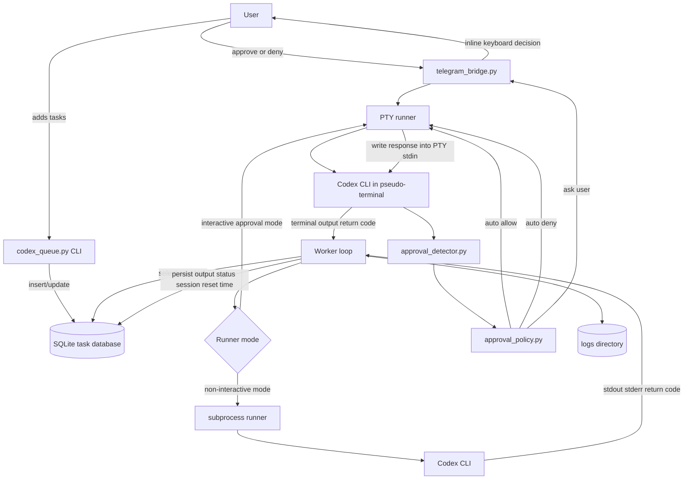
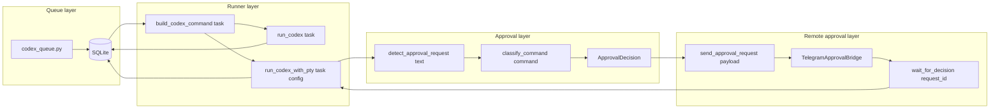
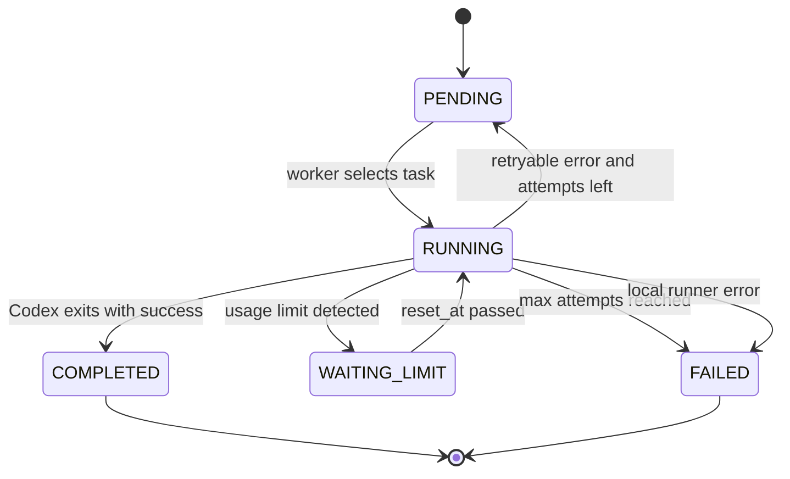
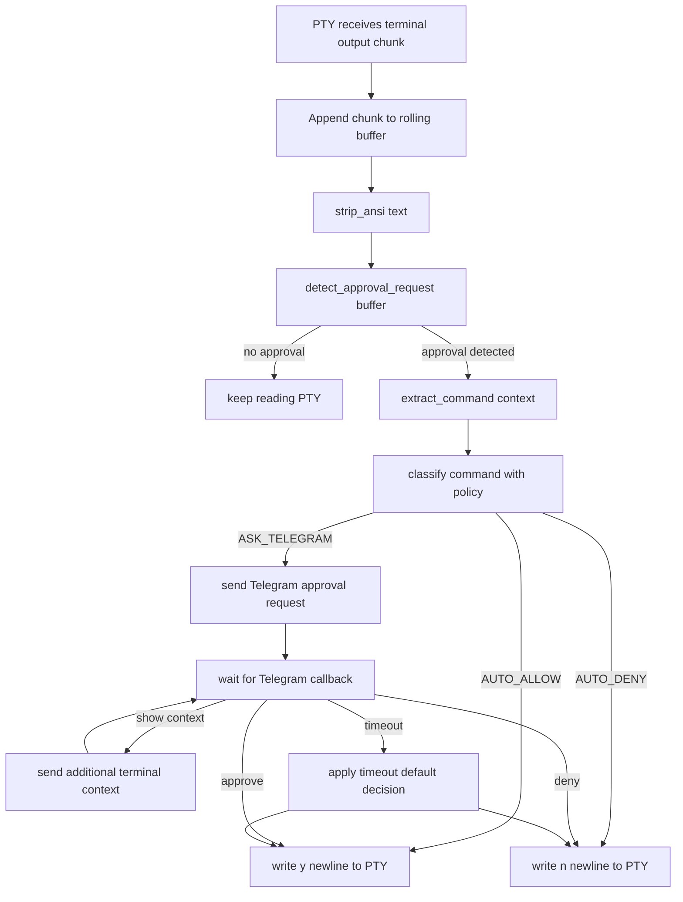
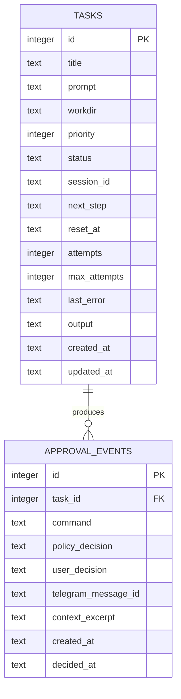
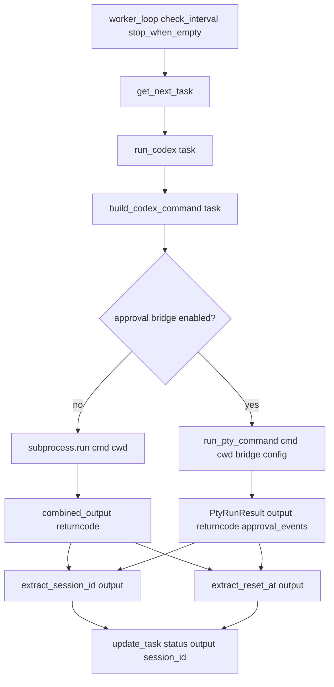
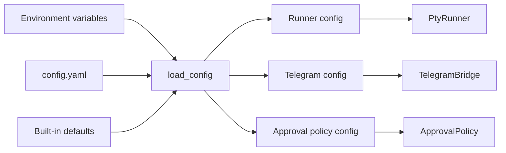

# Architecture

This document describes the planned v0.2 architecture for Durex.

Durex is evolving from a simple Codex task queue into a local LLM task orchestrator with remote human approval through Telegram.

The main goal of v0.2 is to let Codex run unattended for long sessions while still allowing the user to approve sensitive terminal prompts from a phone.

---

## High-level architecture

---

## Main components

---

## Task lifecycle

---

## PTY approval pipeline

---

## Data model overview

The current database table is intentionally simple. v0.2 can keep the same task table and add optional fields later.

---

## Function-level data flow

---

## Configuration flow

---

## Security boundaries

Durex v0.2 should keep these boundaries clear:

1. The Telegram bot does not execute commands directly.
2. Telegram only returns a decision to the local PTY runner.
3. The local Codex process remains the only process receiving terminal input.
4. The policy engine decides whether a command can be auto-approved, denied, or sent to Telegram.
5. All approval decisions should be logged for auditing.

---

## Why PTY first

PTY is the practical v0.2 choice because it can operate with the existing interactive terminal behavior. It does not require Codex to expose every approval event as structured data.

The tradeoff is that PTY parsing is text-based and therefore less stable than structured events. For that reason, the roadmap keeps structured event support as the v0.3/v0.4 direction.
