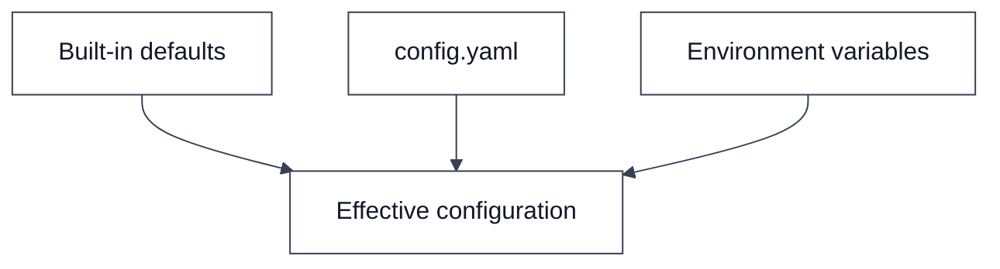
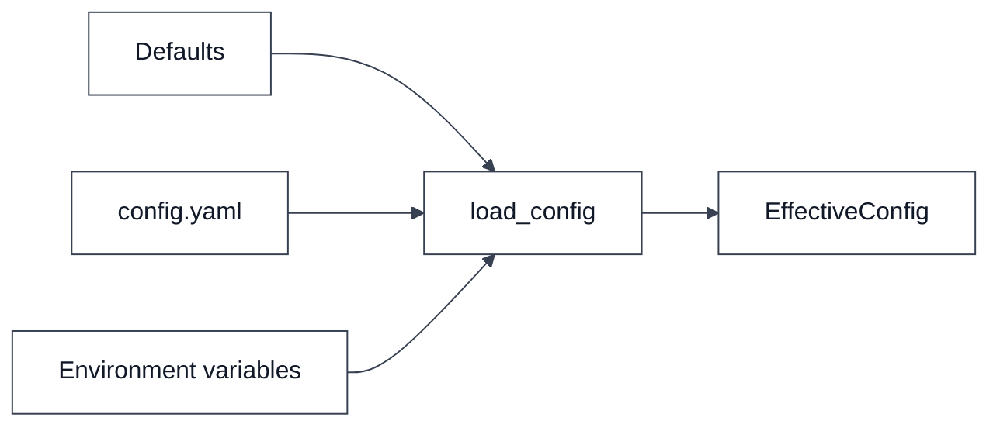

# Configuration

This document describes the planned configuration model for Durex v0.2.

The objective is to move runtime settings out of the source code and into a configuration file while still allowing environment-variable overrides for secrets.

---

## How to read this document

Configuration is described as a merge pipeline. Built-in defaults provide safe
fallbacks, `config.yaml` stores normal project settings, and environment
variables override values that are deployment-specific or secret.

Every diagram edge should be read as a merge or load trigger. The arrows do not
mean all sources have equal priority. They mean each source contributes values to
the final runtime configuration, with environment variables winning over file
settings and file settings winning over defaults.

The application should use the final `EffectiveConfig` object. Individual
modules should not repeatedly parse YAML or read environment variables directly
unless they are part of the configuration loader boundary.

---

## Configuration sources

The recommended precedence order is:



### Source nodes

`Built-in defaults` are constants compiled into Durex. They keep the application
usable when no configuration file exists.

`config.yaml` is the project-level configuration file. It should contain normal
runtime preferences such as runner mode, timeout values, logging settings, and
policy defaults.

`Environment variables` are the deployment-level override layer. They are
especially important for secrets, local machine paths, and values that should not
be committed.

`Effective configuration` is the merged result consumed by the rest of the
application.

### Source edge triggers

`Built-in defaults -> Effective configuration` is triggered at loader startup.
The loader begins with defaults so every supported setting has a known value.

`config.yaml -> Effective configuration` is triggered when a configuration file
is present and can be parsed.

`Environment variables -> Effective configuration` is triggered after file
loading. This last step allows local shell configuration to override checked-in
defaults safely.

Priority:

```text
Environment variables
    > config.yaml
        > built-in defaults
```

---

## Configuration file

Example:

```yaml
runner:
  mode: pty
  check_interval_seconds: 60
  default_retry_hours: 5

telegram:
  enabled: true
  bot_token_env: DUREX_TELEGRAM_BOT_TOKEN
  allowed_chat_id_env: DUREX_TELEGRAM_CHAT_ID
  verbosity: normal
  approval_timeout_seconds: 900
  timeout_default_decision: deny

policy:
  default_decision: ask

logging:
  directory: logs
  approval_audit_enabled: true
```

---

## Runner section

```yaml
runner:
  mode: pty
  check_interval_seconds: 60
  default_retry_hours: 5
```

### mode

Allowed values:

```text
pty
events
```

Meaning:

| Value | Meaning |
|---|---|
| `pty` | Run Codex inside a pseudo-terminal |
| `events` | Use structured event mode when available |

Recommended v0.2 value:

```yaml
mode: pty
```

---

### check_interval_seconds

How often the worker checks for runnable tasks.

Example:

```yaml
check_interval_seconds: 60
```

Equivalent to:

```python
worker_loop(check_interval=60)
```

---

### default_retry_hours

Fallback delay when a usage-limit reset timestamp cannot be extracted.

Example:

```yaml
default_retry_hours: 5
```

Behavior:

```text
reset_at = utc_now + default_retry_hours
```

---

## Telegram section

```yaml
telegram:
  enabled: true
  bot_token_env: DUREX_TELEGRAM_BOT_TOKEN
  allowed_chat_id_env: DUREX_TELEGRAM_CHAT_ID
  verbosity: normal
  approval_timeout_seconds: 900
  timeout_default_decision: deny
```

### enabled

Enable or disable Telegram approvals.

```yaml
enabled: true
```

---

### bot_token_env

Environment variable containing the bot token.

```yaml
bot_token_env: DUREX_TELEGRAM_BOT_TOKEN
```

Example:

```bash
export DUREX_TELEGRAM_BOT_TOKEN="example-token"
```

---

### allowed_chat_id_env

Environment variable containing the authorized Telegram chat id.

```yaml
allowed_chat_id_env: DUREX_TELEGRAM_CHAT_ID
```

Example:

```bash
export DUREX_TELEGRAM_CHAT_ID="123456789"
```

---

### verbosity

Controls the amount of information sent to Telegram.

Allowed values:

```text
compact
normal
verbose
```

Comparison:

| Mode | Content |
|---|---|
| compact | task and command |
| normal | task, command, reason |
| verbose | task, command, reason and terminal context |

---

### approval_timeout_seconds

Maximum time to wait for a Telegram decision.

Example:

```yaml
approval_timeout_seconds: 900
```

Meaning:

```text
15 minutes
```

---

### timeout_default_decision

Decision applied when the timeout expires.

Allowed values:

```text
approve
deny
stop
```

Recommended value:

```yaml
timeout_default_decision: deny
```

---

## Policy section

```yaml
policy:
  default_decision: ask
```

The policy engine decides whether an approval request:

```text
is automatically approved
is automatically denied
must be sent to Telegram
```

---

### default_decision

Allowed values:

```text
ask
approve
deny
```

Recommended value:

```yaml
default_decision: ask
```

---

### Future policy rules

A future version can support explicit rule lists.

Example:

```yaml
policy:
  default_decision: ask

  auto_allow:
    - test commands
    - static analysis commands

  ask_telegram:
    - repository modification commands
    - package installation commands

  auto_deny:
    - explicitly forbidden operations
```

The exact syntax can evolve without changing the overall architecture.

---

## Logging section

```yaml
logging:
  directory: logs
  approval_audit_enabled: true
```

### directory

Directory used for log files.

```yaml
directory: logs
```

Future layout:

```text
logs/
  task_1.log
  task_2.log
  task_3.log
```

---

### approval_audit_enabled

Enable audit logging of approval decisions.

```yaml
approval_audit_enabled: true
```

Future output:

```text
approval_audit.log
```

Example event:

```text
2026-05-30T22:15:00Z
request_id=abc123
source=telegram
action=approve
```

---

## Configuration loader

Recommended architecture:



### Loader nodes

`Defaults` contains the base dataclass or dictionary values used when no external
configuration is present.

`config.yaml` contains persisted user configuration.

`Environment variables` contains process-level overrides such as Telegram token
and chat-id variable names.

`load_config` is the only component that should understand how to combine all
configuration sources.

`EffectiveConfig` is the normalized object passed to runners, policies, Telegram
bridges, logging, and future integrations.

### Loader edge triggers

`Defaults -> load_config` is triggered before any external data is read.

`config.yaml -> load_config` is triggered when the configured file path exists.
Missing files should keep defaults rather than failing startup.

`Environment variables -> load_config` is triggered after YAML parsing so env
values can override file values.

`load_config -> EffectiveConfig` is triggered after validation and type
normalization. At this point integers, booleans, enums, paths, and timeout values
should already be converted into the shapes expected by runtime code.

The rest of the application should depend only on:

```text
EffectiveConfig
```

and not directly on environment variables or YAML parsing.

---

## Future configuration areas

Future versions may add:

```yaml
github:
  enabled: true

workflow:
  enabled: true

web:
  enabled: true

workers:
  count: 4
```

The v0.2 design should keep configuration modular enough to support these additions without redesigning the entire file.
