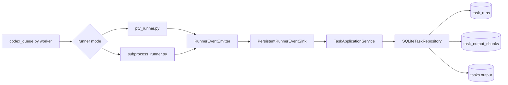

# Live Runner Output

This document defines the live-output contract delivered for roadmap issue
[#10](https://github.com/kinderp/durex/issues/10). It covers typed runner
events, SQLite projection, cursor reads, retention, normalization, migration,
failure behavior, and the boundaries left for later roadmap issues.

## User outcome

Both supported runner modes now publish output while Codex is still running.
The output is normalized and stored in SQLite in short transactions, so another
thread can query it without waiting for process completion.

This change supplies the runtime and persistence contract. The current
Telegram `/tail` command still reads the historical `tasks.output` field.
Refresh, More, and live-console buttons are intentionally assigned to issue
[#12](https://github.com/kinderp/durex/issues/12).

## Runtime flow



`Worker -> runner mode` is triggered after the queue selects a runnable task and
increments its attempt count.

`PTY/subprocess -> RunnerEventEmitter` is triggered by process start, every
decoded output chunk, PTY approval interaction changes, and process exit.

`RunnerEventEmitter -> PersistentRunnerEventSink` is synchronous. A persistence
failure aborts the owned child process instead of silently claiming that live
output remains available.

`PersistentRunnerEventSink -> TaskApplicationService` normalizes display output
and maps lifecycle events into an additive SQLite projection.

`SQLiteTaskRepository -> task_runs/task_output_chunks` uses one short
transaction per event. `tasks.output` remains the historical final result and
is written by the established queue finalization path.

## Event contract

Every event carries:

- `task_id`: queue task identity;
- `run_id`: random identity for one execution attempt;
- `sequence`: strictly increasing event position within that run.

The event union in `runtime_contracts.py` contains:

| Event | Meaning |
|---|---|
| `RunnerLifecycleEvent` | `started`, `completed`, `failed`, or `cancelled` |
| `RunnerOutputEvent` | One incrementally decoded output chunk |
| `RunnerInteractionEvent` | An interaction in `requested` or `resolved` state |

Output sequences may contain gaps because lifecycle and interaction events use
the same sequence space. Consumers must compare numbers, not assume contiguous
output chunk identifiers.

PTY approval interactions use the detector request id as `interaction_id`.
Their resolved event records the final action and source. Interaction events
are not persisted in issue #10; durable interaction audit belongs to issue
[#13](https://github.com/kinderp/durex/issues/13).

## Runner behavior

### PTY

`run_pty_command()` uses an incremental UTF-8 decoder. A multibyte character
split across two `os.read()` calls is emitted once without introducing a
replacement character. The runner emits output before approval detection so a
reader can observe the same text that triggered an interaction.

A Telegram Stop decision emits `cancelled`. Normal zero exit emits `completed`;
normal non-zero exit emits `failed`. If an event consumer raises, the runner
terminates the owned child before propagating the error.

### Subprocess

`run_subprocess_command()` replaces final-only `subprocess.run()` capture. It
uses a selector to drain stdout and stderr independently, with one incremental
UTF-8 decoder per stream. Chunks are emitted in observed readiness order.

The historical compatibility value remains:

```text
stdout + "\n" + stderr
```

Live chunks are interleaved by observed pipe readiness, while historical final
output keeps stdout and stderr grouped as before.

## SQLite schema

Initialization creates two additive tables. The existing `tasks` table is not
rewritten.

### `task_runs`

One row represents one execution attempt. It stores:

- `run_id`, `task_id`, and attempt number;
- lifecycle status and return code;
- start, update, and finish timestamps;
- latest persisted lifecycle/output sequence;
- sequence and character metadata for compacted output.

### `task_output_chunks`

One row stores one normalized display chunk. `(run_id, sequence)` is the primary
key. Replaying the same sequence and text is a no-op. Reusing a retained
sequence with different text or appending a late sequence violates the
repository contract and raises `TaskRepositoryError`.

The live projection preserves observed stdout/stderr readiness order but does
not store a stream label. The final compatibility output still keeps stdout and
stderr grouped as described above. While a run is active,
`last_event_sequence` is the latest persisted lifecycle/output position and may
temporarily lag an interaction event because durable interaction storage is
deferred to issue #13.

## Migration

No separate migration command is required. Any operation that initializes
`TaskApplicationService` executes idempotent `CREATE TABLE IF NOT EXISTS` and
`CREATE INDEX IF NOT EXISTS` statements. Existing task rows and historical
output remain unchanged.

The migration is additive, but operators should still back up
`codex_tasks.db` before deploying a new Durex revision when the database is
important.

## Retention

Built-in limits apply per run:

| Limit | Default |
|---|---:|
| Display characters | 200,000 |
| Chunks | 1,000 |
| Retained finished runs per task | 3 |

Compaction happens in the same transaction as append. It keeps the newest
suffix, removes complete oldest chunks until both limits are satisfied, and
records `dropped_through_sequence` plus `dropped_chars`. A single oversized
chunk keeps only its newest suffix.

Starting a new run prunes finished history beyond the configured count. Active
`started` rows are never pruned because issue #10 cannot decide whether another
worker still owns them. Lease and stale-run recovery belong to issue
[#11](https://github.com/kinderp/durex/issues/11).

These are constructor defaults, not YAML or environment options. Unified
configuration and validation belong to issue
[#14](https://github.com/kinderp/durex/issues/14).

## Cursor reads

`TaskApplicationService.live_output()` returns a `LiveOutputPage` for an
explicit run or the newest run for a task.

```python
page = tasks.live_output(task_id, limit=100)
newer = tasks.live_output(
    task_id,
    run_id=page.run_id,
    after_sequence=page.chunks[-1].sequence,
)
older = tasks.live_output(
    task_id,
    run_id=page.run_id,
    before_sequence=page.chunks[0].sequence,
)
```

With no cursor, the service returns the newest page. `after_sequence` supports
Refresh without returning the cursor chunk again. `before_sequence` supports
More without returning the current first chunk again. The two cursors cannot be
combined in one call.

`has_older`, `has_more`, `first_available_sequence`,
`dropped_through_sequence`, and `dropped_chars` tell a presentation layer
whether older data exists or was compacted. Callers must retain `run_id`; a new
attempt starts a new sequence space.

## Finalization and recovery

Terminal lifecycle finalization is compare-and-set behavior:

- the first terminal event closes a `started` run;
- an identical replay is a no-op;
- a conflicting terminal replay raises `TaskRepositoryError`;
- output cannot be appended after finalization.

If runner code raises after `started`, `PersistentRunnerEventSink.fail_open_run()`
marks the live run `failed` once. A host crash can still leave `started` rows;
issue #11 will add durable worker ownership, heartbeat, and restart recovery.
If that cleanup also fails, queue finalization preserves the original runner
error and appends the cleanup error as secondary diagnostic context.

The run status describes the child execution. Queue finalization can still move
a task to `WAITING_LIMIT` after a non-zero child exit when usage-limit text is
detected.

## Display and security boundary

The live projection is display-oriented:

- PTY and pipe bytes are decoded incrementally as UTF-8 with replacement only
  for truly invalid final byte sequences;
- CSI, OSC, and single-character ANSI controls are removed across chunk
  boundaries;
- carriage returns are normalized to line breaks and CRLF becomes one newline;
- unsafe control characters are removed;
- obvious `token=`, `password=`, `secret=`, `api_key=`, and bearer values are
  redacted with the existing display redactor.

This is best-effort display redaction, not a data-loss-prevention system.
Secrets split across unrelated text events or using unknown formats may remain.
The historical `tasks.output` field preserves decoded runner output for
compatibility and is not redacted by this projection. Protect the SQLite file as
sensitive local data and do not expose it through an unauthorized interface.

## Concurrency

Each append opens a separate SQLite connection and completes validation,
insert, compaction, and metadata update in one short transaction. Readers use
separate connections and never share mutable cursor objects with the runner.
Run start, append, and finalization acquire a SQLite `BEGIN IMMEDIATE` write
reservation before reading mutable run state. This serializes competing writers
without excluding normal readers during validation and prevents stale sequence
checks from moving a cursor backward.

Issue #10 does not provide multi-process task ownership. Two workers can still
claim the same task through the existing non-atomic scheduling path; issue #11
owns atomic claims and leases.

## Validation coverage

The test suite covers:

- ordered lifecycle, output, and interaction events;
- UTF-8 characters split across PTY reads;
- stdout and stderr streaming;
- output query before PTY and subprocess exit;
- ANSI sequences split across output events;
- display redaction and control normalization;
- duplicate, conflicting, and non-monotonic sequences;
- bounded characters, bounded chunks, and dropped-cursor metadata;
- additive schema migration and service restart;
- finished-run retention;
- completed, failed, cancelled, and fail-open finalization;
- idempotent terminal replay.

## Deferred work

- Atomic claims, leases, stale-run recovery, and immediate cancellation: #11.
- Telegram Refresh, More, and live task console presentation: #12.
- Durable interaction audit and lifecycle notifications: #13.
- YAML/environment configuration for retention limits: #14.
- End-to-end restart and Telegram release hardening: #15.
