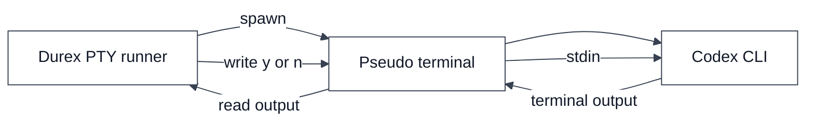
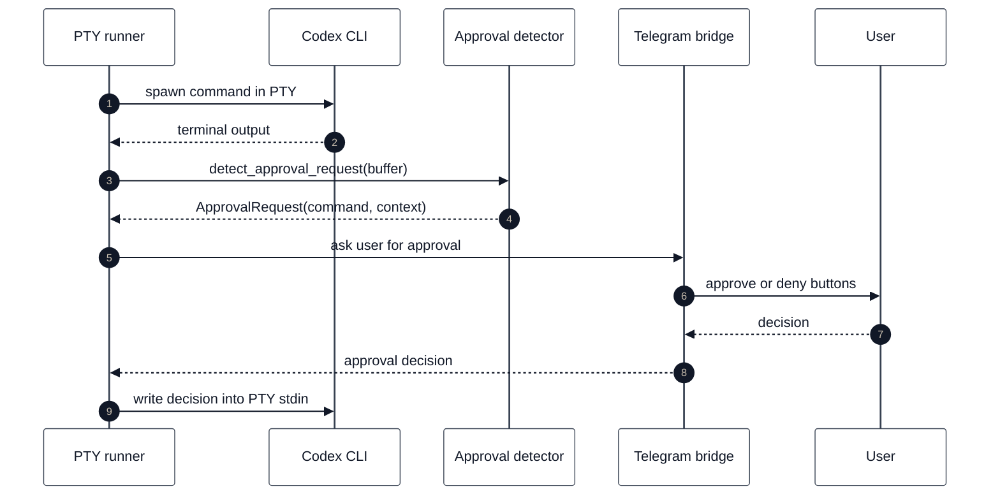
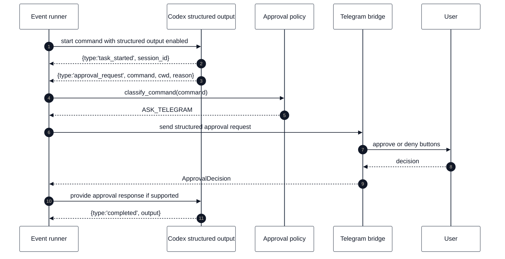
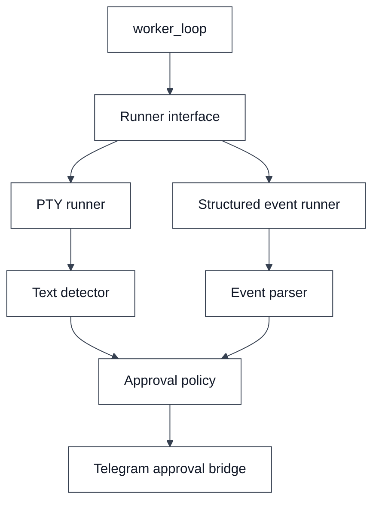
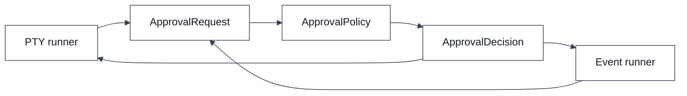

# PTY Bridge vs Structured Events

This document compares the two integration strategies discussed for Durex v0.2 and beyond.

Durex needs to observe Codex execution, detect approval requests, send them to Telegram, receive the user decision and feed that decision back into the running task.

There are two main ways to do that:

1. PTY bridge
2. Structured events

---

## How to read this comparison

This document is not only a roadmap discussion. It is also a guide to the two
possible runtime integration models.

For each diagram, read every node as a runtime responsibility and every edge as
a trigger. A trigger can be a process spawn, a chunk of terminal output, a JSON
event, a policy result, a Telegram callback, or a write back into the running
Codex process.

The central design question is: should Durex infer what Codex is doing by
watching terminal text, or should Codex report what it is doing through explicit
machine-readable events?

PTY is the current practical path because it works with existing interactive
terminal behavior. Structured events are the cleaner long-term path because
they remove most text parsing heuristics.

---

## Executive summary

| Area | PTY bridge | Structured events |
|---|---|---|
| Works with interactive terminal behavior | Yes | Not always |
| Reads what a human sees | Yes | No |
| Stable machine-readable data | No | Yes |
| Easy first implementation | Yes | Depends on event coverage |
| Approval detection | Text patterns | Event types |
| Telegram bridge support | Yes | Yes |
| Audit trail quality | Medium | High |
| Future-proof design | Medium | High |
| Best version fit | v0.2 | v0.3+ |

The recommended roadmap is:

```text
v0.2: PTY bridge first
v0.3+: structured events when the event stream exposes enough data
```

---

## PTY bridge

A PTY bridge launches Codex inside a pseudo-terminal. From Codex's point of view, it is running in a real terminal. From Durex's point of view, the PTY is a stream of terminal output plus a writable input channel.



### PTY bridge nodes

`Durex PTY runner` is the local controller implemented by `run_pty_command()`.
It starts the child process, reads output, detects prompts, applies policy, and
writes final answers back into the terminal.

`Pseudo terminal` is the operating-system PTY pair created with `pty.openpty()`.
To Codex it looks like a real terminal. To Durex it is a file descriptor that
can be read from and written to.

`Codex CLI` is the child process running inside the PTY. It prints normal
terminal output, may redraw lines with ANSI/control sequences, and may ask for
interactive approval.

### PTY bridge edge triggers

`Durex PTY runner -> Pseudo terminal` with `spawn` is triggered when the worker
chooses PTY mode and calls `spawn_pty_process(cmd, cwd)`.

`Pseudo terminal -> Codex CLI` starts the child process with stdin, stdout, and
stderr attached to the slave side of the PTY.

`Codex CLI -> Pseudo terminal` with `terminal output` is triggered whenever
Codex writes output, including prompts, progress messages, ANSI colors, and
normal command output.

`Pseudo terminal -> Durex PTY runner` with `read output` is triggered when
`select()` reports that the PTY master file descriptor has bytes ready.
After the direct child exits, the runner drains data already buffered by the
PTY until EOF/EIO or one complete read interval is quiet. This preserves final
output without waiting indefinitely for descendant processes that retain the
slave descriptor.

`Durex PTY runner -> Pseudo terminal` with `write y or n` is triggered after the
policy path produces a final approve or deny decision.

`Pseudo terminal -> Codex CLI` with `stdin` delivers that answer to Codex as if
the user typed it locally.

### How it works



### Sequence participants

`PTY runner` owns the read/write loop. It does not understand Telegram details
or policy rules directly; it delegates those parts and only coordinates the
flow.

`Codex CLI` is the running task. It is not aware of Durex. It only sees a normal
interactive terminal.

`Approval detector` is the text heuristic layer. It strips terminal formatting,
keeps only recent output, detects prompt-like text, and returns a normalized
`ApprovalRequest`.

`Telegram approval gateway` is the remote human approval boundary. It sends a
message and waits on the local broker while the shared dispatcher owns Telegram
polling.

`User` is the human decision maker. The user's Telegram action becomes a local
terminal response, not a remote shell command.

### Sequence trigger details

`Runner -> Codex: spawn command in PTY` starts when the worker dispatches a task
to PTY mode.

`Codex -> Runner: terminal output` happens repeatedly while the child process is
alive. Each chunk can be ordinary output or a prompt.

`Runner -> Detector` happens after each chunk is appended to the rolling buffer.
The detector is called many times, but it returns an approval only when the tail
of the buffer looks interactive.

`Detector -> Runner: ApprovalRequest` is triggered by prompt detection. The
request contains a deduplication id, extracted command if available, reason, and
recent context.

`Runner -> Telegram: ask user for approval` happens only when policy says the
command requires human approval. Auto-allow and auto-deny skip Telegram.

`Telegram -> User` sends inline buttons to the configured chat id.

`User -> Telegram` happens when the user taps one of the buttons.

`Telegram -> Runner` returns a normalized decision such as approve, deny, stop,
show context, or timeout.

`Runner -> Codex` writes the terminal response. Approve maps to `y\n`, deny maps
to `n\n`, and stop terminates the process rather than writing an answer.

### Strengths

- Works with interactive terminal applications.
- Mirrors exactly what a user sees in the terminal.
- Can support simple remote control from Telegram.
- Does not require Codex to expose every approval step as a formal event.
- Good fit for early versions and practical automation.

### Weaknesses

- Text parsing is fragile.
- Terminal output can contain ANSI colors, cursor movements and progress spinners.
- Prompt wording can change between Codex versions.
- It is harder to build a perfect audit trail.
- Detecting the exact command may require heuristics.

### Good use cases

- Remote approval of interactive prompts.
- Overnight execution with human-in-the-loop confirmations.
- Local usage where practical behavior matters more than formal event schemas.
- Early implementation of the Telegram approval feature.

---

## Structured events

Structured events use a machine-readable output stream, typically JSON lines or another explicit event protocol. Instead of reading terminal text, Durex reads events such as task start, command request, approval request and task completion.

```mermaid
%%{init: {"theme": "base", "themeVariables": {"primaryColor": "#ffffff", "primaryTextColor": "#111827", "primaryBorderColor": "#374151", "lineColor": "#374151", "secondaryColor": "#f3f4f6", "tertiaryColor": "#ffffff", "textColor": "#111827", "mainBkg": "#ffffff", "nodeBorder": "#374151", "clusterBkg": "#f9fafb", "clusterBorder": "#9ca3af", "edgeLabelBackground": "#ffffff", "actorBkg": "#ffffff", "actorBorder": "#374151", "actorTextColor": "#111827", "activationBkgColor": "#e5e7eb", "activationBorderColor": "#374151", "signalColor": "#111827", "signalTextColor": "#111827", "noteBkgColor": "#fef3c7", "noteTextColor": "#111827", "noteBorderColor": "#92400e"}}}%%
flowchart LR
    Codex[Codex CLI structured mode] -->|JSON event stream| EventRunner[Durex event runner]
    EventRunner --> Policy[Approval policy]
    Policy --> Telegram[Telegram bridge]
    Telegram --> User[User]
    User --> Telegram
    Telegram --> EventRunner
```



### Structured-event nodes

`Codex CLI structured mode` is a future or alternative Codex execution mode
that emits explicit machine-readable events instead of requiring Durex to infer
state from terminal text.

`Durex event runner` would be the counterpart to `run_pty_command()`. It would
read events, parse them, classify approval requests, and return a normalized run
result to the queue worker.

`Approval policy` is the same policy concept used by PTY mode. The important
design point is that policy should not care whether the approval request came
from terminal text or structured JSON.

`ApprovalDecisionProvider` is also reusable. It receives a normalized approval
request and returns a normalized decision without exposing transport polling to
the runner.

`User` remains the human approver.

### Structured-event edge triggers

`Codex CLI structured mode -> Durex event runner` is triggered whenever Codex
emits a JSON event. Example event types could include task started, command
requested, approval requested, usage limit reached, completed, or failed.

`EventRunner -> Approval policy` is triggered only by approval-related events
that contain enough command/context information to classify.

`Approval policy -> approval provider` is triggered when the policy returns
`ASK_TELEGRAM`.

`Approval provider -> User` sends the same inline-button approval request used in
PTY mode.

`User -> Telegram dispatcher` is triggered by the button callback.

`Approval broker -> EventRunner` returns the final decision to the event runner.
For structured events to fully replace PTY, Codex also needs a response channel
where the event runner can send that decision back.

### How it works



### Structured sequence details

The `Event runner` starts Codex with structured output enabled. Unlike PTY mode,
the runner expects data with a schema.

`task_started` tells Durex that a session exists and gives it a stable
`session_id` without scraping terminal output.

`approval_request` is the key event. It should include the command, working
directory, reason, request id, and enough context for Telegram display.

`classify_command(command)` is the same policy operation used by PTY mode. This
keeps approval behavior consistent across runner implementations.

`send structured approval request` sends the normalized request to Telegram.
The message can be clearer than PTY mode because the event already separates
fields such as command, cwd, and reason.

`ApprovalDecision` returns to the event runner after the user acts or a timeout
expires.

`provide approval response if supported` is the major requirement for this
model. Reading structured events is not enough; Durex must also be able to send
the approval answer back to the running Codex process in a supported way.

`completed` lets Durex persist output and final status without parsing terminal
return text.

### Strengths

- More stable than terminal text parsing.
- Easier to log and audit.
- Easier to test automatically.
- Clearer separation between normal output, errors, tool calls and approvals.
- Better suited for dashboards and long-term integrations.

### Weaknesses

- Depends on the completeness of the event stream.
- May not expose every interactive prompt.
- May differ from interactive terminal behavior.
- Requires a formal response channel for approvals to fully replace PTY.
- May need fallback to PTY if an event is missing.

### Good use cases

- Production-grade automation.
- Dashboards.
- Audit logs.
- Multi-worker execution.
- Future remote orchestration.

---

## Hybrid strategy

The best long-term design is a hybrid runner interface.



### Hybrid nodes

`worker_loop` is the queue scheduler. It should only know that a task is being
run and that a normalized result will come back.

`Runner interface` is the abstraction Durex should grow toward. It hides
whether a task is executed through PTY text parsing or structured events.

`PTY runner` is the current concrete implementation. It talks to terminal I/O.

`Structured event runner` is the future concrete implementation. It talks to an
event stream and response channel.

`Text detector` belongs only to the PTY path. Its output should be normalized so
the rest of the system does not depend on terminal strings.

`Event parser` belongs only to the structured-events path. It should parse JSON
events into the same normalized request objects.

`Approval policy` and `Telegram approval bridge` are shared. They should not
need separate logic for PTY vs events.

### Hybrid edge triggers

`worker_loop -> Runner interface` is triggered after the worker selects a task.

`Runner interface -> PTY runner` happens when runtime config chooses PTY mode.

`Runner interface -> Structured event runner` happens when runtime config
chooses event mode and the event stream is sufficiently capable.

`PTY runner -> Text detector` is triggered by terminal output chunks.

`Structured event runner -> Event parser` is triggered by incoming structured
events.

`Text detector -> Approval policy` and `Event parser -> Approval policy` happen
only after either path has produced a normalized approval request.

`Approval policy -> Telegram approval bridge` happens when the request requires
human approval.

The queue should not care whether the current task is executed by a PTY runner or a structured event runner. Both should return a normalized result:

```text
RunResult {
  returncode,
  output,
  session_id,
  reset_at,
  approval_events,
  error
}
```

---

## Recommendation for Durex

### v0.2

Use PTY bridge.

Reason:

- it solves the immediate problem;
- it works with interactive approval prompts;
- it allows Telegram confirmation from a phone;
- it can be implemented without waiting for complete structured event support.

### v0.3+

Add structured event support behind the same runner interface.

Reason:

- better auditability;
- better testing;
- cleaner logs;
- safer long-term automation.

---

## Design rule

Durex should keep the approval flow independent from the runner implementation.



### Design-rule nodes

`PTY runner` produces an `ApprovalRequest` by parsing recent terminal text.

`Event runner` produces the same `ApprovalRequest` by parsing a structured event.

`ApprovalRequest` is the boundary object. It should contain the command, working
directory if known, reason, context, task id, and request id.

`ApprovalPolicy` owns the local safety decision. It can auto-allow, auto-deny,
or ask a human.

`ApprovalDecision` is the normalized outcome. It tells the runner what action to
take and records where the action came from.

### Design-rule edge triggers

`PTY runner -> ApprovalRequest` is triggered when text detection finds an
interactive prompt.

`Event runner -> ApprovalRequest` is triggered when a structured approval event
arrives.

`ApprovalRequest -> ApprovalPolicy` is triggered immediately after either runner
normalizes the request.

`ApprovalPolicy -> ApprovalDecision` is triggered by policy classification and,
when needed, remote human approval.

`ApprovalDecision -> PTY runner` lets PTY mode write terminal input or stop the
process.

`ApprovalDecision -> Event runner` lets event mode send a structured response if
Codex supports one.

That means the rest of the system only sees normalized objects:

```text
ApprovalRequest(command, cwd, reason, context, task_id)
ApprovalDecision(action, source, decided_at)
```

This design makes it possible to start with PTY in v0.2 and later add structured events without rewriting the whole queue system.
