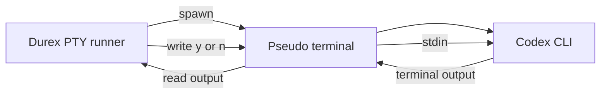
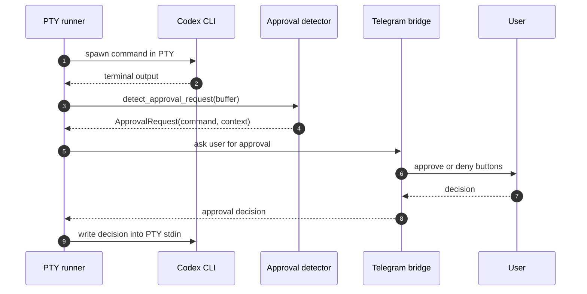
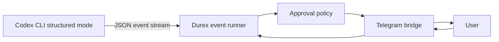
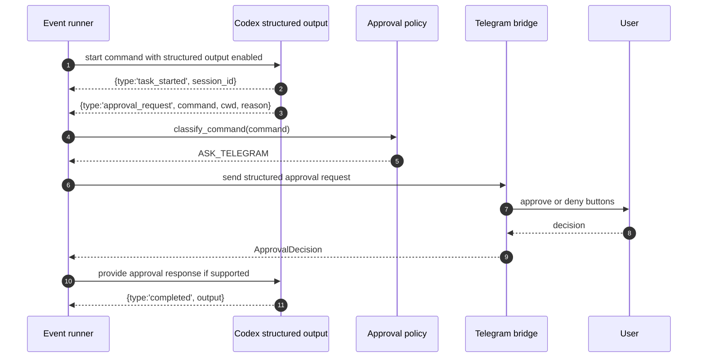
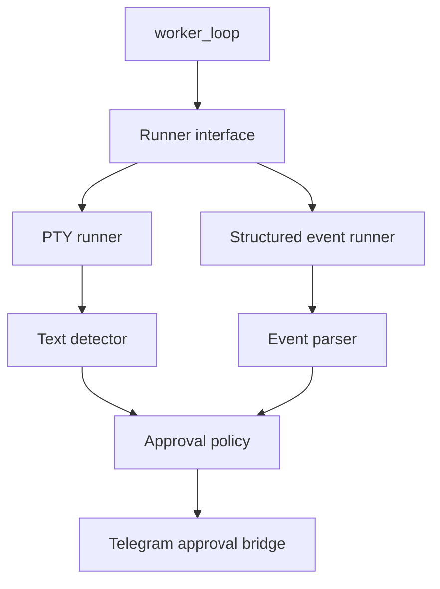
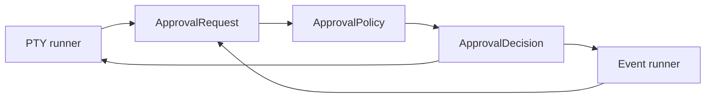

# PTY Bridge vs Structured Events

This document compares the two integration strategies discussed for Durex v0.2 and beyond.

Durex needs to observe Codex execution, detect approval requests, send them to Telegram, receive the user decision and feed that decision back into the running task.

There are two main ways to do that:

1. PTY bridge
2. Structured events

---

## Executive summary

| Area | PTY bridge | Structured events |
|---|---|---|
| Works with interactive terminal behavior | Yes | Not always |
| Reads what a human sees | Yes | No |
| Stable machine-readable data | No | Yes |
| Easy first implementation | Yes | Depends on event coverage |
| Approval detection | Text patterns | Event types |
| Telegram bridge support | Yes | Yes |
| Audit trail quality | Medium | High |
| Future-proof design | Medium | High |
| Best version fit | v0.2 | v0.3+ |

The recommended roadmap is:

```text
v0.2: PTY bridge first
v0.3+: structured events when the event stream exposes enough data
```

---

## PTY bridge

A PTY bridge launches Codex inside a pseudo-terminal. From Codex's point of view, it is running in a real terminal. From Durex's point of view, the PTY is a stream of terminal output plus a writable input channel.



### How it works



### Strengths

- Works with interactive terminal applications.
- Mirrors exactly what a user sees in the terminal.
- Can support simple remote control from Telegram.
- Does not require Codex to expose every approval step as a formal event.
- Good fit for early versions and practical automation.

### Weaknesses

- Text parsing is fragile.
- Terminal output can contain ANSI colors, cursor movements and progress spinners.
- Prompt wording can change between Codex versions.
- It is harder to build a perfect audit trail.
- Detecting the exact command may require heuristics.

### Good use cases

- Remote approval of interactive prompts.
- Overnight execution with human-in-the-loop confirmations.
- Local usage where practical behavior matters more than formal event schemas.
- Early implementation of the Telegram approval feature.

---

## Structured events

Structured events use a machine-readable output stream, typically JSON lines or another explicit event protocol. Instead of reading terminal text, Durex reads events such as task start, command request, approval request and task completion.



### How it works



### Strengths

- More stable than terminal text parsing.
- Easier to log and audit.
- Easier to test automatically.
- Clearer separation between normal output, errors, tool calls and approvals.
- Better suited for dashboards and long-term integrations.

### Weaknesses

- Depends on the completeness of the event stream.
- May not expose every interactive prompt.
- May differ from interactive terminal behavior.
- Requires a formal response channel for approvals to fully replace PTY.
- May need fallback to PTY if an event is missing.

### Good use cases

- Production-grade automation.
- Dashboards.
- Audit logs.
- Multi-worker execution.
- Future remote orchestration.

---

## Hybrid strategy

The best long-term design is a hybrid runner interface.



The queue should not care whether the current task is executed by a PTY runner or a structured event runner. Both should return a normalized result:

```text
RunResult {
  returncode,
  output,
  session_id,
  reset_at,
  approval_events,
  error
}
```

---

## Recommendation for Durex

### v0.2

Use PTY bridge.

Reason:

- it solves the immediate problem;
- it works with interactive approval prompts;
- it allows Telegram confirmation from a phone;
- it can be implemented without waiting for complete structured event support.

### v0.3+

Add structured event support behind the same runner interface.

Reason:

- better auditability;
- better testing;
- cleaner logs;
- safer long-term automation.

---

## Design rule

Durex should keep the approval flow independent from the runner implementation.



That means the rest of the system only sees normalized objects:

```text
ApprovalRequest(command, cwd, reason, context, task_id)
ApprovalDecision(action, source, decided_at)
```

This design makes it possible to start with PTY in v0.2 and later add structured events without rewriting the whole queue system.
