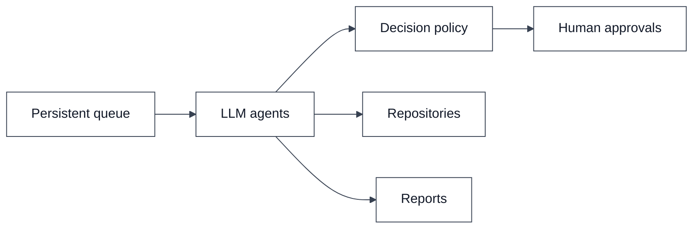
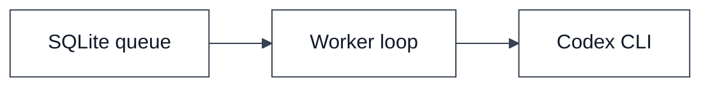
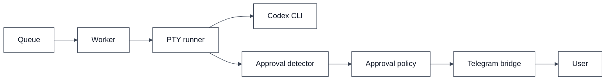
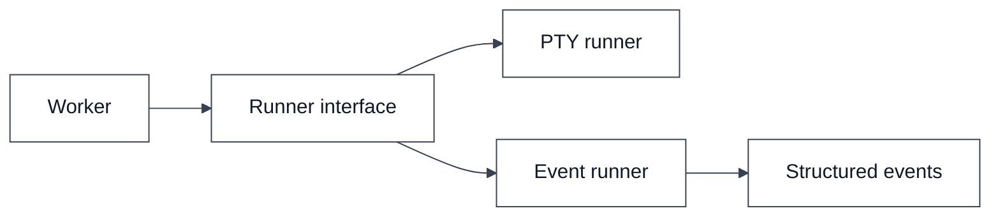
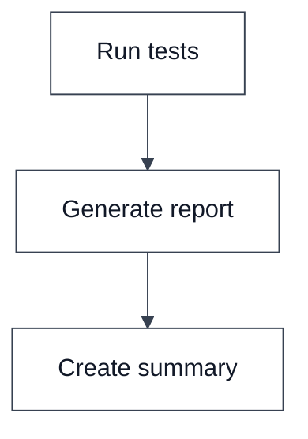
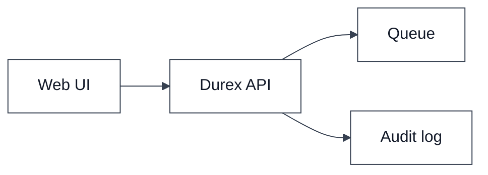
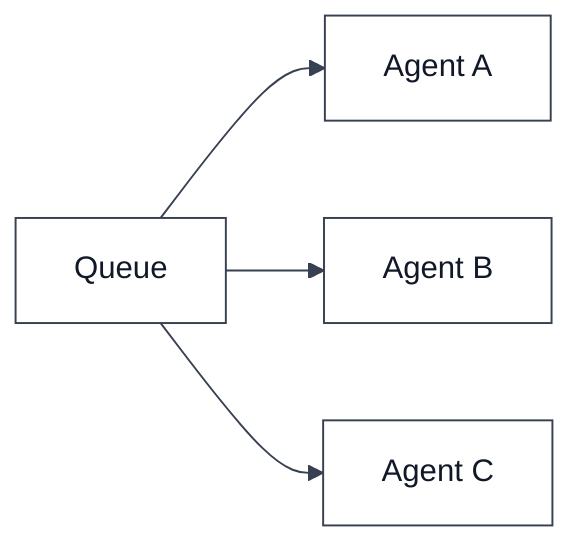
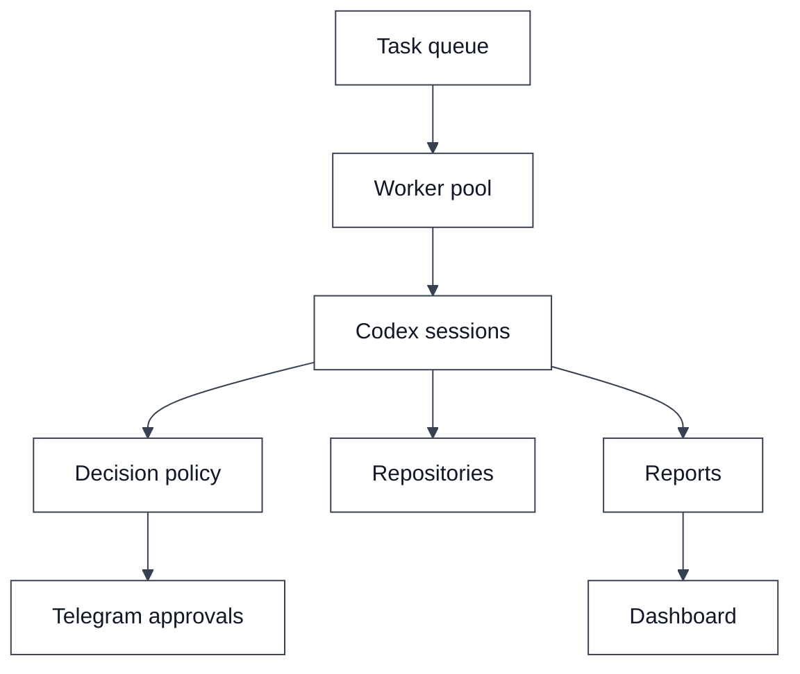
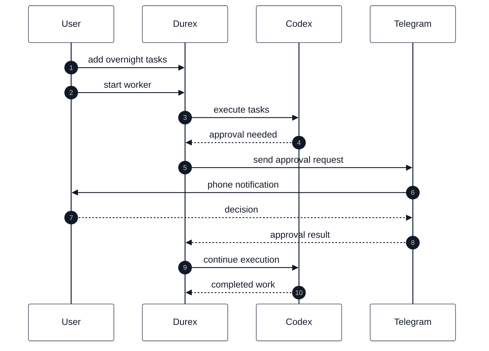

```mermaid
%%{init: {"theme": "base", "themeVariables": {"primaryColor": "#ffffff", "primaryTextColor": "#111827", "primaryBorderColor": "#374151", "lineColor": "#374151", "secondaryColor": "#f3f4f6", "tertiaryColor": "#ffffff", "textColor": "#111827", "mainBkg": "#ffffff", "nodeBorder": "#374151", "clusterBkg": "#f9fafb", "clusterBorder": "#9ca3af", "edgeLabelBackground": "#ffffff", "actorBkg": "#ffffff", "actorBorder": "#374151", "actorTextColor": "#111827", "activationBkgColor": "#e5e7eb", "activationBorderColor": "#374151", "signalColor": "#111827", "signalTextColor": "#111827", "noteBkgColor": "#fef3c7", "noteTextColor": "#111827", "noteBorderColor": "#92400e"}}}%%
flowchart LR
    GitHub[GitHub repository]
    GitHub --> Queue[Durex queue]
    Queue --> Codex[Codex]
    Codex --> PullRequest[Pull request]
    PullRequest --> Telegram[Approval]
```

# Roadmap

This document describes the planned evolution of Durex from a simple Codex queue into a general-purpose AI task orchestration platform.

The roadmap is intentionally incremental. Each version should remain usable on its own.

---

## How to read this roadmap

Each version adds one major capability layer. The diagrams show the new shape of
the system at that stage, not a complete implementation blueprint.

Read each edge as the new dependency or trigger introduced by that release. For
example, `Queue -> Worker` means queued tasks can trigger worker execution, while
`Policy -> Telegram` means a policy decision can trigger a remote approval
request.

The roadmap is ordered by risk. Early versions focus on local persistence,
runner control, approval handling, and observability. Later versions add
workflow graphs, external integrations, web UI, and multiple agents.

---

## Vision

Durex exists to solve three practical problems:

1. long-running engineering tasks;
2. usage limits that interrupt work;
3. approvals that require a human to be present.

The long-term goal is an orchestrator that can continue useful work while the user is away and request help only when necessary.



### Vision nodes and triggers

`Persistent queue` is the durable backlog of work. It triggers agent execution
when tasks are ready.

`LLM agents` are the execution units that perform repository work, produce
reports, and encounter decisions.

`Decision policy` evaluates whether an agent action is safe, should be blocked,
or requires the user.

`Human approvals` are triggered only when policy cannot safely decide
automatically.

`Repositories` and `Reports` are the long-term outputs: code changes,
reviewable artifacts, status summaries, and audit trails.

---

## v0.1

Current generation.

### Features

- SQLite task queue
- task persistence
- usage limit detection
- resume support
- retry support
- simple worker loop

### Architecture



### Architecture meaning

`SQLite queue` stores tasks and lets the process survive restarts.

`Worker loop` is triggered by the operator running the worker command. It claims
ready tasks and updates their status.

`Codex CLI` is triggered once the worker starts a task.

### Goal

Provide a reliable queue that can survive usage-limit interruptions.

---

## v0.2

PTY bridge and Telegram approvals.

### Features

- PTY runner
- approval detector
- approval policy engine
- Telegram approval bridge
- approval audit trail
- configurable verbosity
- timeout policies

### Architecture



### Architecture meaning

`Queue -> Worker` is the same task-claim trigger from v0.1.

`Worker -> PTY runner` means tasks can run in a pseudo-terminal instead of only
through subprocess capture.

`PTY runner -> Approval detector` is triggered by terminal output.

`Approval detector -> Approval policy` is triggered when an interactive prompt is
recognized.

`Approval policy -> Telegram bridge` is triggered when local policy returns an
ask-user decision.

`Telegram bridge -> User` is triggered by the approval request sent to the phone.

### Goal

Allow unattended execution while still enabling human approval from a phone.

---

## v0.3

Structured events.

### Features

- event runner
- structured logging
- event audit trail
- unified runner interface

### Architecture



### Architecture meaning

`Worker -> Runner interface` introduces an abstraction so the worker does not
depend on one execution backend.

`Runner interface -> PTY runner` keeps the current terminal-based path.

`Runner interface -> Event runner` adds the future structured-event path.

`Event runner -> Structured events` is triggered when Codex exposes machine
readable events for output, tool calls, approvals, usage limits, and completion.

### Goal

Reduce reliance on terminal text parsing.

---

## v0.4

Workflow engine.

### Features

- task dependencies
- conditional execution
- task chaining
- workflow graphs

Example:

```text
Run tests
  -> Generate report
      -> Create summary
```

### Architecture



### Architecture meaning

`Run tests -> Generate report` is triggered only after the upstream task reaches
a successful terminal state or satisfies a configured condition.

`Generate report -> Create summary` is triggered after report output exists.

The workflow engine therefore changes the queue from a flat list into a graph of
ready, blocked, completed, and failed nodes.

### Goal

Move from independent tasks to orchestrated workflows.

---

## v0.5

GitHub-native automation.

### Features

- GitHub integration
- pull-request workflows
- repository actions
- automated review pipelines

### Architecture



### Architecture meaning

`GitHub repository -> Durex queue` is triggered by repository events or explicit
operator requests.

`Durex queue -> Codex` is the normal task execution trigger.

`Codex -> Pull request` is triggered when an agent produces reviewable code
changes.

`Pull request -> Approval` is triggered when merge, push, review response, or
other repository-facing actions need human authorization.

### Goal

Enable repository-centered automation.

---

## v0.6

Web dashboard.

### Features

- active tasks view
- completed tasks view
- approval history
- queue management
- retry controls

### Architecture



### Architecture meaning

`Web UI -> Durex API` is triggered by user actions in the browser.

`Durex API -> Queue` is triggered by task inspection, enqueue, retry, pause, and
cancel operations.

`Durex API -> Audit log` is triggered by approval-history and task-history views.

### Goal

Make monitoring and control easier.

---

## v0.7

Multi-agent execution.

### Features

- multiple workers
- specialized agents
- distributed queues
- role-based execution

### Architecture



### Architecture meaning

`Queue -> Agent A/B/C` is triggered when independent workers claim runnable
tasks. Each agent can specialize by repository, task type, risk level, or
available execution backend.

The local supervisor already establishes atomic claims, opaque worker ids,
lease ids, monotonic epochs, heartbeat, and owner-scoped cancellation. The
multi-host release must preserve those contracts while replacing local SQLite
scheduling with a control plane and authenticated outbound agents.

SQLite must not be shared over NFS. Each machine runs one local Durex agent;
Telegram talks to the control plane rather than opening a direct shell to each
host. Placement uses enrolled node identity, capabilities, and configured
workdir aliases. Offline event delivery uses bounded spooling and idempotent
`(run_id, sequence)` replay.

Detailed planning is tracked in
[#21](https://github.com/kinderp/durex/issues/21).

### Goal

Increase throughput and specialization.

---

## v1.0

Autonomous overnight engineer.

### Features

- persistent workflows
- approvals through Telegram
- GitHub integration
- audit logs
- workflow dependencies
- structured events
- multiple workers

### Architecture



### Architecture meaning

`Task queue -> Worker pool` is triggered when queued work is ready and capacity
is available.

`Worker pool -> Codex sessions` starts multiple local or distributed execution
sessions.

`Codex sessions -> Decision policy` is triggered by actions that require safety
classification.

`Decision policy -> Telegram approvals` is triggered by human-required actions.

`Codex sessions -> Repositories` is triggered by code, review, or repository
automation tasks.

`Codex sessions -> Reports -> Dashboard` is triggered as completed work produces
summaries that need to be inspected later.

### Example overnight flow



### Overnight trigger details

`User -> Durex: add overnight tasks` creates queued work before the user leaves.

`User -> Durex: start worker` begins unattended processing.

`Durex -> Codex: execute tasks` is triggered for each ready task.

`Codex -> Durex: approval needed` is triggered by an interactive approval prompt
or future structured approval event.

`Durex -> Telegram -> User` is triggered when policy requires human input.

`User -> Telegram -> Durex` returns the approval decision.

`Durex -> Codex: continue execution` writes the resulting local action or sends
the equivalent structured response.

`Codex -> Durex: completed work` updates task status and output for later review.

### Goal

The user should be able to prepare a queue before going offline and wake up to completed work, reports and reviewable results.

---

## Guiding principles

1. Keep the queue simple.
2. Prefer composable modules.
3. Separate runner logic from approval logic.
4. Keep approval decisions auditable.
5. Support both PTY and structured-event execution.
6. Allow human supervision without requiring continuous presence.
