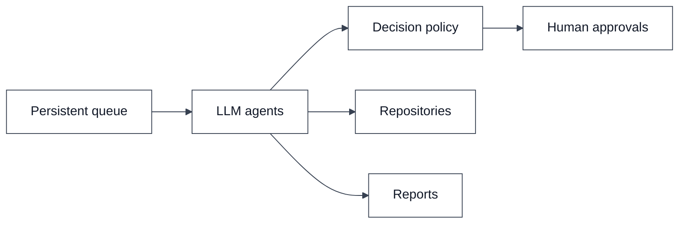
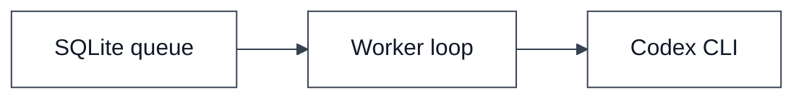
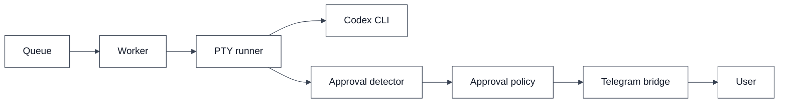
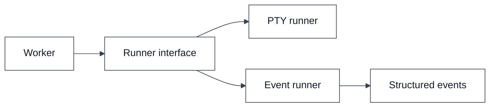
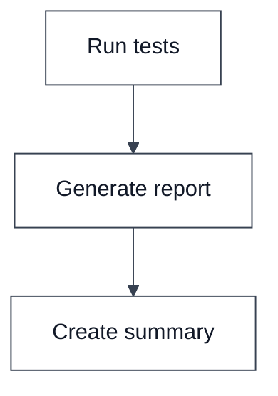
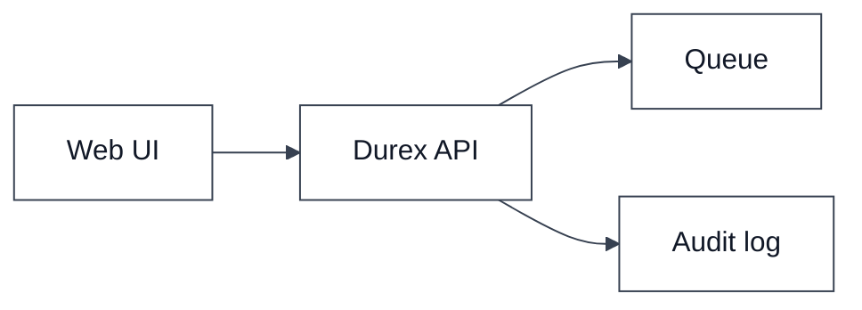
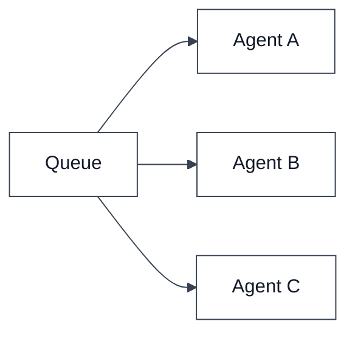
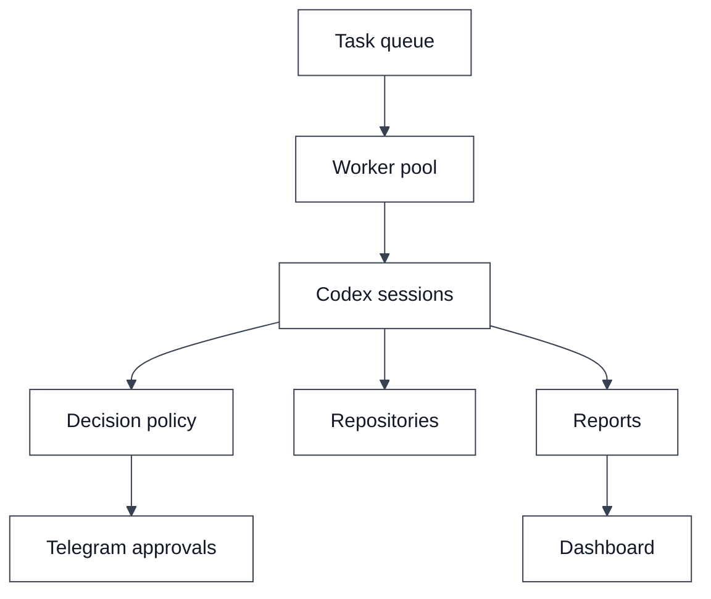
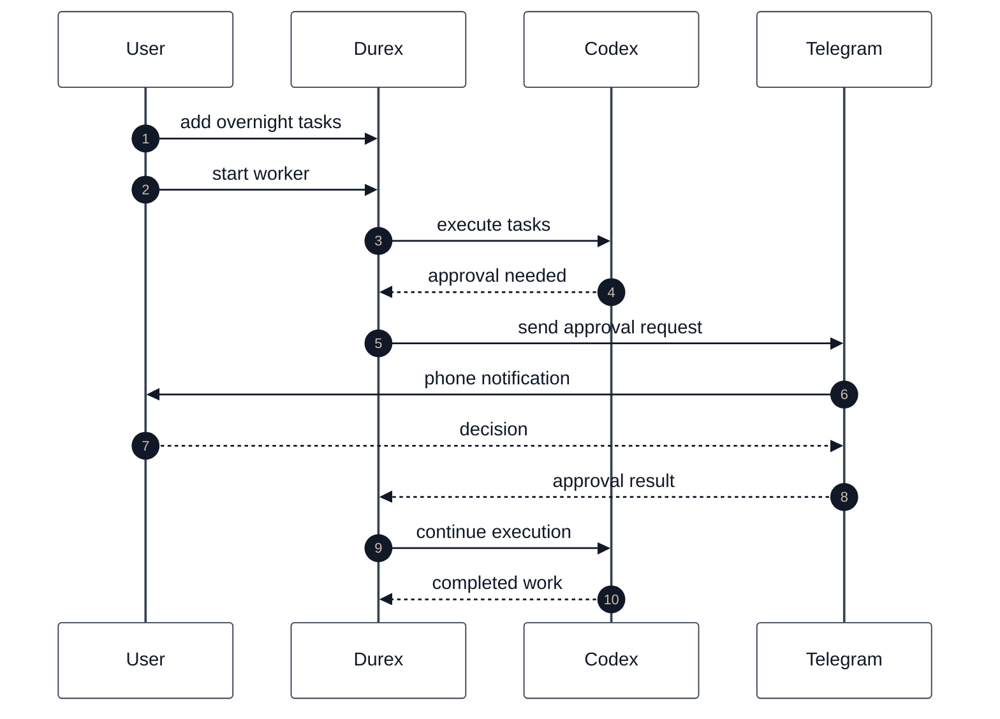

```mermaid
%%{init: {"theme": "base", "themeVariables": {"primaryColor": "#ffffff", "primaryTextColor": "#111827", "primaryBorderColor": "#374151", "lineColor": "#374151", "secondaryColor": "#f3f4f6", "tertiaryColor": "#ffffff", "textColor": "#111827", "mainBkg": "#ffffff", "nodeBorder": "#374151", "clusterBkg": "#f9fafb", "clusterBorder": "#9ca3af", "edgeLabelBackground": "#ffffff", "actorBkg": "#ffffff", "actorBorder": "#374151", "actorTextColor": "#111827", "activationBkgColor": "#e5e7eb", "activationBorderColor": "#374151", "signalColor": "#111827", "signalTextColor": "#111827", "noteBkgColor": "#fef3c7", "noteTextColor": "#111827", "noteBorderColor": "#92400e"}}}%%
flowchart LR
    GitHub[GitHub repository]
    GitHub --> Queue[Durex queue]
    Queue --> Codex[Codex]
    Codex --> PullRequest[Pull request]
    PullRequest --> Telegram[Approval]
```

# Roadmap

This document describes the planned evolution of Durex from a simple Codex queue into a general-purpose AI task orchestration platform.

The roadmap is intentionally incremental. Each version should remain usable on its own.

---

## Vision

Durex exists to solve three practical problems:

1. long-running engineering tasks;
2. usage limits that interrupt work;
3. approvals that require a human to be present.

The long-term goal is an orchestrator that can continue useful work while the user is away and request help only when necessary.



---

## v0.1

Current generation.

### Features

- SQLite task queue
- task persistence
- usage limit detection
- resume support
- retry support
- simple worker loop

### Architecture



### Goal

Provide a reliable queue that can survive usage-limit interruptions.

---

## v0.2

PTY bridge and Telegram approvals.

### Features

- PTY runner
- approval detector
- approval policy engine
- Telegram approval bridge
- approval audit trail
- configurable verbosity
- timeout policies

### Architecture



### Goal

Allow unattended execution while still enabling human approval from a phone.

---

## v0.3

Structured events.

### Features

- event runner
- structured logging
- event audit trail
- unified runner interface

### Architecture



### Goal

Reduce reliance on terminal text parsing.

---

## v0.4

Workflow engine.

### Features

- task dependencies
- conditional execution
- task chaining
- workflow graphs

Example:

```text
Run tests
  -> Generate report
      -> Create summary
```

### Architecture



### Goal

Move from independent tasks to orchestrated workflows.

---

## v0.5

GitHub-native automation.

### Features

- GitHub integration
- pull-request workflows
- repository actions
- automated review pipelines

### Architecture



### Goal

Enable repository-centered automation.

---

## v0.6

Web dashboard.

### Features

- active tasks view
- completed tasks view
- approval history
- queue management
- retry controls

### Architecture



### Goal

Make monitoring and control easier.

---

## v0.7

Multi-agent execution.

### Features

- multiple workers
- specialized agents
- distributed queues
- role-based execution

### Architecture



### Goal

Increase throughput and specialization.

---

## v1.0

Autonomous overnight engineer.

### Features

- persistent workflows
- approvals through Telegram
- GitHub integration
- audit logs
- workflow dependencies
- structured events
- multiple workers

### Architecture



### Example overnight flow



### Goal

The user should be able to prepare a queue before going offline and wake up to completed work, reports and reviewable results.

---

## Guiding principles

1. Keep the queue simple.
2. Prefer composable modules.
3. Separate runner logic from approval logic.
4. Keep approval decisions auditable.
5. Support both PTY and structured-event execution.
6. Allow human supervision without requiring continuous presence.
