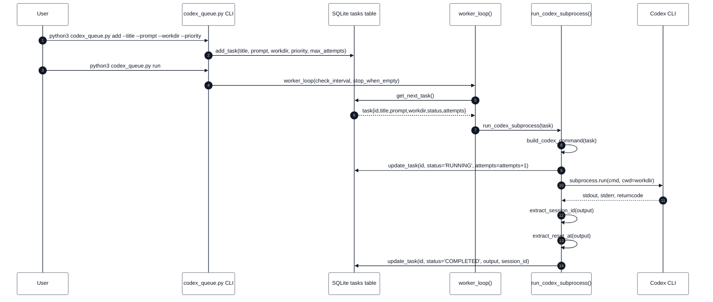
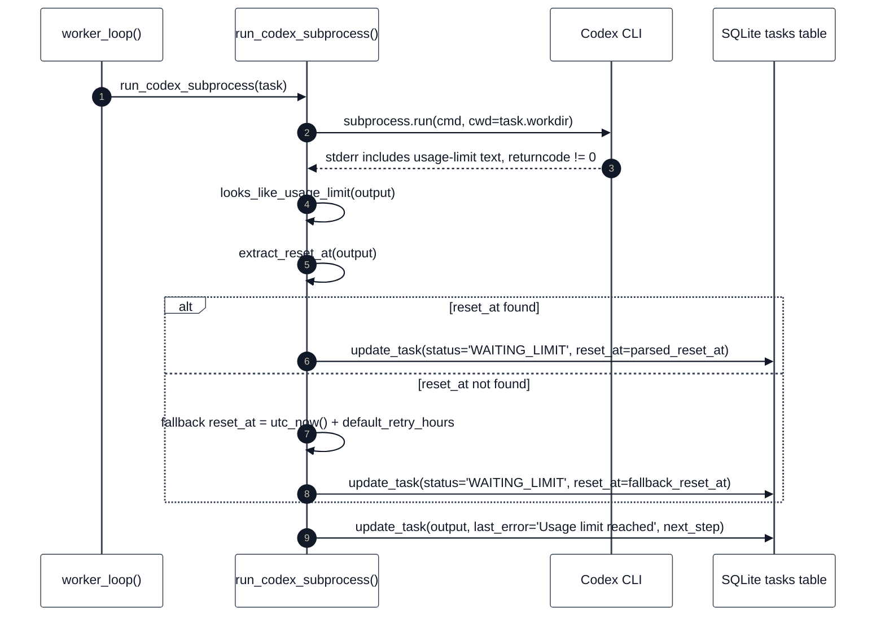
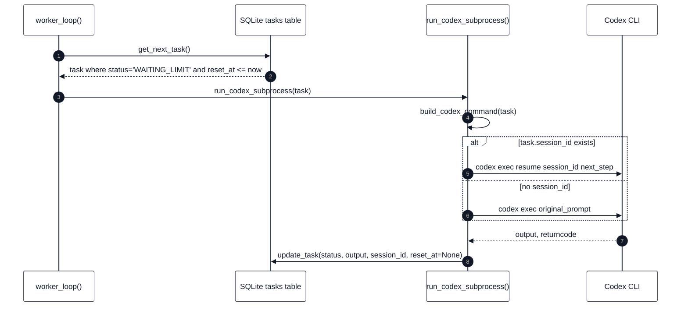
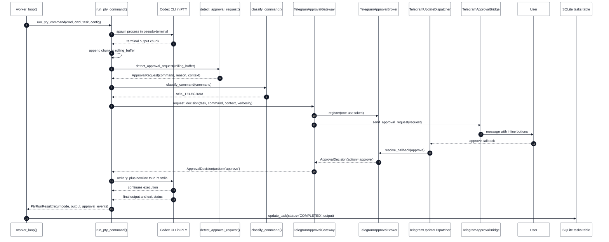
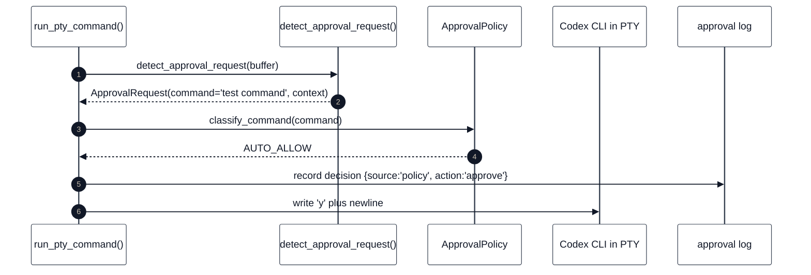
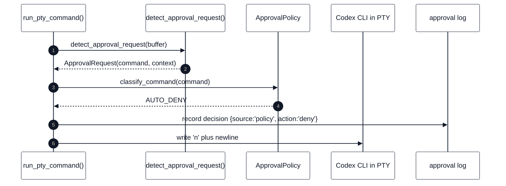
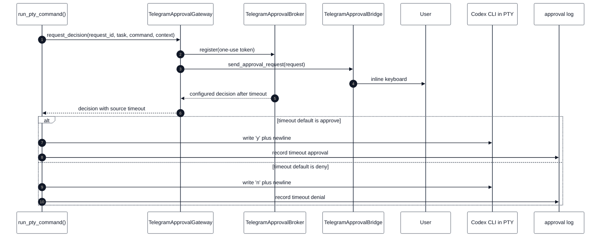
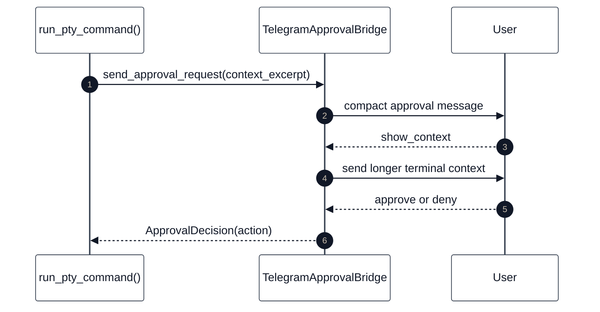
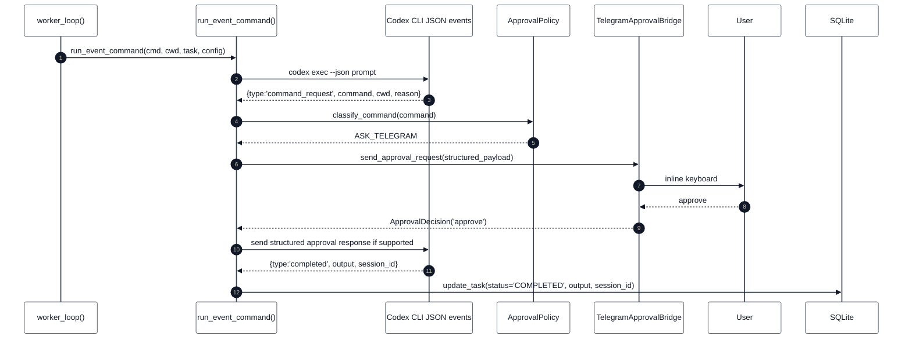
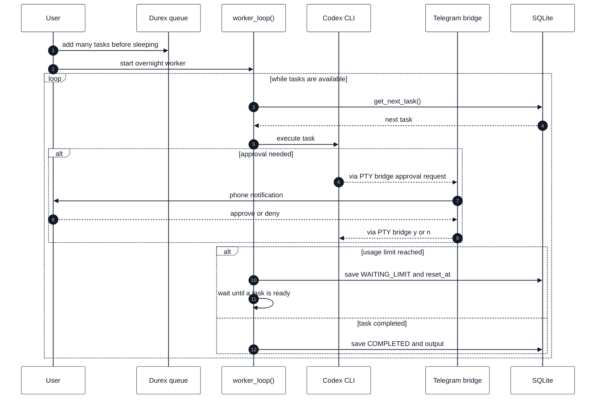

# Sequence Diagrams

This document describes the planned v0.2 runtime flows for Durex.

The diagrams intentionally include function names and the main data passed between components. They are meant to be used as an implementation guide for the PTY bridge and Telegram approval features.

---

## How to read these sequence diagrams

Each sequence diagram shows one runtime story from left to right. A participant
is a concrete actor, module, function, process, or storage layer. A message is
not just a visual arrow: it is the trigger that causes the next component to do
work.

Use these diagrams together with `ARCHITECTURE.md`:

- `ARCHITECTURE.md` explains the static shape of the system;
- this file explains time-ordered execution;
- each section below describes who participates, what each participant does,
  and why every message is sent.

Some diagrams include function names from the current code. `run_task()`
dispatches between `run_codex_subprocess()` for non-interactive execution and
`run_codex_pty()` for PTY-based interactive execution.

---

## 1. Normal non-interactive task execution



### Participants and responsibilities

`User` creates the task and starts the worker from the shell.

`codex_queue.py CLI` parses command-line arguments and translates user commands
into function calls such as `add_task()` and `worker_loop()`.

`SQLite tasks table` stores the queue. It is the only persistent state in this
flow.

`worker_loop()` polls the queue, selects the next runnable task, and hands it to
the runner.

`run_codex_subprocess()` is the non-interactive runner path.

`Codex CLI` is the external process started by Durex.

### Message triggers

`User -> CLI: add ...` is triggered when the user queues a task from the shell.

`CLI -> DB: add_task(...)` inserts a new row with `PENDING` status.

`User -> CLI: run` starts the worker process.

`CLI -> Worker: worker_loop(...)` hands control to the queue scheduler.

`Worker -> DB: get_next_task()` asks SQLite for the highest-priority runnable
task.

`DB -> Worker: task{...}` returns the selected task row.

`Worker -> Runner: run_codex_subprocess(task)` starts execution for that task.

`Runner -> Runner: build_codex_command(task)` decides whether to run a fresh
prompt or resume an existing Codex session.

`Runner -> DB: update_task(... RUNNING ...)` marks the task as in progress and
increments the attempt count before starting Codex.

`Runner -> Codex: subprocess.run(...)` starts Codex and blocks until it exits.

`Codex -> Runner: stdout, stderr, returncode` returns all process output and
the exit code.

`Runner -> Runner: extract_session_id(output)` tries to find a Codex session id
for future resume.

`Runner -> Runner: extract_reset_at(output)` checks whether the output contains
a usage-limit reset time.

`Runner -> DB: update_task(... COMPLETED ...)` persists successful output and
the detected session id.

Data passed:

```text
task = {
  id,
  title,
  prompt,
  workdir,
  priority,
  status,
  session_id,
  next_step,
  attempts,
  max_attempts
}
```

---

## 2. Usage limit reached



### Participants and responsibilities

`worker_loop()` has already selected a task and sent it to the runner.

`run_codex_subprocess()` represents the subprocess execution path.

`Codex CLI` returns an error output that looks like a usage or rate limit.

`SQLite tasks table` stores enough information to resume the task later instead
of treating the failure as permanent.

### Message triggers

`Worker -> Runner: run_codex_subprocess(task)` starts a normal execution attempt.

`Runner -> Codex: subprocess.run(...)` executes Codex in the task workdir.

`Codex -> Runner: stderr includes usage-limit text` is triggered when Codex
exits non-zero and prints limit-related text.

`Runner -> Runner: looks_like_usage_limit(output)` checks for markers such as
`usage limit`, `rate limit`, `quota`, `429`, and similar phrases.

`Runner -> Runner: extract_reset_at(output)` tries to parse an explicit retry
timestamp from the output.

`reset_at found` means Durex can schedule the retry at the exact parsed time.

`reset_at not found` means Durex falls back to a conservative local delay.

`Runner -> DB: update_task(status='WAITING_LIMIT', reset_at=...)` prevents the
task from being selected again until the reset time has passed.

`Runner -> DB: update_task(output, last_error, next_step)` stores the output and
the resume instruction that will be used on the next attempt.

Important fields saved:

```text
status='WAITING_LIMIT'
reset_at='ISO-8601 UTC timestamp'
next_step='Resume from where you stopped and complete the task.'
```

---

## 3. Automatic resume after reset_at



### Participants and responsibilities

`worker_loop()` is still the scheduler. It does not need a special resume
command from the user.

`SQLite tasks table` exposes `WAITING_LIMIT` tasks as runnable once `reset_at`
has passed.

`run_codex_subprocess()` builds either a resume command or a fresh command
depending on whether `session_id` exists.

`Codex CLI` receives either `codex exec resume ...` or the original prompt.

### Message triggers

`Worker -> DB: get_next_task()` is triggered on every worker polling cycle.

`DB -> Worker: task where status='WAITING_LIMIT' and reset_at <= now` happens
only after the stored reset time is in the past.

`Worker -> Runner: run_codex_subprocess(task)` starts the retry attempt.

`Runner -> Runner: build_codex_command(task)` chooses the correct command shape.

`task.session_id exists` means Durex can ask Codex to resume the previous
session with `next_step`.

`no session_id` means Durex has to run the original prompt again.

`Codex -> Runner: output, returncode` returns the retry result.

`Runner -> DB: update_task(...)` persists the new final state and clears
`reset_at` when the usage-limit pause is no longer active.

---

## 4. PTY task execution with Telegram approval



### Participants and responsibilities

`worker_loop()` selects and dispatches the task.

`run_pty_command()` owns the interactive PTY lifecycle. It starts Codex, reads
terminal chunks, calls the detector, applies policy, and writes terminal input.

`Codex CLI in PTY` behaves as if a human is using a normal terminal.

`detect_approval_request()` scans the rolling terminal buffer and creates a
normalized approval request when a prompt is detected.

`classify_command()` decides whether the command should be auto-allowed,
auto-denied, or sent to Telegram.

`TelegramApprovalGateway` registers and sends the remote request, then waits on
`TelegramApprovalBroker`. `TelegramUpdateDispatcher` is the only callback poller.

`User` decides from the phone.

`SQLite tasks table` receives the final task result.

### Message triggers

`Worker -> Pty: run_pty_command(...)` is triggered when the task uses PTY mode.

`Pty -> Codex: spawn process in pseudo-terminal` creates the child Codex process
with terminal-like stdin/stdout/stderr.

`Codex -> Pty: terminal output chunk` happens whenever Codex writes output.

`Pty -> Pty: append chunk to rolling_buffer` keeps recent terminal text for
prompt detection.

`Pty -> Detector: detect_approval_request(...)` is called repeatedly after
output chunks.

`Detector -> Pty: ApprovalRequest(...)` happens only when recent output looks
like an approval prompt.

`Pty -> Policy: classify_command(command)` is triggered by the approval request.

`Policy -> Pty: ASK_TELEGRAM` means the local policy cannot safely decide
without the user.

`Pty -> Gateway: request_decision(...)` registers a one-use callback token before
sending task, command, context, and verbosity to the bot.

`Telegram -> User: message with inline buttons` displays approve, deny, show
context, and stop choices.

`User -> Dispatcher: approve` is the button callback returned through the shared
poll.

`Dispatcher -> Broker -> Gateway -> Pty` returns the normalized decision after
the dispatcher validates the callback chat, token, and action.

`Pty -> Codex: write 'y' plus newline` answers the terminal prompt.

`Codex -> Pty: continues execution` confirms that the child process accepted the
answer and resumed.

`Codex -> Pty: final output and exit status` happens when Codex exits.

`Pty -> Worker: PtyRunResult(...)` returns normalized output, return code, and
approval events.

`Worker -> DB: update_task(...)` persists the completed task state.

---

## 5. Auto-allow policy flow



### Participants and responsibilities

`run_pty_command()` is waiting on terminal output.

`detect_approval_request()` recognizes the prompt and extracts the command.

`ApprovalPolicy` classifies the command.

`Codex CLI in PTY` receives the answer.

`approval log` represents the in-memory `ApprovalAuditEvent` list returned in
`PtyRunResult`; future versions can persist this.

### Message triggers

`Pty -> Detector` is triggered by a terminal prompt in the rolling buffer.

`Detector -> Pty: ApprovalRequest(command='test command', context)` returns the
normalized prompt details.

`Pty -> Policy: classify_command(command)` checks the command against policy
rules.

`Policy -> Pty: AUTO_ALLOW` is triggered when the command matches an
explicitly safe rule.

`Pty -> Audit: record decision` records that policy, not Telegram, approved the
prompt.

`Pty -> Codex: write 'y' plus newline` answers the prompt without involving the
user.

The policy engine should only auto-allow commands that are explicitly configured as safe for the local project.

---

## 6. Auto-deny policy flow



### Participants and responsibilities

This flow mirrors auto-allow, but the policy result is denial. It is used for
commands that should never be approved automatically or remotely.

`ApprovalPolicy` is the key participant: the denial comes from configured local
safety rules.

### Message triggers

`Pty -> Detector` and `Detector -> Pty` happen when terminal text looks like an
approval prompt.

`Pty -> Policy: classify_command(command)` asks the policy engine for a local
decision.

`Policy -> Pty: AUTO_DENY` is triggered by a matching deny rule.

`Pty -> Audit: record decision` records the denial source and action.

`Pty -> Codex: write 'n' plus newline` rejects the terminal prompt.

---

## 7. Telegram timeout flow



### Participants and responsibilities

`run_pty_command()` has already sent an approval request and is blocked waiting
for a final decision.

`TelegramApprovalBroker` waits for the dispatcher to resolve a callback until
the approval timeout expires. `TelegramApprovalBridge` does not own the wait.

`User` may be unavailable or may ignore the message.

`Codex CLI in PTY` is waiting for terminal input.

`approval log` records that the final action came from timeout handling.

### Message triggers

`Pty -> Gateway: request_decision(...)` registers the request and starts the
waiting period.

`Telegram -> User: inline keyboard` sends the prompt to the configured chat.

`Broker -> Gateway: configured decision after timeout` happens when no matching
callback reaches the broker before the deadline.

`Pty -> Pty: apply timeout_default_decision` converts timeout into a final
decision. This is configured on the bridge and should usually be deny.

`timeout default is approve` writes `y\n` and records a timeout approval. This
is possible but not recommended for safety-sensitive prompts.

`timeout default is deny` writes `n\n` and records a timeout denial.

For safety, the recommended timeout default is denial.

---

## 8. Show more context flow



### Participants and responsibilities

`run_pty_command()` sends the initial approval request with a compact context.

`TelegramApprovalBridge` can send additional context without resolving the
approval.

`User` can inspect more terminal output before making a final choice.

### Message triggers

`Pty -> Telegram: send_approval_request(context_excerpt)` sends the first
approval message. The excerpt is intentionally compact to keep the phone message
readable.

`Telegram -> User: compact approval message` displays the command and basic
task metadata.

`User -> Telegram: show_context` is a non-final callback. It asks for more
terminal output but does not approve or deny the prompt.

`Telegram -> User: send longer terminal context` sends the additional context.

`User -> Telegram: approve or deny` is the final callback.

`Telegram -> Pty: ApprovalDecision(action)` returns the final action to the PTY
runner.

---

## 9. Future structured event runner



### Participants and responsibilities

`worker_loop()` would still be the queue scheduler.

`run_event_command()` is a planned runner that reads structured Codex events
instead of terminal output.

`Codex CLI JSON events` is a future structured-output mode.

`ApprovalPolicy` and `TelegramApprovalBridge` are intentionally the same
concepts used in PTY mode.

`SQLite` receives the final normalized task update.

### Message triggers

`Worker -> EventRunner: run_event_command(...)` is triggered when a future
runner config selects structured events.

`EventRunner -> Codex: codex exec --json prompt` starts Codex with structured
output enabled.

`Codex -> EventRunner: command_request` is the structured equivalent of a PTY
approval prompt. It should include command, cwd, and reason fields.

`EventRunner -> Policy: classify_command(command)` reuses the same policy
engine as PTY mode.

`Policy -> EventRunner: ASK_TELEGRAM` triggers remote approval.

`EventRunner -> Telegram: send_approval_request(structured_payload)` sends a
cleaner payload because fields are already separated by the event schema.

`User -> Telegram: approve` is the callback.

`Telegram -> EventRunner: ApprovalDecision('approve')` returns the decision.

`EventRunner -> Codex: send structured approval response if supported` is the
critical requirement. Structured events can only fully replace PTY if Codex also
accepts a structured approval response.

`Codex -> EventRunner: completed` returns final output and session id.

`EventRunner -> DB: update_task(...)` persists the result.

---

## 10. Overnight unattended workflow



### Participants and responsibilities

`User` prepares the queue before leaving the computer.

`Durex queue` stores all tasks and their priorities.

`worker_loop()` repeatedly selects runnable work until no task is available or
the worker is stopped.

`Codex CLI` executes each task.

`Telegram bridge` only appears when an approval prompt needs human input.

`SQLite` stores progress after every task outcome.

### Message triggers

`User -> Queue: add many tasks before sleeping` is a batch of normal `add`
commands.

`User -> Worker: start overnight worker` starts unattended processing.

`Worker -> DB: get_next_task()` happens at the top of each loop iteration.

`DB -> Worker: next task` returns the next runnable task, ordered by status,
priority, and id.

`Worker -> Codex: execute task` starts either subprocess or PTY execution.

`approval needed` is triggered only if PTY output or future structured events
produce an approval request.

`Codex -> Telegram: via PTY bridge approval request` means the local PTY runner
detected the prompt and sent it to Telegram. Codex is not directly talking to
Telegram.

`Telegram -> User: phone notification` wakes the user only when a decision is
needed.

`User -> Telegram: approve or deny` returns the human decision.

`Telegram -> Codex: via PTY bridge y or n` means the local runner writes the
answer into the PTY. Telegram never writes to Codex directly.

`usage limit reached` persists `WAITING_LIMIT` and `reset_at`, then the worker
waits for another runnable task or for the reset time.

`task completed` persists `COMPLETED` and output.
