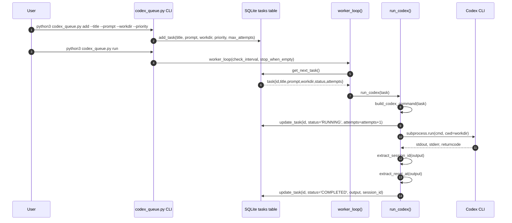
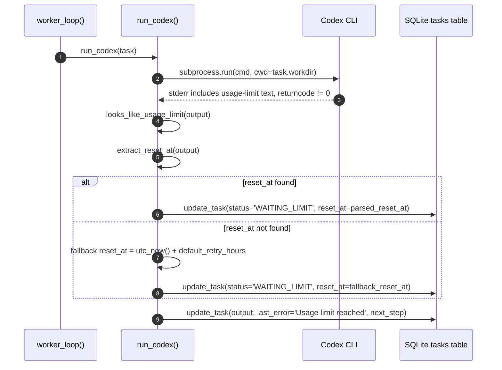
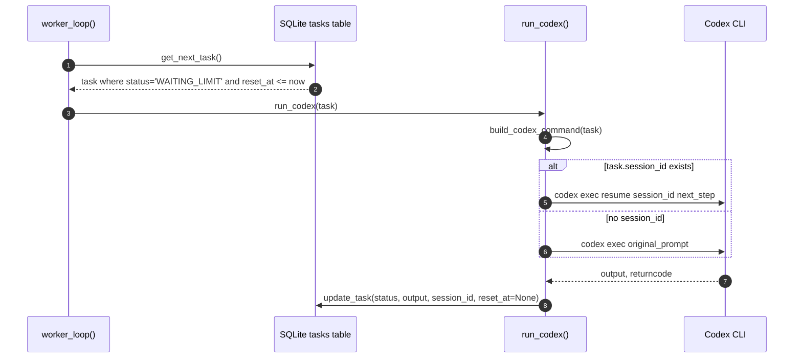
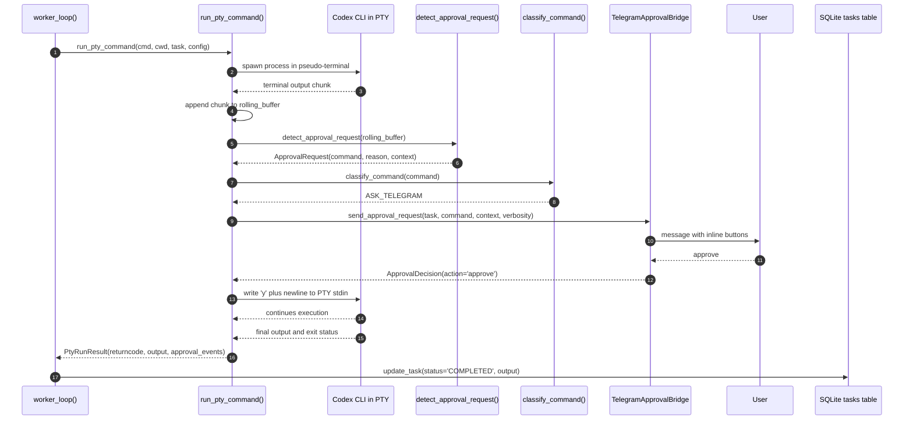
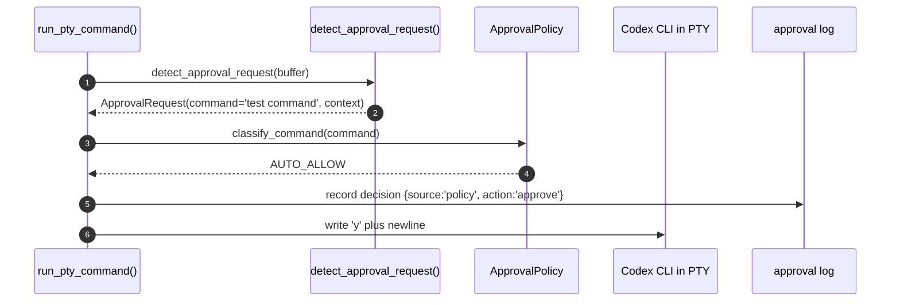
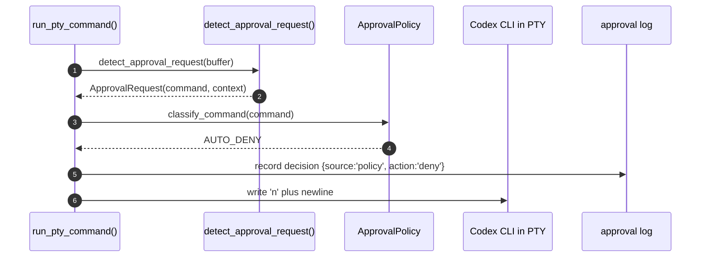
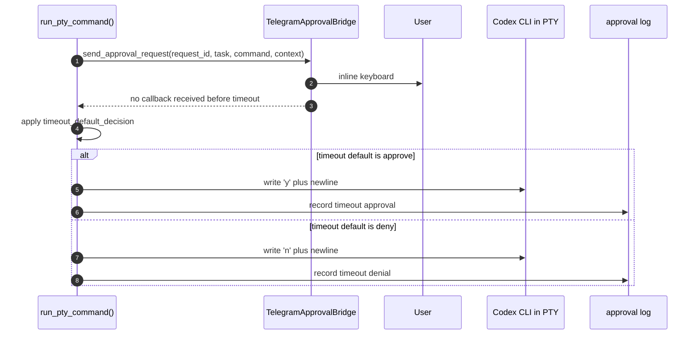
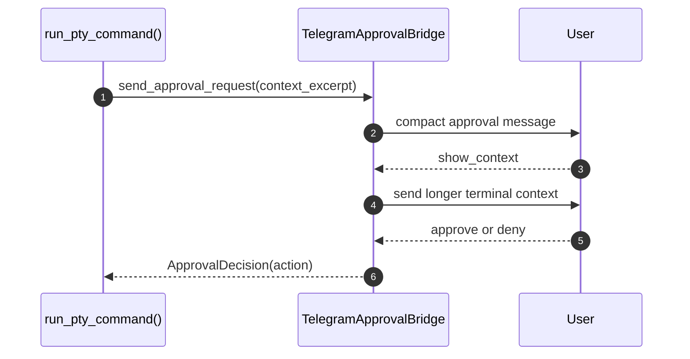
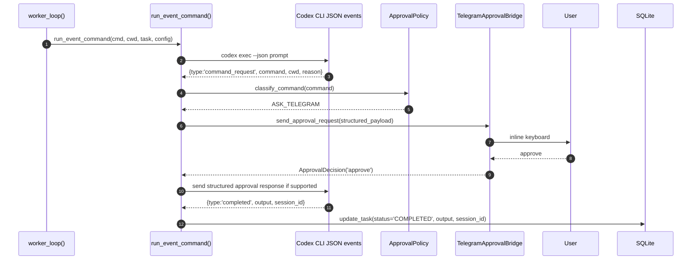
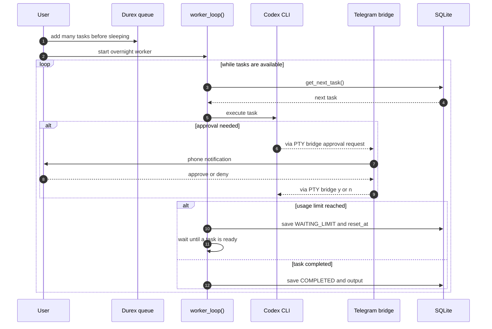

# Sequence Diagrams

This document describes the planned v0.2 runtime flows for Durex.

The diagrams intentionally include function names and the main data passed between components. They are meant to be used as an implementation guide for the PTY bridge and Telegram approval features.

---

## 1. Normal non-interactive task execution



Data passed:

```text
task = {
  id,
  title,
  prompt,
  workdir,
  priority,
  status,
  session_id,
  next_step,
  attempts,
  max_attempts
}
```

---

## 2. Usage limit reached



Important fields saved:

```text
status='WAITING_LIMIT'
reset_at='ISO-8601 UTC timestamp'
next_step='Resume from where you stopped and complete the task.'
```

---

## 3. Automatic resume after reset_at



---

## 4. PTY task execution with Telegram approval



---

## 5. Auto-allow policy flow



The policy engine should only auto-allow commands that are explicitly configured as safe for the local project.

---

## 6. Auto-deny policy flow



---

## 7. Telegram timeout flow



For safety, the recommended timeout default is denial.

---

## 8. Show more context flow



---

## 9. Future structured event runner



---

## 10. Overnight unattended workflow


