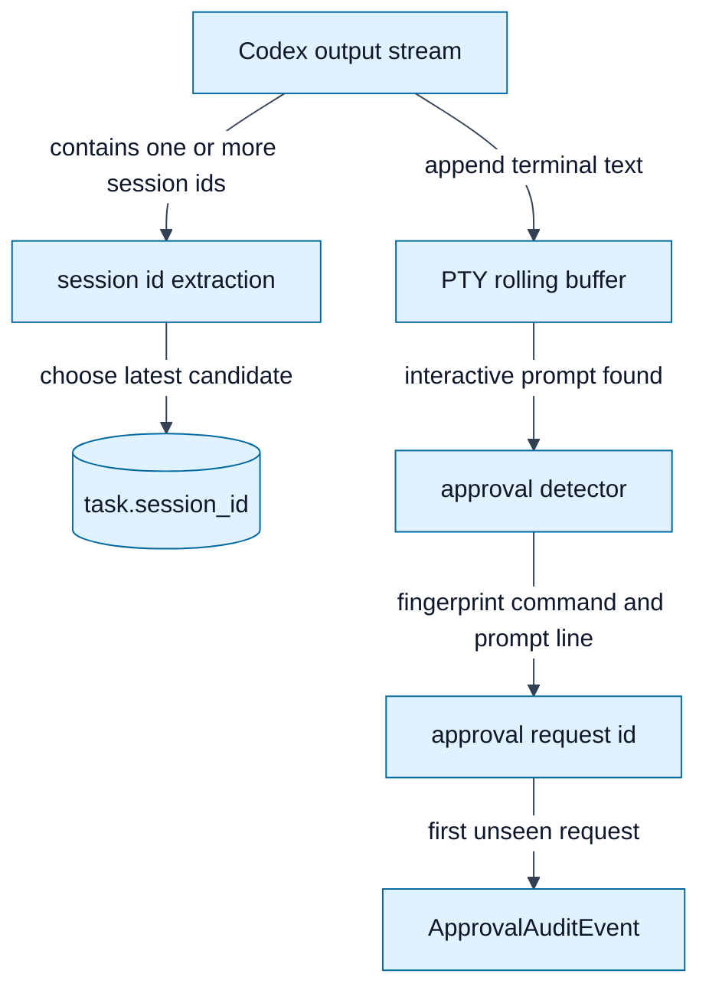

# Session Approval Deduplication

This document records the fixes made to session id extraction and the PTY
approval flow after duplicated output interpretation was observed.

---

## How to read this document

This document explains a correctness fix, not a feature area. The central issue
was that Durex interpreted unstable terminal output as stable identity. That
affected two places:

1. session resume, where the wrong Codex `session_id` could be persisted;
2. approval detection, where one visible prompt could be handled more than once.

The diagrams below use edges as triggers. A trigger can be a log fragment being
scanned, a terminal buffer changing, a prompt being fingerprinted, or the PTY
runner writing a decision back to Codex.

---

## Problem

The queue runner extracts a Codex `session_id` from command output so interrupted
tasks can resume. The previous extraction returned the first matching id. If an
output log contained multiple runs or retry fragments, Durex could persist an old
session id and resume the wrong session.

The PTY runner also reads terminal output incrementally and keeps a rolling
buffer so the approval detector can inspect recent text. The previous request id
was built from the extracted command plus the whole display context.

That was unstable because the context changes as more terminal output arrives.
The same approval prompt could therefore produce multiple ids, causing Durex to
handle the same approval more than once.

The detector also treated plain mentions of `approve` or `approval` as approval
prompts. This could re-trigger detection after a process continued and printed a
normal status line containing those words.



### Diagram nodes

`Codex output stream` is the mixed stdout and stderr text produced by Codex.

`session id extraction` scans command output for Codex session identifiers.

`task.session_id` is the persisted resume handle used when a task is interrupted
by usage limits or other resumable stops.

`PTY rolling buffer` contains recent terminal text used by the approval detector.

`approval detector` parses prompt-like terminal output.

`approval request id` is the stable deduplication key for one prompt.

`ApprovalAuditEvent` records the approval decision that was actually handled.

### Diagram edge triggers

`Output -> SessionScan` is triggered after task output is available for parsing.

`SessionScan -> StoredSession` is triggered after all candidate ids have been
scanned. The latest candidate is stored because it is the session most likely to
represent the final active Codex run.

`Output -> PtyBuffer` is triggered every time the PTY runner receives another
terminal output chunk.

`PtyBuffer -> Detector` is triggered when recent output contains a strict
interactive approval signal.

`Detector -> RequestId` is triggered only after a prompt has been accepted as
interactive rather than ordinary prose.

`RequestId -> Audit` is triggered only when the request id has not already been
handled in the current PTY run.

## Fixes

- `approval_detector.make_request_id()` now fingerprints only the extracted
  command and the stable prompt line, not the full rolling context.
- `codex_queue.extract_session_id()` now scans all candidate ids and returns the
  latest occurrence in the output.
- `approval_detector.looks_like_approval_prompt()` now requires an interactive
  prompt signal such as `[y/N]`, `(y/n)`, `yes/no`, or approval wording with a
  question mark.
- `pty_runner.run_pty_command()` clears the rolling detection buffer after an
  approval decision is written back to the PTY. This prevents stale prompt text
  from being re-read as a new request.

## Expected Behavior

The persisted Codex `session_id` should be the last valid session id shown in
the output.

One visible approval prompt should produce one `ApprovalAuditEvent`.

Additional output printed after the approval decision should not create another
event unless the terminal shows a new approval prompt.

## Regression Coverage

- `tests/test_approval_detector.py` verifies that unrelated context growth does
  not change a request id when a command is known.
- `tests/test_approval_detector.py` verifies that generic prompts remain
  distinct when no command can be extracted.
- `tests/test_approval_detector.py` verifies that ordinary text containing
  `approve` is not treated as a prompt.
- `tests/test_codex_queue.py` verifies that session extraction returns the
  latest candidate from multi-session output.
- `tests/test_pty_runner.py` runs a real PTY subprocess and verifies that one
  prompt is handled exactly once.

## Local Verification

The repository can be checked without network access. All tests are compatible
with `unittest discover`:

```bash
python3 -m unittest discover -s tests -v
python3 -m py_compile approval_detector.py approval_policy.py pty_runner.py telegram_bridge.py codex_queue.py
```

When `pytest` is installed, this should also work:

```bash
python3 -m pytest -q
```
