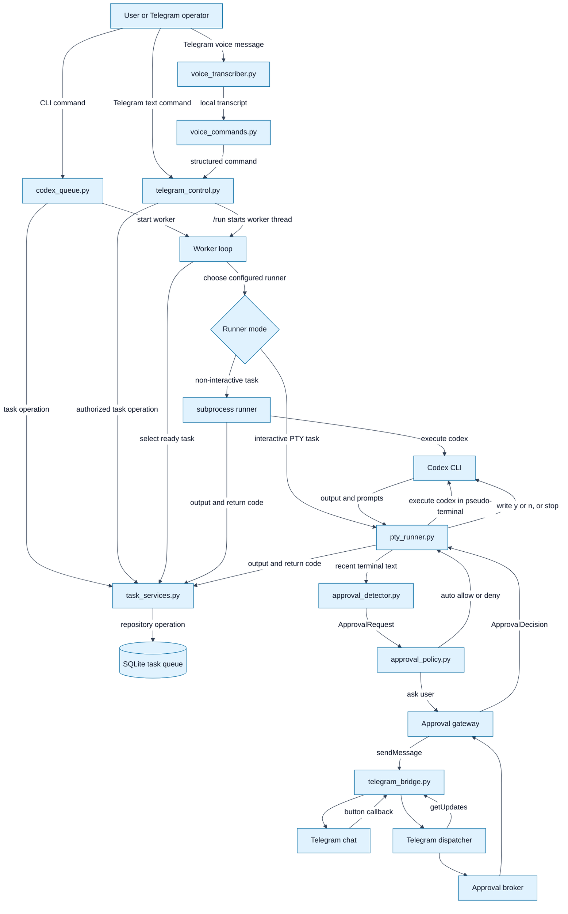

# System Overview

This document is the entry point for understanding the whole Durex system.

Use it as a map. It explains what each Python file owns, how the main runtime
flows connect, and where to go for deeper detail in the other Markdown files.

For step-by-step usage, command examples, and practical workflows, start with
[USER_GUIDE.md](USER_GUIDE.md).

---

## How to read this document

Durex is easiest to understand recursively:

1. start from the queue;
2. follow the worker into a runner;
3. follow the runner into Codex execution;
4. follow interactive prompts into approval detection and policy;
5. follow human-required decisions into Telegram;
6. follow status, output, and retry results back into SQLite.

Each subsection below gives a system-level explanation first, then points to the
more detailed document section that expands that part of the system.

---

## Whole-system map

### Map nodes

`User or Telegram operator` is the human who adds tasks, starts the worker,
checks status, approves prompts, or operates the queue remotely.

`codex_queue.py` is the local CLI and runner coordinator. Its compatibility
functions delegate queue operations to `task_services.py`; it owns runner
dispatch, usage-limit handling, and command-line subcommands.

`telegram_control.py` is the Telegram command router. It lets the authorized
Telegram chat inspect and operate the queue without accepting arbitrary shell
input.

`task_services.py` owns task records, the repository protocol, all task SQL, and
the application service shared by CLI and Telegram adapters.

`voice_transcriber.py` is the optional local speech-to-text layer used by
Telegram voice commands.

`voice_commands.py` turns Italian or English transcripts into structured queue
commands.

`SQLite task queue` is the durable system state. It stores tasks, priority,
attempts, status, output, last error, session id, and usage-limit reset time.

`Worker loop` is the local scheduler. It repeatedly claims the next runnable task
and runs it until the queue is empty, blocked, or stopped.

`Runner mode` selects between the classic subprocess path and the PTY path.

`subprocess runner` is the simple non-interactive execution path in
`codex_queue.py`.

`pty_runner.py` is the interactive execution path. It runs Codex in a
pseudo-terminal, reads output incrementally, detects approval prompts, and writes
decisions back to the terminal.

`Codex CLI` is the external agent process doing the requested work.

`approval_detector.py` turns terminal text into stable `ApprovalRequest`
objects.

`approval_policy.py` decides whether an approval request can be handled locally
or must be sent to Telegram.

`telegram_bridge.py` is the shared Telegram Bot API client for approval messages,
update transport, test messages, and chat-id discovery.

`telegram_dispatcher.py` owns the process-level update loop, callback namespace
routing, one-use approval correlation, and thread-safe approval broker.

`Telegram chat` is the configured chat id authorized to approve prompts or issue
remote-control commands.

### Map edge triggers

`User -> codex_queue.py` is triggered by local commands such as `init`, `add`,
`list`, `run`, `telegram-check`, or `telegram-control`.

`User -> telegram_control.py` is triggered by Telegram text commands such as
`/status`, `/tasks`, `/add`, `/run`, `/tail`, or `/stop`.

`User -> voice_transcriber.py -> voice_commands.py -> telegram_control.py` is
triggered by Telegram voice messages when `DUREX_VOICE_ENABLED=1`.

`codex_queue.py -> task_services.py` is triggered when local CLI or worker code
adds, lists, updates, or selects tasks.

`telegram_control.py -> task_services.py` is triggered only after the Telegram
message comes from `DUREX_TELEGRAM_CHAT_ID`. The command router contains no task
SQL.

`task_services.py -> SQLite task queue` is triggered by repository operations
from either entry point.

`Worker loop -> SQLite task queue` is triggered before each task run when the
worker asks for the next executable task.

`Worker loop -> Runner mode` is triggered after a task has been claimed.

`Runner mode -> subprocess runner` is triggered when the task is configured for
non-interactive execution.

`Runner mode -> pty_runner.py` is triggered when the task is configured for
interactive PTY execution.

`Codex CLI -> pty_runner.py` is triggered whenever Codex writes terminal output.

`pty_runner.py -> approval_detector.py` is triggered when new output is appended
to the rolling detection buffer.

`approval_detector.py -> approval_policy.py` is triggered only after a strict
interactive approval prompt is detected.

`approval_policy.py -> pty_runner.py` is triggered when policy can auto-allow or
auto-deny.

`approval_policy.py -> TelegramApprovalGateway` is triggered when policy
requires a human decision.

`telegram_bridge.py -> Telegram chat` is triggered by `sendMessage` for approval
requests, context messages, remote-control responses, and test messages.

`Telegram chat -> telegram_bridge.py -> TelegramUpdateDispatcher` is triggered
by approval callbacks or message updates fetched through the single long poll.

`TelegramUpdateDispatcher -> TelegramApprovalBroker` is triggered only for a
validated callback in the `durex:<token>:<action>` namespace. Other callbacks
and messages continue to `TelegramControlBot`.

`pty_runner.py -> Codex CLI` is triggered after a final approval decision. The
runner writes `y\n`, writes `n\n`, or terminates the process.

`subprocess runner -> SQLite task queue` and `pty_runner.py -> SQLite task queue`
are triggered when task output, exit status, resume information, or errors are
recorded.

`pty_runner.py` also returns approval events in memory as part of the PTY result.
Those events are not persisted to SQLite today; storing them in an audit table is
planned for stronger approval history.

Details:

- High-level architecture: [ARCHITECTURE.md - High-level architecture](ARCHITECTURE.md#high-level-architecture)
- Function data flow: [ARCHITECTURE.md - Function-level data flow](ARCHITECTURE.md#function-level-data-flow)
- Runtime sequences: [SEQUENCE_DIAGRAMS.md](SEQUENCE_DIAGRAMS.md)

---

## Python file responsibilities

### `codex_queue.py`

`codex_queue.py` is the main CLI entry point and runner coordinator.

It is responsible for:

- exposing compatibility functions for task creation, listing, selection, and
  updates through the shared application service;
- detecting usage-limit output;
- building Codex commands;
- dispatching tasks to subprocess mode or PTY mode;
- composing standalone Telegram dispatcher runtimes when PTY approvals are enabled;
- exposing CLI commands such as `init`, `add`, `list`, `run`, `telegram-check`,
  and `telegram-control`.

Read this file first when you want to understand scheduling, usage-limit
handling, runner dispatch, and the CLI surface.

Details:

- Queue architecture: [ARCHITECTURE.md - Data model overview](ARCHITECTURE.md#data-model-overview)
- Task states: [ARCHITECTURE.md - Task lifecycle](ARCHITECTURE.md#task-lifecycle)
- Normal execution: [SEQUENCE_DIAGRAMS.md - Normal non-interactive task execution](SEQUENCE_DIAGRAMS.md#1-normal-non-interactive-task-execution)
- Usage limits: [SEQUENCE_DIAGRAMS.md - Usage limit reached](SEQUENCE_DIAGRAMS.md#2-usage-limit-reached)

### `task_services.py`

`task_services.py` is the shared persistence and application boundary.

It is responsible for:

- the transport-neutral `TaskRecord`;
- the `TaskRepository` protocol and SQLite implementation;
- creating the task schema and executing all task SQL;
- queue ordering, runnable selection, status counts, task detail, and output
  lookup;
- normal updates and atomic expected-status transitions;
- the `TaskApplicationService` used by CLI, worker, and Telegram adapters.

Details: [APPLICATION_SERVICES.md](APPLICATION_SERVICES.md)

### `runtime_contracts.py`

`runtime_contracts.py` defines transport-neutral protocols and event types for
task runners, worker supervision, and Telegram transport. These contracts are
the migration targets for the dispatcher, live output, and durable supervisor
issues; they do not import Telegram or SQLite implementation types.

Details: [APPLICATION_SERVICES.md - Runtime contracts](APPLICATION_SERVICES.md#runtime-contracts)

### `pty_runner.py`

`pty_runner.py` is the interactive runner.

It is responsible for:

- spawning Codex inside a pseudo-terminal;
- reading terminal output incrementally;
- keeping a rolling buffer for prompt detection;
- calling `approval_detector.py`;
- calling `approval_policy.py`;
- sending Telegram approval requests when policy asks for the user;
- writing approval decisions back into the PTY;
- stopping the child process for stop decisions;
- returning normalized output and approval audit events.

Read this file when you want to understand how Durex can handle prompts while
Codex is still running.

Details:

- PTY pipeline: [ARCHITECTURE.md - PTY approval pipeline](ARCHITECTURE.md#pty-approval-pipeline)
- PTY vs events: [PTY_VS_EVENTS.md - PTY bridge](PTY_VS_EVENTS.md#pty-bridge)
- PTY Telegram sequence: [SEQUENCE_DIAGRAMS.md - PTY task execution with Telegram approval](SEQUENCE_DIAGRAMS.md#4-pty-task-execution-with-telegram-approval)

### `approval_detector.py`

`approval_detector.py` is the terminal text parser.

It is responsible for:

- stripping ANSI and control characters;
- normalizing terminal text;
- keeping only useful tail context;
- redacting obvious secret-looking fragments before display;
- recognizing strict interactive approval prompts;
- extracting likely command text;
- building stable request ids for deduplication;
- returning `ApprovalRequest` objects.

Read this file when you want to understand how Durex turns noisy terminal output
into an approval request.

Details:

- Dedup fix: [SESSION_APPROVAL_DEDUP.md](SESSION_APPROVAL_DEDUP.md)
- Detector in pipeline: [ARCHITECTURE.md - PTY approval pipeline](ARCHITECTURE.md#pty-approval-pipeline)
- Show-context behavior: [SEQUENCE_DIAGRAMS.md - Show more context flow](SEQUENCE_DIAGRAMS.md#8-show-more-context-flow)

### `approval_policy.py`

`approval_policy.py` is the local decision layer.

It is responsible for:

- representing policy actions as `auto_allow`, `auto_deny`, and `ask_telegram`;
- matching commands against policy rules;
- normalizing command text before matching;
- building the default policy;
- loading future policy shapes from dictionaries;
- returning `PolicyDecision` objects with action, reason, and matched rule.

Read this file when you want to understand why one approval is handled locally
while another is sent to Telegram.

Details:

- Auto-allow flow: [SEQUENCE_DIAGRAMS.md - Auto-allow policy flow](SEQUENCE_DIAGRAMS.md#5-auto-allow-policy-flow)
- Auto-deny flow: [SEQUENCE_DIAGRAMS.md - Auto-deny policy flow](SEQUENCE_DIAGRAMS.md#6-auto-deny-policy-flow)
- Policy configuration: [CONFIGURATION.md - Policy section](CONFIGURATION.md#policy-section)

### `telegram_bridge.py`

`telegram_bridge.py` is the Telegram Bot API client shared by approvals and
remote control.

It is responsible for:

- reading Telegram bridge configuration;
- sending messages with optional inline keyboards;
- building approval messages at compact, normal, or verbose levels;
- polling Telegram updates;
- extracting chat ids from updates;

Callback parsing and decision coordination live in `telegram_dispatcher.py`.

Read this file when you want to understand Telegram API interaction and approval
message rendering.

Details:

- Telegram approvals: [TELEGRAM_APPROVALS.md](TELEGRAM_APPROVALS.md)
- Approval lifecycle: [TELEGRAM_APPROVALS.md - Approval request lifecycle](TELEGRAM_APPROVALS.md#approval-request-lifecycle)
- Telegram setup: [TELEGRAM_APPROVALS.md - Environment variables](TELEGRAM_APPROVALS.md#environment-variables)

### `telegram_dispatcher.py`

`telegram_dispatcher.py` is the process-level Telegram orchestration boundary.

It is responsible for:

- owning the only runtime `getUpdates` loop;
- routing control messages and callback namespaces;
- validating approval callback chat ids, tokens, and actions;
- registering pending approvals before outbound messages are visible;
- resolving final decisions once and keeping `show_context` nonterminal;
- applying bounded duplicate detection, timeout, retry, and conservative shutdown.

Read [TELEGRAM_UPDATE_DISPATCHER.md](TELEGRAM_UPDATE_DISPATCHER.md) for the full
ownership and failure contract.

### `telegram_control.py`

`telegram_control.py` is the remote queue-control adapter.

It is responsible for:

- handling message and non-approval callback updates routed by the dispatcher;
- accepting commands only from `DUREX_TELEGRAM_CHAT_ID`;
- parsing `/add` arguments safely;
- optionally downloading and dispatching authorized voice messages;
- enforcing allowed working-directory roots;
- responding to `/status`, `/tasks`, `/add`, `/run`, `/tail`, and `/stop`;
- starting a background worker thread;
- stopping gracefully before the next task;
- truncating Telegram responses to fit message limits.

Read this file when you want to understand how a phone can operate the Durex
queue without becoming a shell bridge.

Details:

- Remote-control architecture: [TELEGRAM_REMOTE_CONTROL.md - Remote-control architecture](TELEGRAM_REMOTE_CONTROL.md#remote-control-architecture)
- Command lifecycle: [TELEGRAM_REMOTE_CONTROL.md - Command lifecycle](TELEGRAM_REMOTE_CONTROL.md#command-lifecycle)
- Worker lifecycle: [TELEGRAM_REMOTE_CONTROL.md - Worker lifecycle](TELEGRAM_REMOTE_CONTROL.md#worker-lifecycle)

### `voice_commands.py`

`voice_commands.py` is the deterministic voice transcript parser.

It is responsible for:

- recognizing supported Italian and English command phrases;
- extracting task title, prompt, priority, workdir, task id, and limit values;
- resolving configured spoken workdir aliases;
- returning structured `VoiceCommand` objects instead of shell text.

Read this file when you want to understand which spoken commands Durex accepts.

Details:

- Voice command guide: [TELEGRAM_VOICE_COMMANDS.md](TELEGRAM_VOICE_COMMANDS.md)

### `voice_transcriber.py`

`voice_transcriber.py` is the optional local transcription boundary.

It is responsible for:

- defining the provider-neutral voice transcription protocol;
- loading `faster-whisper` lazily only when voice support is enabled;
- returning transcript text and detected language;
- providing a static test transcriber for unit tests.

Read this file when you want to understand the privacy boundary for voice
commands.

Details:

- Privacy model: [TELEGRAM_VOICE_COMMANDS.md - Privacy Model](TELEGRAM_VOICE_COMMANDS.md#privacy-model)

---

## Test file responsibilities

The tests document the intended behavior of the system boundaries.

`tests/test_codex_queue.py` covers database and queue-level behavior, including
finalization, retry, runner dispatch, Telegram check helpers, and session
extraction.

`tests/test_task_services.py` covers task ordering, usage-limit eligibility,
atomic expected-status transitions, recency ordering, and output lookup.

`tests/test_pty_runner.py` covers PTY execution and verifies that approval
prompts are handled once.

`tests/test_approval_detector.py` covers prompt recognition, command extraction,
redaction, and request-id stability.

`tests/test_approval_policy.py` covers policy decisions, rule matching, default
policy behavior, and policy loading.

`tests/test_telegram_control.py` covers Telegram remote-control routing,
authorized chat filtering, `/add` parsing, allowed workdir enforcement, worker
approval rejection, polling retry behavior, and voice-message routing.

`tests/test_voice_commands.py` covers Italian and English transcript parsing.

`tests/test_voice_transcriber.py` covers transcription provider construction,
lazy dependency loading, and the static test transcriber.

Details:

- Local verification: [README.md - Testing](../README.md#testing)
- Dedup regression coverage: [SESSION_APPROVAL_DEDUP.md - Regression Coverage](SESSION_APPROVAL_DEDUP.md#regression-coverage)

---

## Recursive system flow

### 1. Task creation

The user creates work through the local CLI or through Telegram remote control.

Local path:

1. The user runs `python3 codex_queue.py add ...`.
2. `codex_queue.py` delegates to `TaskApplicationService`.
3. `SQLiteTaskRepository` initializes storage and inserts a `PENDING` row.

Telegram path:

1. The user sends `/add ...` to the bot.
2. `telegram_control.py` receives the message through long polling.
3. The chat id is checked against `DUREX_TELEGRAM_CHAT_ID`.
4. The `/add` header is parsed with shell-like quoting.
5. The requested workdir is checked against allowed roots.
6. The injected `TaskApplicationService` inserts the task through its
   repository.

Details:

- Local task commands: [README.md - Adding tasks](../README.md#adding-tasks)
- Remote add command: [TELEGRAM_REMOTE_CONTROL.md - `/add`](TELEGRAM_REMOTE_CONTROL.md#add)

### 2. Worker scheduling

The worker is started locally with `codex_queue.py run` or remotely with
Telegram `/run`.

The scheduling loop:

1. asks `TaskApplicationService` for the next runnable task;
2. skips tasks blocked by `WAITING_LIMIT` until `reset_at`;
3. marks the selected task as `RUNNING`;
4. increments attempts;
5. chooses the configured runner mode;
6. records final output, failure, completion, or waiting state.

Details:

- Task lifecycle: [ARCHITECTURE.md - Task lifecycle](ARCHITECTURE.md#task-lifecycle)
- Overnight workflow: [SEQUENCE_DIAGRAMS.md - Overnight unattended workflow](SEQUENCE_DIAGRAMS.md#10-overnight-unattended-workflow)

### 3. Subprocess execution

Subprocess mode is the simple path.

The flow:

1. `codex_queue.py` builds a Codex command from the task row.
2. The command runs through `subprocess.run()`.
3. Durex captures stdout and stderr after the process exits.
4. The output is scanned for usage-limit messages and session ids.
5. The task becomes `COMPLETED`, `FAILED`, or `WAITING_LIMIT`.

Use this path for non-interactive jobs where Codex will not need live terminal
input.

Details:

- Runner modes: [README.md - Runner modes](../README.md#runner-modes)
- Non-interactive sequence: [SEQUENCE_DIAGRAMS.md - Normal non-interactive task execution](SEQUENCE_DIAGRAMS.md#1-normal-non-interactive-task-execution)

### 4. PTY execution

PTY mode is the interactive path.

The flow:

1. `pty_runner.py` starts Codex inside a pseudo-terminal.
2. It reads output chunks with `select()`.
3. It appends chunks to full output and to a rolling detection buffer.
4. It sends recent buffer text to `approval_detector.py`.
5. It handles approval prompts while Codex is still blocked.
6. It keeps reading until Codex exits or the task is stopped.
7. It returns output, return code, and approval events to `codex_queue.py`.

Details:

- PTY bridge details: [PTY_VS_EVENTS.md - PTY bridge](PTY_VS_EVENTS.md#pty-bridge)
- PTY approval pipeline: [ARCHITECTURE.md - PTY approval pipeline](ARCHITECTURE.md#pty-approval-pipeline)

### 5. Approval detection

Approval detection turns unstable terminal text into a stable request.

The flow:

1. terminal text is stripped of ANSI/control characters;
2. obvious sensitive fragments are redacted for display;
3. the detector checks for strict interactive prompt signals;
4. the detector extracts the likely command;
5. the detector fingerprints command and prompt line into a stable request id;
6. the PTY runner ignores request ids already handled in that run.

Details:

- Deduplication: [SESSION_APPROVAL_DEDUP.md](SESSION_APPROVAL_DEDUP.md)
- Detector sequence: [SEQUENCE_DIAGRAMS.md - PTY task execution with Telegram approval](SEQUENCE_DIAGRAMS.md#4-pty-task-execution-with-telegram-approval)

### 6. Policy decision

Policy converts an `ApprovalRequest` into a local action or a human request.

The flow:

1. command text is normalized;
2. deny rules are checked;
3. allow rules are checked;
4. ask-Telegram rules are checked;
5. the default decision is used when no rule matches;
6. the PTY runner executes the resulting policy action.

Details:

- Policy flows: [SEQUENCE_DIAGRAMS.md - Auto-allow policy flow](SEQUENCE_DIAGRAMS.md#5-auto-allow-policy-flow)
- Configuration: [CONFIGURATION.md - Policy section](CONFIGURATION.md#policy-section)

### 7. Telegram approvals

Telegram approval is used only when policy requires a human answer.

The flow:

1. `pty_runner.py` converts the detector request into a
   `TelegramApprovalRequest`;
2. `TelegramApprovalGateway` registers a one-use token and sends a message with
   inline buttons;
3. `TelegramUpdateDispatcher` receives callback updates through its single poll;
4. callbacks are accepted only from the allowed chat and matching one-use token;
5. approve, deny, stop, timeout, or show-context actions are normalized;
6. the PTY runner writes the final decision back into Codex or stops the task.

Details:

- Telegram approval protocol: [TELEGRAM_APPROVALS.md](TELEGRAM_APPROVALS.md)
- Timeout flow: [SEQUENCE_DIAGRAMS.md - Telegram timeout flow](SEQUENCE_DIAGRAMS.md#7-telegram-timeout-flow)
- Show context flow: [SEQUENCE_DIAGRAMS.md - Show more context flow](SEQUENCE_DIAGRAMS.md#8-show-more-context-flow)

### 8. Telegram remote control

Remote control is separate from approvals. It controls the queue, not Codex
terminal input.

The flow:

1. `telegram_control.py` starts the shared update dispatcher;
2. messages are ignored unless they come from the allowed chat id;
3. supported text commands are routed to queue or worker operations;
4. authorized voice messages are downloaded, transcribed locally, and parsed
   into the same supported operations when voice support is enabled;
5. `/run` starts a background worker thread if one is not already running;
6. `/stop` requests a graceful stop before the next task;
7. responses are sent back through `telegram_bridge.py`.

Details:

- Remote control: [TELEGRAM_REMOTE_CONTROL.md](TELEGRAM_REMOTE_CONTROL.md)
- Voice commands: [TELEGRAM_VOICE_COMMANDS.md](TELEGRAM_VOICE_COMMANDS.md)
- Security boundaries: [TELEGRAM_REMOTE_CONTROL.md - Security Boundaries](TELEGRAM_REMOTE_CONTROL.md#security-boundaries)

### 9. Usage-limit handling and resume

Usage-limit handling keeps the queue useful when Codex cannot continue
immediately.

The flow:

1. runner output is scanned for usage-limit language;
2. reset timestamps are extracted when possible;
3. session ids are extracted from output, using the latest candidate;
4. the task is marked `WAITING_LIMIT`;
5. the worker skips the task until `reset_at`;
6. the next run builds a resume command when a session id is available.

Details:

- Usage-limit sequence: [SEQUENCE_DIAGRAMS.md - Usage limit reached](SEQUENCE_DIAGRAMS.md#2-usage-limit-reached)
- Resume sequence: [SEQUENCE_DIAGRAMS.md - Automatic resume after reset_at](SEQUENCE_DIAGRAMS.md#3-automatic-resume-after-reset_at)
- Session fix: [SESSION_APPROVAL_DEDUP.md](SESSION_APPROVAL_DEDUP.md)

---

## Cross-reference matrix

| Question | Start here | Then read |
|---|---|---|
| What is the whole system doing? | [README.md - Architecture overview](../README.md#architecture-overview) | [ARCHITECTURE.md](ARCHITECTURE.md) |
| What does each Python module do? | This document | [ARCHITECTURE.md - Main components](ARCHITECTURE.md#main-components) |
| How does a task move through states? | [ARCHITECTURE.md - Task lifecycle](ARCHITECTURE.md#task-lifecycle) | [SEQUENCE_DIAGRAMS.md](SEQUENCE_DIAGRAMS.md) |
| How does PTY approval work? | This document, `pty_runner.py` section | [TELEGRAM_APPROVALS.md](TELEGRAM_APPROVALS.md) |
| Why not only use subprocess mode? | [README.md - Runner modes](../README.md#runner-modes) | [PTY_VS_EVENTS.md](PTY_VS_EVENTS.md) |
| How do Telegram bot values get configured? | [TELEGRAM_APPROVALS.md - Environment variables](TELEGRAM_APPROVALS.md#environment-variables) | [TELEGRAM_REMOTE_CONTROL.md - Starting Remote Control](TELEGRAM_REMOTE_CONTROL.md#starting-remote-control) |
| How does remote queue control work? | `telegram_control.py` section here | [TELEGRAM_REMOTE_CONTROL.md](TELEGRAM_REMOTE_CONTROL.md) |
| How are duplicate approvals avoided? | `approval_detector.py` section here | [SESSION_APPROVAL_DEDUP.md](SESSION_APPROVAL_DEDUP.md) |
| What is planned next? | [ROADMAP.md](ROADMAP.md) | [PTY_VS_EVENTS.md - Structured events](PTY_VS_EVENTS.md#structured-events) |

---

## Recommended reading path

For a first full understanding:

1. read this document end to end;
2. read [OPERATING_RULES.md](OPERATING_RULES.md) before starting a new change;
3. read [USER_GUIDE.md](USER_GUIDE.md) for commands and workflows;
4. read [README.md](../README.md) for the project summary;
5. read [ARCHITECTURE.md](ARCHITECTURE.md) for component and data-model detail;
6. read [SEQUENCE_DIAGRAMS.md](SEQUENCE_DIAGRAMS.md) for runtime behavior;
7. read [TELEGRAM_APPROVALS.md](TELEGRAM_APPROVALS.md) and
   [TELEGRAM_REMOTE_CONTROL.md](TELEGRAM_REMOTE_CONTROL.md) for Telegram;
8. read [PTY_VS_EVENTS.md](PTY_VS_EVENTS.md) to understand current PTY choices
   and future structured-event direction;
9. read [CONFIGURATION.md](CONFIGURATION.md) and [ROADMAP.md](ROADMAP.md) for
   planned evolution.

For code reading:

1. start with `codex_queue.py`;
2. follow `run_task()` into subprocess or `run_codex_pty()`;
3. follow PTY mode into `pty_runner.py`;
4. follow approval detection into `approval_detector.py`;
5. follow decisions into `approval_policy.py`;
6. follow Telegram approvals into `telegram_bridge.py`;
7. follow Telegram queue control into `telegram_control.py`;
8. read the matching tests after each module.
