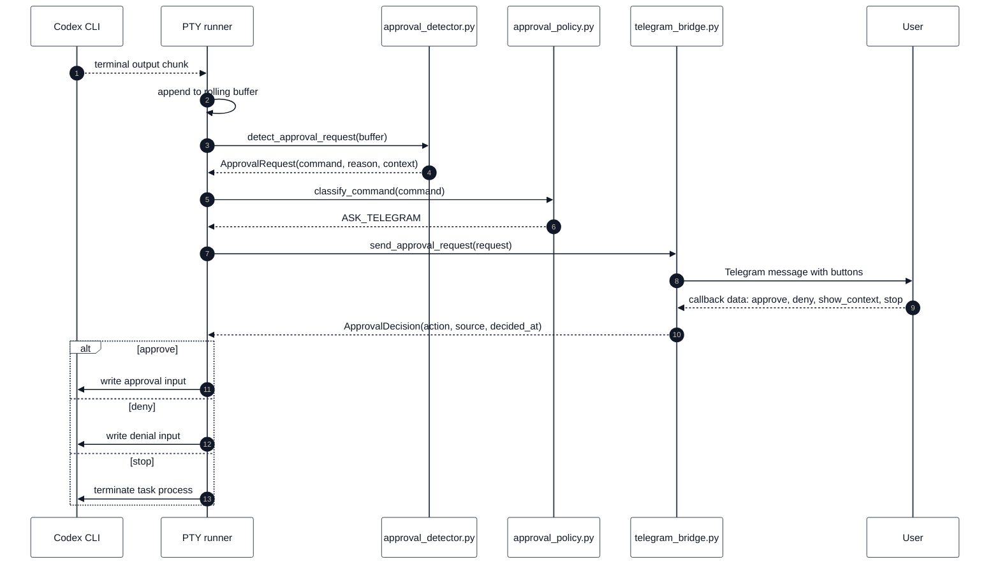
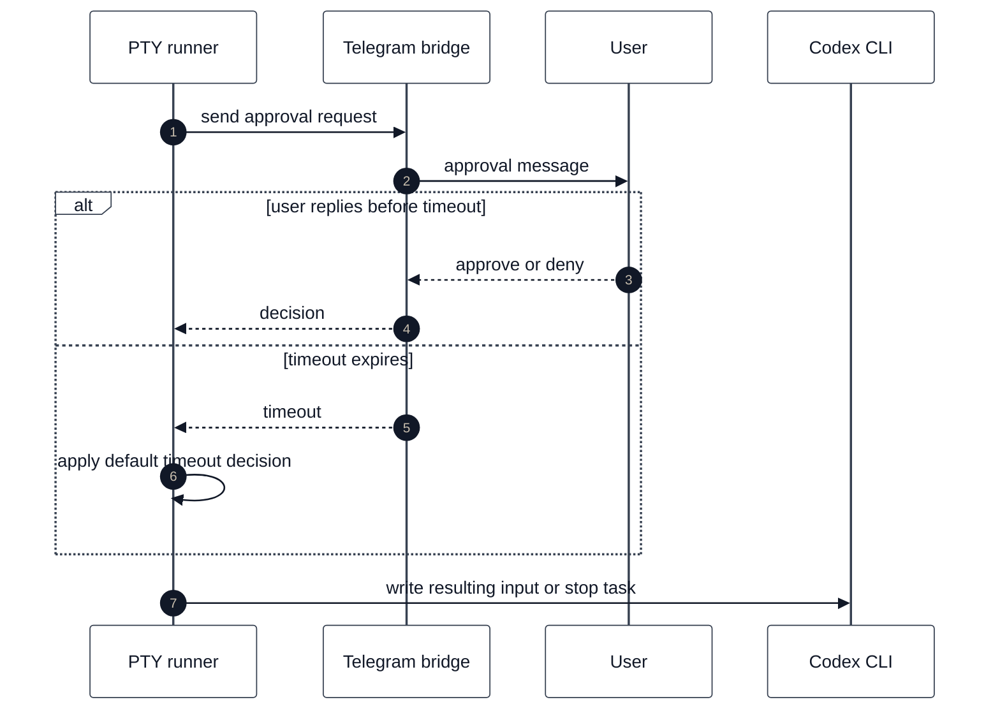
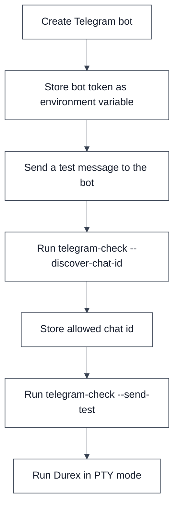

# Telegram Approvals

This document describes the planned Telegram approval system for Durex v0.2.

The goal is to allow Codex to keep running while the user is away from the computer, while still asking for human approval when a terminal prompt requires confirmation.

---

## Overview

```mermaid
%%{init: {"theme": "base", "themeVariables": {"primaryColor": "#ffffff", "primaryTextColor": "#111827", "primaryBorderColor": "#374151", "lineColor": "#374151", "secondaryColor": "#f3f4f6", "tertiaryColor": "#ffffff", "textColor": "#111827", "mainBkg": "#ffffff", "nodeBorder": "#374151", "clusterBkg": "#f9fafb", "clusterBorder": "#9ca3af", "edgeLabelBackground": "#ffffff", "actorBkg": "#ffffff", "actorBorder": "#374151", "actorTextColor": "#111827", "activationBkgColor": "#e5e7eb", "activationBorderColor": "#374151", "signalColor": "#111827", "signalTextColor": "#111827", "noteBkgColor": "#fef3c7", "noteTextColor": "#111827", "noteBorderColor": "#92400e"}}}%%
flowchart LR
    Codex[Codex CLI in PTY] --> PtyRunner[PTY runner]
    PtyRunner --> Detector[Approval detector]
    Detector --> Policy[Approval policy]
    Policy -->|ASK_TELEGRAM| Bot[Telegram bot]
    Bot --> User[User phone]
    User --> Bot
    Bot --> PtyRunner
    PtyRunner -->|writes decision| Codex
```



Telegram is not allowed to execute commands directly. It only sends an approval decision back to the local runner.

---

## Approval request lifecycle



---

## Telegram buttons

A first implementation should support these buttons:

| Button | Action | Meaning |
|---|---|---|
| Approve | `approve` | Send the positive confirmation back to the PTY |
| Deny | `deny` | Send the negative confirmation back to the PTY |
| Show context | `show_context` | Send a longer excerpt of the terminal output |
| Stop task | `stop` | Stop the current task process |

The exact visual labels can be chosen by the implementation, but the internal callback actions should remain stable.

---

## ApprovalRequest payload

The Telegram bridge should receive a normalized request object.

```text
ApprovalRequest {
  request_id,
  task_id,
  task_title,
  workdir,
  command,
  reason,
  context,
  created_at,
  verbosity
}
```

Field meanings:

| Field | Meaning |
|---|---|
| `request_id` | Unique local approval request identifier |
| `task_id` | Current queue task id |
| `task_title` | Human-readable task title |
| `workdir` | Directory where Codex is working |
| `command` | Detected command, if any |
| `reason` | Why approval is needed |
| `context` | Recent terminal output |
| `created_at` | ISO timestamp |
| `verbosity` | Message verbosity mode |

---

## ApprovalDecision payload

The Telegram bridge should return a normalized decision object.

```text
ApprovalDecision {
  request_id,
  action,
  source,
  telegram_user_id,
  telegram_message_id,
  decided_at
}
```

Allowed actions:

```text
approve
deny
show_context
stop
timeout
```

---

## Verbosity modes

The Telegram bridge should support three verbosity levels.

### Compact

Compact mode is meant for quick decisions.

```text
Task: Grade student A
Command: pytest -q

Approve?
```

### Normal

Normal mode includes task, directory, detected command and reason.

```text
Task: Grade student A
Directory: /Users/antonio/grading/student_A
Command: pytest -q
Reason: Codex is waiting for terminal approval.

Approve this action?
```

### Verbose

Verbose mode also includes recent terminal context.

```text
Task: Grade student A
Directory: /Users/antonio/grading/student_A
Command: pytest -q
Reason: Codex is waiting for terminal approval.

Recent output:
...

Approve this action?
```

---

## Timeout behavior

The runner should not wait forever for a Telegram response.



Recommended default:

```text
timeout_default_decision = deny
```

This is safer than approving unknown actions when the user is unavailable.

---

## Security model

Telegram must be treated as an approval channel, not as a command execution channel.

Rules:

1. The bot should only accept callbacks from an allowed chat id.
2. The bot should ignore messages from unknown users.
3. The bot should not accept arbitrary text commands as shell input.
4. The local runner should keep the final authority over what is written into the PTY.
5. Every approval decision should be logged.

---

## Environment variables

Telegram approvals need two environment variables:

- `DUREX_TELEGRAM_BOT_TOKEN`: the bot token generated by Telegram `@BotFather`.
- `DUREX_TELEGRAM_CHAT_ID`: the only Telegram chat allowed to approve or deny
  Durex prompts.

### Create the bot and get the token

1. Open `@BotFather` in Telegram.
2. Send `/newbot`.
3. Choose a display name for the bot.
4. Choose a username ending in `bot`, for example `my_durex_bot`.
5. Copy the token returned by BotFather.

Export the token:

```bash
export DUREX_TELEGRAM_BOT_TOKEN="123456:example"
```

The token authenticates the bot against the Telegram Bot API. Keep it secret:
anyone with this value can control the bot.

Validate that the token works:

```bash
python3 codex_queue.py telegram-check
```

This calls Telegram's `getMe` method and prints the bot username/id when the
token is valid.

### Get the authorized chat id

To find the chat id, send any message to the bot from the Telegram chat you want
to authorize, then run:

```bash
python3 codex_queue.py telegram-check --discover-chat-id
export DUREX_TELEGRAM_CHAT_ID="123456789"
python3 codex_queue.py telegram-check --send-test
```

`telegram-check --discover-chat-id` calls Telegram's `getUpdates` method and
prints chat ids found in recent updates. Private chat ids are usually positive
integers; group and supergroup ids are often negative. Copy the exact value
printed by the command.

`telegram-check --send-test` calls `sendMessage` using
`DUREX_TELEGRAM_CHAT_ID`. If the message arrives in Telegram, the live Bot API
configuration is ready for Durex approvals and remote control.

The configuration file can then reference Telegram without storing secrets in Git.

### Official Telegram references

- Bot overview: https://core.telegram.org/bots
- BotFather guide: https://core.telegram.org/bots/features#botfather
- Bot API reference: https://core.telegram.org/bots/api
- Bot API tutorial: https://core.telegram.org/bots/tutorial
- `getMe`: https://core.telegram.org/bots/api#getme
- `getUpdates`: https://core.telegram.org/bots/api#getupdates
- `sendMessage`: https://core.telegram.org/bots/api#sendmessage

---

## Setup flow



---

## Example configuration

```yaml
telegram:
  enabled: true
  bot_token_env: DUREX_TELEGRAM_BOT_TOKEN
  allowed_chat_id_env: DUREX_TELEGRAM_CHAT_ID
  verbosity: normal
  approval_timeout_seconds: 900
  timeout_default_decision: deny
```

---

## Audit events

Each approval should create an audit record.

```text
ApprovalAuditEvent {
  task_id,
  request_id,
  command,
  decision,
  source,
  created_at,
  decided_at
}
```

Possible sources:

```text
policy
telegram
timeout
system
```

---

## Implementation note

The first version can use Telegram long polling through the Bot API. This avoids running a public webhook server and keeps the system local-friendly.

A future version can support webhooks for always-on server deployments.
