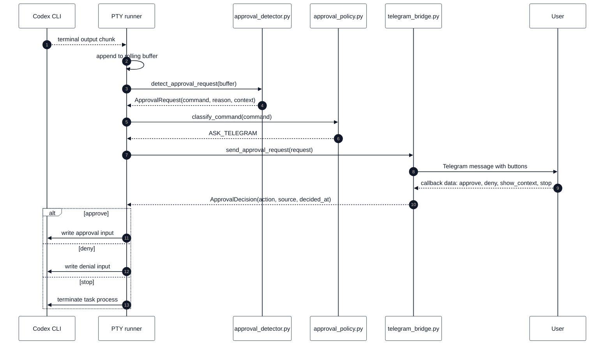
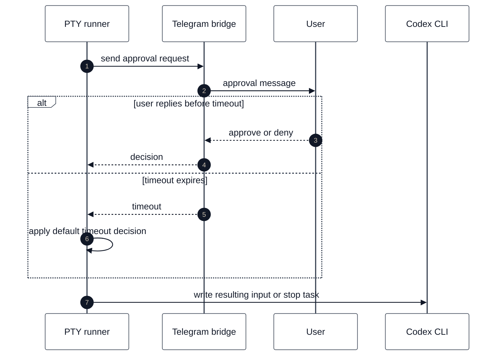
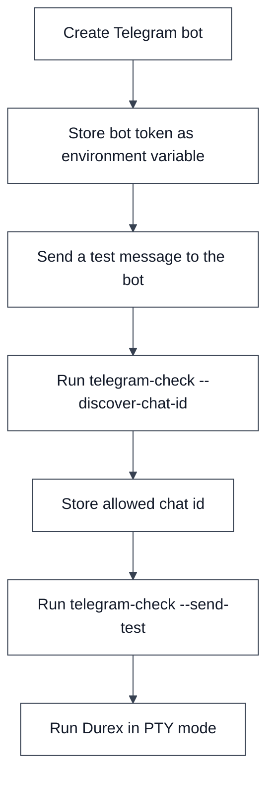

# Telegram Approvals

This document describes the planned Telegram approval system for Durex v0.2.

The goal is to allow Codex to keep running while the user is away from the computer, while still asking for human approval when a terminal prompt requires confirmation.

---

## How to read this document

Telegram approvals are a remote decision channel for prompts that already exist
locally in the PTY runner. Telegram does not run shell commands, does not decide
policy, and does not talk directly to Codex.

The local flow is:

1. Codex prints an interactive prompt in a pseudo-terminal.
2. The PTY runner detects that prompt and extracts context.
3. The approval policy decides whether the prompt needs the user.
4. The Telegram bridge sends a message to the configured chat.
5. The user taps a button.
6. The Telegram bridge returns a normalized decision to the PTY runner.
7. The PTY runner writes the final input into Codex or stops the task.

Read every diagram edge as a trigger. An edge can mean terminal output arrived,
a policy result was produced, a Telegram API method was called, a callback was
received, or local PTY input was written.

---

## Overview

```mermaid
%%{init: {"theme": "base", "themeVariables": {"primaryColor": "#ffffff", "primaryTextColor": "#111827", "primaryBorderColor": "#374151", "lineColor": "#374151", "secondaryColor": "#f3f4f6", "tertiaryColor": "#ffffff", "textColor": "#111827", "mainBkg": "#ffffff", "nodeBorder": "#374151", "clusterBkg": "#f9fafb", "clusterBorder": "#9ca3af", "edgeLabelBackground": "#ffffff", "actorBkg": "#ffffff", "actorBorder": "#374151", "actorTextColor": "#111827", "activationBkgColor": "#e5e7eb", "activationBorderColor": "#374151", "signalColor": "#111827", "signalTextColor": "#111827", "noteBkgColor": "#fef3c7", "noteTextColor": "#111827", "noteBorderColor": "#92400e"}}}%%
flowchart LR
    Codex[Codex CLI in PTY] --> PtyRunner[PTY runner]
    PtyRunner --> Detector[Approval detector]
    Detector --> Policy[Approval policy]
    Policy -->|ASK_TELEGRAM| Bot[Telegram bot]
    Bot --> User[User phone]
    User --> Bot
    Bot --> PtyRunner
    PtyRunner -->|writes decision| Codex
```



Telegram is not allowed to execute commands directly. It only sends an approval decision back to the local runner.

### Overview nodes

`Codex CLI in PTY` is the running Codex process. It is attached to a
pseudo-terminal and behaves as if a human is present at a normal shell.

`PTY runner` is the local controller. It reads Codex output, detects prompts,
waits for decisions, and writes the final answer back into the PTY.

`Approval detector` is the text parsing layer. It strips terminal formatting and
recognizes prompt-like output.

`Approval policy` is the local safety gate. It decides whether a command can be
auto-allowed, auto-denied, or must be sent to Telegram.

`Telegram bot` is implemented by `telegram_bridge.py`. It calls the Telegram Bot
API, sends approval messages, polls updates, parses callbacks, and returns
decisions.

`User phone` is the human interaction point. The phone only sends button
callbacks; it never sends shell input directly.

### Overview edge triggers

`Codex CLI in PTY -> PTY runner` is triggered by terminal output from Codex.

`PTY runner -> Approval detector` is triggered after each output chunk is added
to the rolling buffer.

`Approval detector -> Approval policy` is triggered only when an approval prompt
is detected.

`Approval policy -> Telegram bot` with `ASK_TELEGRAM` is triggered when local
policy cannot safely decide automatically.

`Telegram bot -> User phone` is triggered by `sendMessage` with an inline
keyboard.

`User phone -> Telegram bot` is triggered by the button callback.

`Telegram bot -> PTY runner` is triggered when the bridge matches a callback to
the pending request id.

`PTY runner -> Codex CLI in PTY` is triggered after the final action is known.
Approve writes `y\n`, deny writes `n\n`, and stop terminates the child process.

---

## Approval request lifecycle



### Lifecycle participants

`Codex CLI` produces the terminal text that may contain an approval prompt.

`PTY runner` owns the execution loop and is the only component allowed to write
back into the PTY.

`approval_detector.py` converts terminal text into an `ApprovalRequest`.

`approval_policy.py` decides whether the request needs a human.

`telegram_bridge.py` transports the request to Telegram and converts callbacks
into an `ApprovalDecision`.

`User` taps one of the Telegram buttons.

### Lifecycle message triggers

`Codex -> PTY: terminal output chunk` happens whenever Codex writes output.

`PTY -> PTY: append to rolling buffer` stores recent output for detection and
deduplication.

`PTY -> Detector: detect_approval_request(buffer)` is called repeatedly while
Codex is running.

`Detector -> PTY: ApprovalRequest(...)` happens when the detector sees a prompt
such as `[y/N]`, `(y/n)`, `Approve?`, or similar wording.

`PTY -> Policy: classify_command(command)` asks local policy for the safety
classification.

`Policy -> PTY: ASK_TELEGRAM` means the policy requires a human answer.

`PTY -> Bot: send_approval_request(request)` converts the detector request into
a Telegram approval message.

`Bot -> User: Telegram message with buttons` calls `sendMessage` with inline
keyboard markup.

`User -> Bot: callback data` is produced when the user taps a button. Callback
data follows the internal shape `durex:<request_id>:<action>`.

`Bot -> PTY: ApprovalDecision(...)` happens after the bridge verifies chat id,
request id, and action.

`approve` writes positive terminal input to Codex.

`deny` writes negative terminal input to Codex.

`stop` terminates the child process rather than writing `y` or `n`.

---

## Telegram buttons

A first implementation should support these buttons:

| Button | Action | Meaning |
|---|---|---|
| Approve | `approve` | Send the positive confirmation back to the PTY |
| Deny | `deny` | Send the negative confirmation back to the PTY |
| Show context | `show_context` | Send a longer excerpt of the terminal output |
| Stop task | `stop` | Stop the current task process |

The exact visual labels can be chosen by the implementation, but the internal callback actions should remain stable.

Button handling details:

- `Approve` and `Deny` are final actions. They end the approval wait loop and
  produce terminal input.
- `Show context` is not final. The bridge sends more terminal context and keeps
  waiting for approve, deny, stop, or timeout.
- `Stop task` is final. The PTY runner records a stop decision and terminates
  the child process.
- Unknown callback actions are ignored rather than accepted.
- Callback queries from any chat other than `DUREX_TELEGRAM_CHAT_ID` are ignored.

---

## ApprovalRequest payload

The Telegram bridge should receive a normalized request object.

```text
ApprovalRequest {
  request_id,
  task_id,
  task_title,
  workdir,
  command,
  reason,
  context,
  created_at,
  verbosity
}
```

Field meanings:

| Field | Meaning |
|---|---|
| `request_id` | Unique local approval request identifier |
| `task_id` | Current queue task id |
| `task_title` | Human-readable task title |
| `workdir` | Directory where Codex is working |
| `command` | Detected command, if any |
| `reason` | Why approval is needed |
| `context` | Recent terminal output |
| `created_at` | ISO timestamp |
| `verbosity` | Message verbosity mode |

### How the request is built

The PTY runner receives an `ApprovalRequest` from `approval_detector.py`. It then
adds task metadata before sending the message to Telegram. That conversion is
done so the phone message can show a useful task title, task id, working
directory, detected command, reason, and terminal context.

`request_id` is important because Telegram callbacks are asynchronous. When a
callback arrives, the bridge uses this id to confirm that the button belongs to
the approval request currently being awaited.

`command` can be missing. Terminal parsing is heuristic, so the bridge must
still support requests where the command cannot be confidently extracted. In
that case the message uses `<command not detected>` and relies more heavily on
context.

`context` should already be redacted by the detector before being sent to
Telegram. This is best-effort protection for obvious secret-looking fragments,
not a full data-loss-prevention system.

---

## ApprovalDecision payload

The Telegram bridge should return a normalized decision object.

```text
ApprovalDecision {
  request_id,
  action,
  source,
  telegram_user_id,
  telegram_message_id,
  decided_at
}
```

Allowed actions:

```text
approve
deny
show_context
stop
timeout
```

### How the decision is used

The Telegram bridge returns a decision object; it does not write to Codex
itself. The PTY runner is responsible for converting the action into local
process behavior.

`approve` maps to terminal input `y\n`.

`deny` maps to terminal input `n\n`.

`show_context` causes the bridge to send more terminal output to Telegram and
continue waiting. It does not produce terminal input.

`stop` tells the PTY runner to terminate the task process.

`timeout` is produced locally when no final callback arrives before the approval
deadline. The timeout action is then converted into the configured default
decision.

`source` records where the decision came from. For normal button callbacks this
is `telegram`; for missing responses this is `timeout`; for local fallback paths
the source can be system or policy.

---

## Verbosity modes

The Telegram bridge should support three verbosity levels.

### Compact

Compact mode is meant for quick decisions.

```text
Task: Grade student A
Command: pytest -q

Approve?
```

### Normal

Normal mode includes task, directory, detected command and reason.

```text
Task: Grade student A
Directory: /Users/antonio/grading/student_A
Command: pytest -q
Reason: Codex is waiting for terminal approval.

Approve this action?
```

### Verbose

Verbose mode also includes recent terminal context.

```text
Task: Grade student A
Directory: /Users/antonio/grading/student_A
Command: pytest -q
Reason: Codex is waiting for terminal approval.

Recent output:
...

Approve this action?
```

### Choosing a verbosity mode

Use `compact` when the user mostly needs fast approve/deny decisions and already
trusts the task context.

Use `normal` as the default. It gives enough metadata to understand what Codex is
asking without flooding the phone.

Use `verbose` when debugging the detector, reviewing unfamiliar commands, or
working in a repository where the terminal context matters more than the command
line alone.

Higher verbosity can expose more terminal output to Telegram. Keep that in mind
when tasks may print sensitive data.

---

## Timeout behavior

The runner should not wait forever for a Telegram response.



### Timeout participants

`PTY runner` is waiting for a final approval decision while Codex is blocked at
the prompt.

`Telegram bridge` polls the Telegram Bot API for updates matching the request
id.

`User` may answer in time, answer too late, or not answer at all.

`Codex CLI` remains paused until the PTY runner writes input or stops the
process.

### Timeout edge triggers

`PTY -> Bot: send approval request` starts the timeout window.

`Bot -> User: approval message` sends the inline keyboard.

`user replies before timeout` is triggered when a valid callback arrives before
the configured deadline.

`timeout expires` is triggered when polling reaches
`approval_timeout_seconds` without a final decision.

`Bot -> PTY: timeout` returns a synthetic decision with source `timeout`.

`PTY -> PTY: apply default timeout decision` converts timeout to approve or deny.
The safe default is deny.

`PTY -> Codex: write resulting input or stop task` is the final local action.

Recommended default:

```text
timeout_default_decision = deny
```

This is safer than approving unknown actions when the user is unavailable.

---

## Security model

Telegram must be treated as an approval channel, not as a command execution channel.

Rules:

1. The bot should only accept callbacks from an allowed chat id.
2. The bot should ignore messages from unknown users.
3. The bot should not accept arbitrary text commands as shell input.
4. The local runner should keep the final authority over what is written into the PTY.
5. Every approval decision should be logged.

### Why these rules matter

The Telegram bot token is effectively a remote control credential for the bot.
The allowed chat id is the main boundary that prevents unrelated Telegram users
from influencing local approvals.

Even for the authorized chat, Telegram approval is intentionally narrow. The bot
does not accept arbitrary shell text and does not write directly to the PTY. It
only returns one of the normalized actions.

The local PTY runner remains the final authority because it has process context:
it knows the task, the request id, the policy decision, and whether the child
process should receive input or be terminated.

---

## Environment variables

Telegram approvals need two environment variables:

- `DUREX_TELEGRAM_BOT_TOKEN`: the bot token generated by Telegram `@BotFather`.
- `DUREX_TELEGRAM_CHAT_ID`: the only Telegram chat allowed to approve or deny
  Durex prompts.

### Create the bot and get the token

1. Open `@BotFather` in Telegram.
2. Send `/newbot`.
3. Choose a display name for the bot.
4. Choose a username ending in `bot`, for example `my_durex_bot`.
5. Copy the token returned by BotFather.

Export the token:

```bash
export DUREX_TELEGRAM_BOT_TOKEN="123456:example"
```

The token authenticates the bot against the Telegram Bot API. Keep it secret:
anyone with this value can control the bot.

Validate that the token works:

```bash
python3 codex_queue.py telegram-check
```

This calls Telegram's `getMe` method and prints the bot username/id when the
token is valid.

### Get the authorized chat id

To find the chat id, send any message to the bot from the Telegram chat you want
to authorize, then run:

```bash
python3 codex_queue.py telegram-check --discover-chat-id
export DUREX_TELEGRAM_CHAT_ID="123456789"
python3 codex_queue.py telegram-check --send-test
```

`telegram-check --discover-chat-id` calls Telegram's `getUpdates` method and
prints chat ids found in recent updates. Private chat ids are usually positive
integers; group and supergroup ids are often negative. Copy the exact value
printed by the command.

`telegram-check --send-test` calls `sendMessage` using
`DUREX_TELEGRAM_CHAT_ID`. If the message arrives in Telegram, the live Bot API
configuration is ready for Durex approvals and remote control.

The configuration file can then reference Telegram without storing secrets in Git.

### Official Telegram references

- Bot overview: https://core.telegram.org/bots
- BotFather guide: https://core.telegram.org/bots/features#botfather
- Bot API reference: https://core.telegram.org/bots/api
- Bot API tutorial: https://core.telegram.org/bots/tutorial
- `getMe`: https://core.telegram.org/bots/api#getme
- `getUpdates`: https://core.telegram.org/bots/api#getupdates
- `sendMessage`: https://core.telegram.org/bots/api#sendmessage

---

## Setup flow



### Setup nodes

`Create Telegram bot` means using Telegram's official `@BotFather` to create a
bot and receive a token.

`Store bot token as environment variable` means exporting
`DUREX_TELEGRAM_BOT_TOKEN`. The token should not be committed to the repository.

`Send a test message to the bot` creates an update that Telegram can later
return from `getUpdates`. Without this message, chat-id discovery may have
nothing to find.

`Run telegram-check --discover-chat-id` calls the Bot API and prints candidate
chat ids from recent updates.

`Store allowed chat id` means exporting `DUREX_TELEGRAM_CHAT_ID` with the exact
integer printed by the check command.

`Run telegram-check --send-test` verifies that Durex can send a message to the
configured chat.

`Run Durex in PTY mode` means starting the worker with `--runner-mode pty` and
`--telegram` so approval prompts can be sent to the phone.

### Setup edge triggers

`A -> B` is triggered when BotFather returns the bot token.

`B -> C` is triggered after the token is available locally.

`C -> D` is triggered after the user sends any Telegram message to the new bot.

`D -> E` is triggered when `telegram-check` prints the chat id.

`E -> F` is triggered after `DUREX_TELEGRAM_CHAT_ID` is exported.

`F -> G` is triggered only after the test message arrives successfully. At that
point both required Telegram environment variables are known to work.

---

## Example configuration

```yaml
telegram:
  enabled: true
  bot_token_env: DUREX_TELEGRAM_BOT_TOKEN
  allowed_chat_id_env: DUREX_TELEGRAM_CHAT_ID
  verbosity: normal
  approval_timeout_seconds: 900
  timeout_default_decision: deny
```

---

## Audit events

Each approval should create an audit record.

```text
ApprovalAuditEvent {
  task_id,
  request_id,
  command,
  decision,
  source,
  created_at,
  decided_at
}
```

Possible sources:

```text
policy
telegram
timeout
system
```

### Audit event semantics

An audit event should be created whenever Durex handles an approval prompt,
regardless of whether the decision came from policy, Telegram, timeout, or local
fallback.

`policy` means the approval policy made the final decision locally.

`telegram` means the user made the final decision through a Telegram callback.

`timeout` means no valid final callback arrived before the deadline.

`system` means Durex made a conservative local decision because the normal
approval channel was unavailable.

The current PTY runner returns approval events in memory as part of
`PtyRunResult`. Persisting them in SQLite is a natural next step for stronger
auditing.

---

## Implementation note

The first version can use Telegram long polling through the Bot API. This avoids running a public webhook server and keeps the system local-friendly.

A future version can support webhooks for always-on server deployments.

Long polling also has an important operational constraint: one bot token should
have one effective `getUpdates` consumer for a given flow. If remote control and
approval handling both need Telegram updates at the same time, Durex should use
a shared dispatcher rather than two independent polling loops.
