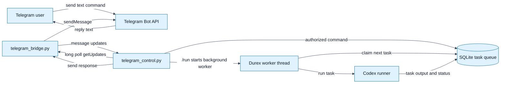
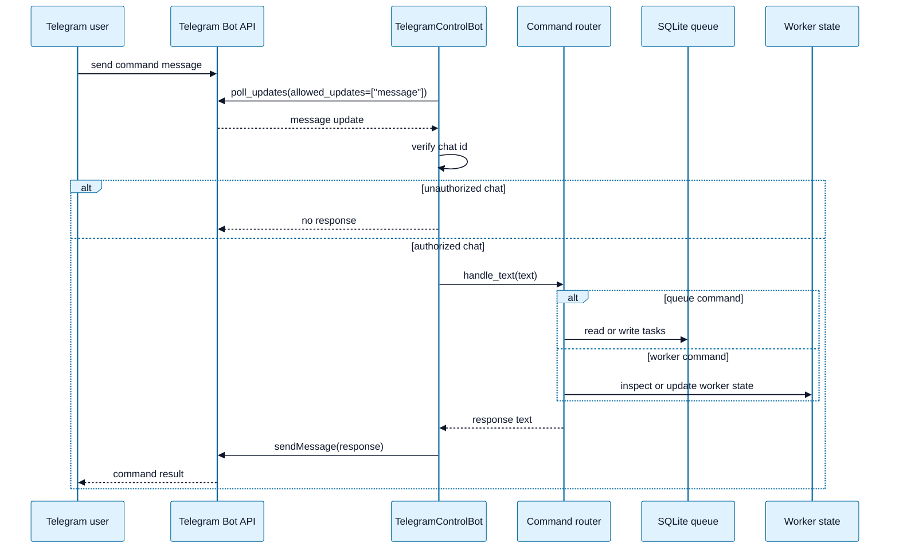
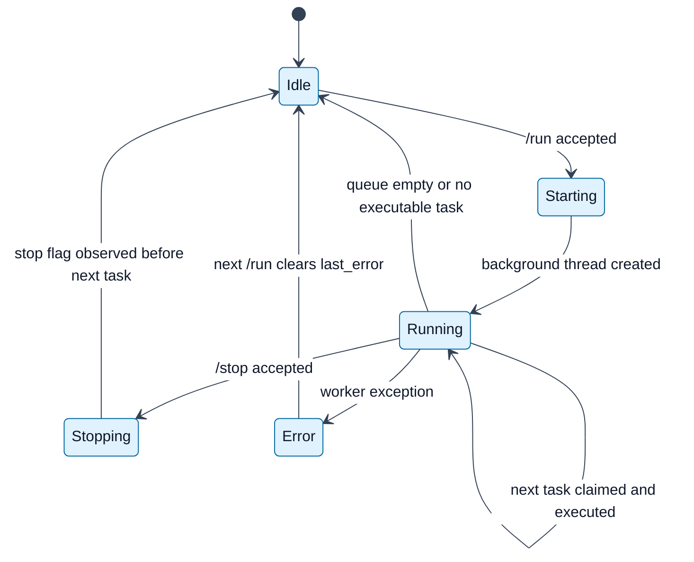

# Telegram Remote Control

This document describes the first Telegram remote-control mode for Durex.

Remote control is separate from Telegram approvals. Approval mode only answers
Codex confirmation prompts. Remote-control mode accepts Telegram messages that
operate the Durex queue and worker.

Remote control is a queue-control channel, not a terminal-control channel. The
Telegram bot receives commands from one configured chat, turns those commands
into calls against Durex queue APIs, and sends back status or output summaries.

---

## How to read this document

Each Mermaid edge describes a trigger. A trigger can be a Telegram message,
a polling response, a command-router decision, a database write, a background
worker state change, or a response message sent back through the Bot API.

The important mental model is:

1. Telegram receives a text command from the user.
2. Durex polls Telegram with `getUpdates`.
3. `telegram_control.py` accepts the update only if it comes from
   `DUREX_TELEGRAM_CHAT_ID`.
4. The command router maps the text command to a safe queue or worker operation.
5. Durex sends a bounded text response back to Telegram.

The remote-control daemon never forwards arbitrary Telegram text into a shell or
PTY. That is the main difference between remote control and future live terminal
control.

---

## Remote-control architecture



### Architecture nodes

`Telegram user` is the operator using the configured Telegram chat. This user can
inspect the queue, add tasks, start the worker, request a graceful stop, and read
task output tails.

`Telegram Bot API` is Telegram's HTTP interface. Durex uses it through long
polling and outbound messages.

`telegram_bridge.py` is the shared Bot API client. In remote-control mode it
polls only `message` updates and sends plain text responses.

`telegram_control.py` is the command router. It verifies the chat id, parses the
message text, calls the correct queue or worker function, catches command errors,
and formats a Telegram response.

`SQLite task queue` stores tasks, statuses, attempts, priorities, prompts,
working directories, output, and errors.

`Durex worker thread` is created by `/run`. It runs in the local process and
continues until the queue is empty, no task can run, an error occurs, or a stop
request is observed before the next task starts.

`Codex runner` is the local execution path used for each task. Depending on
configuration it can use the subprocess runner or the PTY runner.

### Architecture edge triggers

`Telegram user -> Telegram Bot API` is triggered when the user sends a command
such as `/status`, `/tasks`, `/add`, `/run`, `/tail`, or `/stop`.

`telegram_control.py -> telegram_bridge.py` with `long poll getUpdates` is
triggered continuously by `run_forever()`.

`telegram_bridge.py -> telegram_control.py` is triggered when Telegram returns
message updates from the Bot API.

`telegram_control.py -> SQLite task queue` is triggered by commands that read or
modify queue state, including `/status`, `/tasks`, `/add`, and `/tail`.

`telegram_control.py -> Durex worker thread` is triggered by `/run` or `/stop`.
`/run` starts a background thread if one is not already alive. `/stop` sets a
flag that the worker checks before starting another task.

`Durex worker thread -> SQLite task queue` is triggered before each task run when
the worker asks for the next executable task.

`Durex worker thread -> Codex runner` is triggered after a task has been claimed.

`Codex runner -> SQLite task queue` is triggered as task status, output, and
errors are recorded.

`telegram_control.py -> telegram_bridge.py -> Telegram Bot API -> Telegram user`
is triggered after every accepted command and after worker notifications such as
task start, worker idle, or worker error.

---

## Current Scope

The first implementation supports safe queue control:

- show queue and worker status;
- list recent tasks;
- add a new Codex task;
- start the Durex worker until the queue is empty;
- show the tail of task output;
- request that the worker stops before starting another task.

It does not execute arbitrary shell input from Telegram. Direct live control of
Codex terminal input is intentionally left for a future policy layer, such as
Alfred.

## Starting Remote Control

Create a Telegram bot and set the credentials:

1. Open `@BotFather` in Telegram.
2. Send `/newbot`.
3. Choose a display name.
4. Choose a username ending in `bot`, for example `my_durex_bot`.
5. Copy the token returned by BotFather.

```bash
export DUREX_TELEGRAM_BOT_TOKEN="your-bot-token"
```

If you lost an existing bot token, open `@BotFather`, send `/mybots`, select the
bot, then open `API Token` to copy or regenerate the token. Regenerating the
token invalidates the old value, so update `DUREX_TELEGRAM_BOT_TOKEN` before
starting Durex.

Validate the token:

```bash
python3 codex_queue.py telegram-check
```

Send any message to the bot from the Telegram chat that should control Durex,
then discover and validate the chat id:

```bash
python3 codex_queue.py telegram-check --discover-chat-id
export DUREX_TELEGRAM_CHAT_ID="the-chat-id-from-the-check"
python3 codex_queue.py telegram-check --send-test
```

Private chat ids are usually positive integers. Group and supergroup ids are
often negative. Use exactly the value printed by `telegram-check`.

If you lose the chat id later, send `/start` or any normal message to the bot,
then rerun:

```bash
unset DUREX_TELEGRAM_CHAT_ID
python3 codex_queue.py telegram-check --discover-chat-id --poll-timeout 30
```

Export the printed value and verify with `telegram-check --send-test`.

Official Telegram references:

- Bot overview: https://core.telegram.org/bots
- BotFather guide: https://core.telegram.org/bots/features#botfather
- Bot API reference: https://core.telegram.org/bots/api
- Bot API tutorial: https://core.telegram.org/bots/tutorial
- `getMe`: https://core.telegram.org/bots/api#getme
- `getUpdates`: https://core.telegram.org/bots/api#getupdates
- `sendMessage`: https://core.telegram.org/bots/api#sendmessage

Start the remote-control daemon:

```bash
python3 codex_queue.py telegram-control --allowed-workdir /path/to/projects
```

Multiple allowed roots can be configured:

```bash
python3 codex_queue.py telegram-control \
  --allowed-workdir /path/to/project-a \
  --allowed-workdir /path/to/project-b
```

You can also use an environment variable:

```bash
export DUREX_TELEGRAM_ALLOWED_WORKDIRS="/path/to/project-a:/path/to/project-b"
python3 codex_queue.py telegram-control
```

If no allowed root is provided, Durex allows only the current working directory.

For a full first-use checklist and a smoke test that exercises `/status`,
`/tasks`, `/add`, `/run`, `/tail`, and `/stop`, see
[USER_GUIDE.md - First remote-control smoke test](USER_GUIDE.md#first-remote-control-smoke-test).

---

## Command lifecycle



### Lifecycle participants

`Telegram user` sends ordinary Telegram text messages to the bot.

`Telegram Bot API` stores incoming messages until Durex retrieves them with
`getUpdates`.

`TelegramControlBot` is the daemon object. It owns the polling loop, authorized
chat check, response sending, retry state, and background worker state.

`Command router` is `handle_text()`. It recognizes the supported commands and
dispatches them to queue or worker operations.

`SQLite queue` is used by commands that inspect, add, or read output from tasks.

`Worker state` is the in-memory lock-protected state used to know whether the
background worker is running, whether it should stop before the next task, and
what the last worker error was.

### Lifecycle edge triggers

`User -> API: send command message` is triggered by the operator sending a bot
command from Telegram.

`Bot -> API: poll_updates(...)` is triggered by the daemon polling loop. Remote
control asks only for `message` updates, not callback queries.

`API -> Bot: message update` is triggered when Telegram has one or more messages
available for the bot token.

`Bot -> Bot: verify chat id` is triggered for every message update. Messages
from any chat other than `DUREX_TELEGRAM_CHAT_ID` are ignored.

`Bot -> Router: handle_text(text)` is triggered only after the chat is
authorized and the message has text.

`Router -> Queue` is triggered by `/status`, `/tasks`, `/add`, and `/tail`.

`Router -> Worker` is triggered by `/status`, `/run`, `/stop`, and
`/stop-worker`.

`Router -> Bot: response text` is triggered by either a successful command or a
controlled rejection such as invalid `/add` syntax or a disallowed workdir.

`Bot -> API: sendMessage(response)` is triggered after the response is
truncated to stay within Telegram message-size limits.

---

## Telegram Commands

### `/status`

Shows worker state and task counts by status.

```text
/status
```

### `/tasks`

Lists recent tasks. The optional limit defaults to 10.

```text
/tasks
/tasks 20
```

### `/add`

Adds a new Codex task.

Syntax:

```text
/add --title "Fix tests" --workdir /path/to/project --priority 10
Run the tests, fix failures, and summarize the changes.
```

Single-line syntax:

```text
/add --title "Fix tests" --workdir /path/to/project --priority 10 --prompt "Run the tests, fix failures, and summarize the changes."
```

Alternative single-line syntax:

```text
/add --title "Fix tests" --workdir /path/to/project --priority 10 -- Run the tests, fix failures, and summarize the changes.
```

Plain trailing prompt syntax:

```text
/add --title "Fix tests" --workdir /path/to/project --priority 10 Run the tests, fix failures, and summarize the changes.
```

Options:

| Option | Meaning |
|---|---|
| `--title` | Human-readable task title. Optional. |
| `--workdir` | Working directory for Codex. Must be inside an allowed root. |
| `--priority` | Queue priority. Lower values run first. Default: `100`. |
| `--max-attempts` | Maximum retry attempts. Default: `3`. |
| `--prompt` | Prompt for Codex when sending `/add` as one line. Optional. |

The prompt can be placed on the lines after the `/add` header, passed with
`--prompt`, placed after `--`, or written as plain trailing text. Prefer
`--prompt` or `--` for long prompts because they make the boundary between
options and prompt text explicit.

### `/run`

Starts a background Durex worker. The worker runs ready tasks until the queue is
empty or no task can currently run.

```text
/run
```

The command is idempotent while the worker is already running.

### `/tail`

Shows the output tail for the latest task, or for a specific task id.

```text
/tail
/tail 42
```

### `/stop`

Requests that the background worker stops before starting another task.

```text
/stop
```

This does not forcibly kill the currently running Codex process. Hard process
control should be added only with stronger policy and audit support.

---

## Worker lifecycle



### Worker states

`Idle` means no worker thread is alive.

`Starting` is the short transition after `/run` creates a daemon thread.

`Running` means the background worker is repeatedly asking the queue for the next
task and running each task with the configured runner mode.

`Stopping` means `/stop` has set `stop_after_current`. The current task is not
forcibly killed; the worker checks the flag before starting another task.

`Error` means the worker loop caught an exception and stored it in
`last_error`, which is then visible from `/status`.

### Worker edge triggers

`Idle -> Starting` is triggered when `/run` is accepted and no existing worker
thread is alive.

`Starting -> Running` is triggered when the daemon thread begins
`run_worker_until_empty()`.

`Running -> Running` is triggered after each completed task when the worker asks
for another executable task.

`Running -> Stopping` is triggered by `/stop` or `/stop-worker`.

`Stopping -> Idle` is triggered when the worker observes `stop_after_current`
before starting another task.

`Running -> Idle` is triggered when `get_next_task()` returns no executable
task.

`Running -> Error` is triggered by an exception in the worker loop.

`Error -> Idle` is triggered by the next successful `/run` request, which clears
`last_error` before starting a new worker thread.

## Worker Options

Remote-control mode can start workers using either runner:

```bash
python3 codex_queue.py telegram-control --runner-mode subprocess
python3 codex_queue.py telegram-control --runner-mode pty
```

Telegram approval prompts inside remotely started worker tasks are not supported
yet:

```bash
python3 codex_queue.py telegram-control \
  --allowed-workdir /path/to/project \
  --worker-telegram-approvals
```

The command rejects this combination because remote control and approval prompts
would otherwise create competing Telegram `getUpdates` consumers for the same
bot token. A future implementation should use one shared Telegram update
dispatcher that routes message commands and callback-query approvals from a
single polling loop.

## Security Boundaries

Remote control currently enforces these boundaries:

1. Only `DUREX_TELEGRAM_CHAT_ID` can issue commands.
2. `/add --workdir` must stay inside an allowed root.
3. Telegram commands operate Durex queue APIs, not the shell.
4. Output sent back to Telegram is truncated to fit Telegram message limits.
5. Direct PTY input from Telegram is not implemented.

Future Alfred integration should own the higher-risk policy decisions for live
Codex control, command authorization, hard process stops and arbitrary input.

## Implementation Notes

The remote-control daemon uses Telegram long polling for `message` updates. It
shares the same Bot API client class as Telegram approvals, but command routing
lives in `telegram_control.py`.

The command router is tested without network access using a fake bridge.
