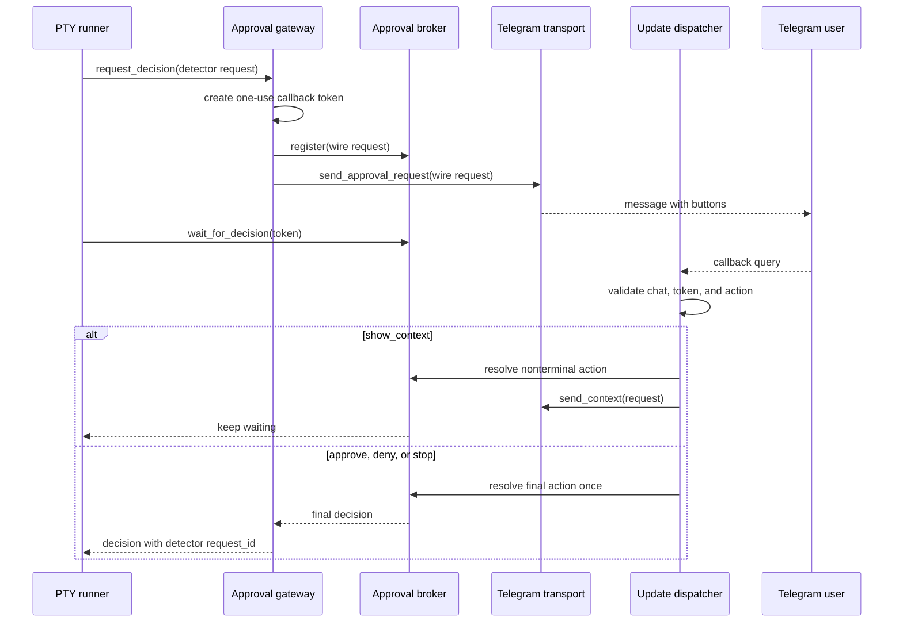

# Telegram Update Dispatcher and Approval Broker

This document defines the shared Telegram polling and approval coordination
implemented for roadmap issue #9.

The result is one process-level owner of Telegram `getUpdates`. The same
`telegram-control` process can now receive queue commands, interactive button
callbacks, voice messages, and PTY approval decisions without starting a second
long poll.

## Runtime architecture

```mermaid
flowchart LR
    API[Telegram Bot API]
    Transport[TelegramApprovalBridge]
    Dispatcher[TelegramUpdateDispatcher]
    Control[TelegramControlBot]
    Broker[TelegramApprovalBroker]
    Gateway[TelegramApprovalGateway]
    Worker[Worker thread]
    PTY[PTY runner]

    Dispatcher -->|single getUpdates loop| Transport
    Transport --> API
    API -->|messages and callbacks| Transport
    Transport --> Dispatcher
    Dispatcher -->|commands and control callbacks| Control
    Dispatcher -->|durex approval callbacks| Broker
    Control --> Worker
    Worker --> PTY
    PTY -->|request_decision| Gateway
    Gateway -->|register before send| Broker
    Gateway -->|send approval message| Transport
    Broker -->|final decision| Gateway
    Gateway --> PTY
```



`TelegramApprovalBridge` is the Bot API transport. It sends messages, downloads
files, acknowledges callbacks, and performs a `getUpdates` request when asked by
the dispatcher. It does not wait for an approval decision.

`TelegramUpdateDispatcher` is the only runtime owner of `poll_updates()`. It
reads both `message` and `callback_query` updates and routes each update by
shape and callback namespace.

`TelegramControlBot` handles normal messages, voice messages, and non-approval
callbacks. Its worker receives the same process-level approval provider.

`TelegramApprovalBroker` is a thread-safe registry. The dispatcher resolves
callbacks into this registry while the PTY worker waits on a local event.

`TelegramApprovalGateway` registers an approval, sends its buttons, and waits on
the broker. It never calls `getUpdates`.

## Polling ownership

The ownership contract is strict:

1. One `TelegramUpdateDispatcher` owns `getUpdates` inside a Durex process.
2. PTY runners and worker threads must not poll Telegram.
3. The approval request is registered before its buttons are sent, so an
   immediate callback cannot arrive before the broker knows the request.
4. The dispatcher reads `message` and `callback_query` updates together.
5. `telegram-check --discover-chat-id` is an operator utility, not part of the
   running control process.

Telegram offsets are scoped to a bot token, not a host process. Do not run two
Durex processes that call `getUpdates` with the same bot token. Stop
`telegram-control` before running chat-id discovery or standalone
`run --telegram` with that token. Multiple independent bots may use separate
processes because their tokens have separate update streams.

## Callback namespaces

The dispatcher reserves only the exact `durex:` prefix for approval decisions.
All other callback namespaces continue to the control router.

| Callback shape | Owner | Purpose |
|---|---|---|
| `durex:<token>:approve` | Approval broker | Approve the current PTY prompt |
| `durex:<token>:deny` | Approval broker | Deny the current PTY prompt |
| `durex:<token>:show_context` | Approval broker and transport | Send context without completing the request |
| `durex:<token>:stop` | Approval broker | Stop the current PTY task |
| `durexlearn:*` | Control router | Save a voice alias |
| `durexadd:*` | Control router | Advance the add-task wizard |
| `durextask:*` | Control router | Show task detail or output |
| `durextasks:*` | Control router | Refresh the task list |
| `durexcontrol:*` | Control router | Start or stop the worker |
| `durexconfig:*` | Control router | Toggle a supported runtime setting |

Unknown non-approval namespaces are ignored by the control router. Malformed
approval callbacks from the authorized chat are acknowledged as invalid and do
not reach the broker. Approval callbacks from any other chat are ignored
without disclosing approval state.

## Approval correlation

The detector's `request_id` is a stable fingerprint used to suppress repeated
detection of the same terminal prompt. A stable fingerprint is not sufficient
for remote callback security because a later task can produce the same prompt.

For each outbound Telegram message, `TelegramApprovalGateway` creates a random,
one-use callback token. The inline keyboard contains that token instead of the
detector fingerprint. After the broker returns a decision, the gateway restores
the detector `request_id` before returning to the PTY runner. This keeps local
audit semantics stable while preventing a button from an old message from
matching a later identical prompt.

The broker keeps bounded histories of completed request tokens and callback
query identifiers. Within that window:

- the same callback query is processed once;
- a second final action cannot replace the first action;
- a callback for a completed request is reported as already handled;
- a callback for an unknown request is reported as expired;
- a completed one-use token cannot be registered again.

Telegram update identifiers are also deduplicated by the dispatcher before any
control or approval handler runs.

## Decision lifecycle



`show_context` is nonterminal. It sends the stored redacted context and leaves
the approval pending. `approve`, `deny`, and `stop` are terminal and idempotent.
The PTY remains the only component allowed to write `y\n`, write `n\n`, or stop
the child process.

## Timeout, shutdown, and failures

An unanswered request returns the configured timeout decision with source
`timeout`. The default remains `deny`.

Dispatcher shutdown releases every waiter. Shutdown never converts a configured
approve fallback into approval: it returns `deny`, or preserves `stop` when stop
is the configured fallback. This prevents process shutdown from authorizing a
pending command.

If sending the approval message fails, the gateway removes the pending broker
registration and propagates the transport error. The task follows the existing
runner failure path.

Transient Bot API polling errors use bounded exponential backoff. In
`telegram-control`, the latest error remains visible through `/status`. A
successful poll resets the delay.

The transport advances its local offset across each fetched Bot API response.
Expected transport failures while dispatching one update are therefore isolated
to that update and reported without aborting the rest of the fetched batch. This
prevents a failed response send or callback acknowledgement from discarding a
later command or approval decision that Telegram returned in the same response.

Standalone approval mode uses a dedicated dispatcher thread for the duration of
the PTY task. Its Bot API socket timeout is derived from the long-poll timeout,
and process ownership is released by that thread only after it exits. If a poll
outlives the expected shutdown bound, another standalone task is rejected
instead of creating a competing poller.

The control daemon subscribes to both `message` and `callback_query` updates.
Standalone approval mode subscribes only to `callback_query` because it has no
command handler; it does not fetch and silently discard Telegram control
messages intended for a later control-daemon session.

## Running the modes

Use one control daemon for queue commands and worker approvals:

```bash
python3 codex_queue.py telegram-control \
  --allowed-workdir /path/to/projects \
  --runner-mode pty \
  --worker-telegram-approvals
```

Then send `/run` from the authorized Telegram chat. Approval buttons and normal
control commands use the same polling loop.

Standalone PTY approval mode remains compatible:

```bash
python3 codex_queue.py run \
  --runner-mode pty \
  --telegram \
  --telegram-verbosity normal
```

Do not run standalone mode and `telegram-control` concurrently with the same bot
token.

## Validation coverage

`tests/test_telegram_dispatcher.py` covers:

- interleaved messages, control callbacks, and approval callbacks;
- authorized, unauthorized, malformed, stale, and duplicate callbacks;
- nonterminal context requests and terminal idempotency;
- unique wire-token correlation and detector-id restoration;
- timeout and conservative shutdown;
- send failure cleanup and transient polling retry.

`tests/test_pty_runner.py` verifies that human-required prompts consume an
injected decision provider. `tests/test_telegram_control.py` verifies that the
worker receives the process-level provider. The suite uses fake transports and
does not require a real Telegram token.

## Non-goals

This change does not add arbitrary terminal input, immediate process
cancellation outside an approval prompt, durable approval history, or live
output persistence. Those capabilities remain separate roadmap work. Alfred is
the future authority for higher-risk policy and control decisions.
