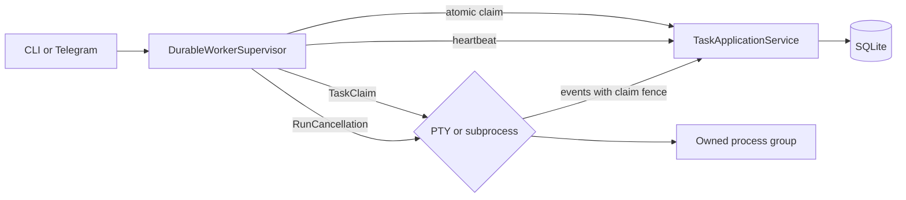
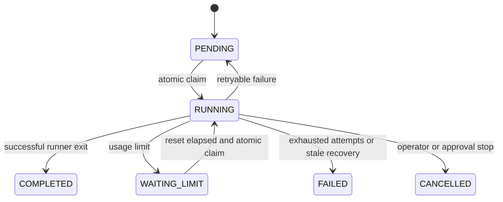

# Durable Worker Supervisor

This document defines the local worker ownership and cancellation contract
delivered for roadmap issue
[#11](https://github.com/kinderp/durex/issues/11). It covers atomic claims,
leases, fencing, heartbeat, recovery, process ownership, Telegram controls,
migration, and the boundary for future multi-host execution.

## User outcome

Durex can run Codex without requiring the operator to remain in front of the
machine while still providing safe, immediate control from Telegram:

- `/run` starts one durable local supervisor;
- `/status` identifies the current task and run;
- `/tail` reads task output;
- `/stop` finishes the current task but prevents the next claim;
- `/stop-current` cancels the process group owned by the current claim.

The CLI worker and Telegram worker use the same supervisor. Two processes that
share one local SQLite database cannot claim the same task concurrently.

## Runtime ownership

The adapter selects configuration and presents messages. It does not own task
selection, lease renewal, or process identifiers.

`DurableWorkerSupervisor` owns one active `TaskClaim`, one heartbeat loop, and
one `RunCancellation`. It observes runner events to expose current output and
interaction state without importing Telegram.

Both runners create a new process session. Cancellation signals only the
process group led by that runner-owned child.

## Claim identity and fencing

A claim has three independent identities:

| Field | Purpose |
|---|---|
| `run_id` | One execution attempt and its ordered event stream |
| `lease_id` | Unpredictable identity for one ownership acquisition |
| `lease_epoch` | Monotonic generation that fences older owners |

`worker_id` identifies the local supervisor instance. It is opaque and must
not be interpreted as a PID or trusted host identity.

The claim transaction uses `BEGIN IMMEDIATE`, selects the highest-priority
runnable task, increments its attempt and lease epoch, and changes it to
`RUNNING` in one write transaction. A competing worker sees the committed state
and cannot acquire the same task.

Heartbeat, cancellation, task finalization, live-run start, live-output append,
and live-run finalization all require the current lease id and epoch. A stale
worker receives a rejected write instead of overwriting the new owner.

## Persisted task metadata

Initialization additively migrates older `tasks` tables with these columns:

| Column | Meaning |
|---|---|
| `active_run_id` | Current execution identity |
| `lease_id` | Current ownership token |
| `lease_owner` | Opaque worker identity |
| `lease_epoch` | Monotonic fencing generation |
| `lease_expires_at` | Recovery deadline |
| `started_at` | Current claim start time |
| `heartbeat_at` | Last successful renewal |
| `last_output_at` | Last fenced live-output write |
| `cancel_requested_at` | First accepted cancellation request |
| `terminal_reason` | Explicit transition or recovery reason |

The migration preserves existing rows and creates
`tasks_status_lease_idx`. No separate migration command is required, but an
important `codex_tasks.db` should still be backed up before upgrades.

## Heartbeat and recovery

The current defaults are a 30-second lease and a 10-second heartbeat. They are
internal constants until unified configuration is delivered by issue #14.

At startup, the supervisor finds `RUNNING` claims whose lease has expired. It
marks them `FAILED`, records an actionable reason, and closes any matching open
live run.

Recovery never automatically returns an expired task to `PENDING`. The old
process may still exist after a crash or network partition, so automatic retry
could execute the same repository operation twice. An operator must inspect the
failure and deliberately requeue or replace the task through a trusted local
maintenance path; Telegram does not currently expose retry. The next claim
receives a higher lease epoch, which rejects every late write from the previous
owner.

If a live supervisor loses its heartbeat fence, it requests cancellation of its
owned process and stops writing task state.

## Stop semantics

| Control | Current task | Next task | Persisted outcome |
|---|---|---|---|
| `/stop` | Continues | Not claimed | Existing runner outcome |
| `/stop-current` | Process group is terminated | Supervisor may continue | `CANCELLED` |
| Approval `Stop` | Process group is terminated | Supervisor may continue | `CANCELLED` |

`/stop-current` does not accept a task id, run id, worker id, or PID. This
prevents Telegram input from selecting an unrelated local process. The
supervisor first persists cancellation against its current fenced claim, then
signals its in-memory cancellation token.

Process shutdown is bounded:

1. send `SIGTERM` to the owned process group;
2. wait up to five seconds;
3. send `SIGKILL` if the group did not exit;
4. wait for the direct child and emit `cancelled`.

When a PTY is waiting for Telegram approval, the approval broker observes the
same cancellation token and returns `STOP` immediately. Cancellation therefore
does not wait for the normal approval timeout.

## Status and observability

While a claim is active, `/status` includes:

- current task id;
- current run id;
- claim start time;
- last observed output time;
- whether an interaction is pending;
- whether stop-after-current was requested;
- the last supervisor error.

Task and live-output metadata remain durable. Pending interaction state is
currently in memory; durable interaction history and notifications belong to
issue #13.

## Task lifecycle

Every supervised terminal or release transition is fenced. `PENDING` and
`WAITING_LIMIT` are release outcomes because the same logical task may be
claimed again with a higher epoch.

## Failure behavior

- If the executor raises, the supervisor attempts a fenced `FAILED`
  finalization and records the error.
- If the executor returns while still owning a `RUNNING` task, the supervisor
  fails it instead of silently abandoning the claim.
- If event persistence fails, the runner terminates its process group and does
  not continue with unobservable output.
- If a cancellation request is replayed, only the first request changes state.
- If ownership changed, stale heartbeat, cancellation, task finalization, and
  output writes are rejected.

## Security boundary

This feature is process control, not arbitrary shell access. Telegram can start
queued work, inspect it, stop after the current task, or cancel the current
owned run. It cannot send terminal input, choose a PID, or bypass configured
workdir and approval controls.

The SQLite database contains prompts, output, run metadata, and potentially
sensitive repository content. Protect it as local application data.

## Multi-host boundary

The current implementation is deliberately single-host. SQLite must not be
placed on NFS or shared directly between machines.

Future roadmap issue
[#21](https://github.com/kinderp/durex/issues/21) will design a fleet model with:

- one outbound Durex agent per machine;
- a central control plane and durable scheduler;
- stable node enrollment, authentication, rotation, and revocation;
- capability and configured workdir-alias based placement;
- opaque worker ids and monotonically fenced ownership;
- bounded offline event spooling and idempotent `(run_id, sequence)` replay;
- owner-scoped cancellation routed to the node that owns the lease;
- versioned agent/control-plane contracts.

Telegram should remain a client of that control plane, not a direct shell into
every worker. Alfred remains responsible for higher-level policy and Codex
governance; Durex owns execution transport, lifecycle, and observability.

The current `TaskApplicationService`, `WorkerSupervisor`, runner-event, and
cancellation boundaries avoid exposing SQLite connections or local PIDs. That
is the compatibility foundation for replacing local persistence and scheduling
without rewriting runners or Telegram presentation.

## Validation coverage

The test suite covers:

- concurrent atomic claims;
- additive migration from the pre-supervisor schema;
- heartbeat, cancellation, and finalization fences;
- stale recovery and reassignment;
- stale live-output rejection;
- abandoned executor failure;
- stop-after-current and stop-current behavior;
- graceful and forced process-group termination;
- subprocess and PTY cancellation;
- cancellation while Telegram approval is pending;
- Telegram current-run status and command routing.

## Deferred work

- Telegram live console pagination and refresh controls: #12.
- Durable interaction history and lifecycle notifications: #13.
- Validated YAML/environment supervisor settings: #14.
- Restart and end-to-end release hardening: #15.
- Multi-host worker fleet: #21.
